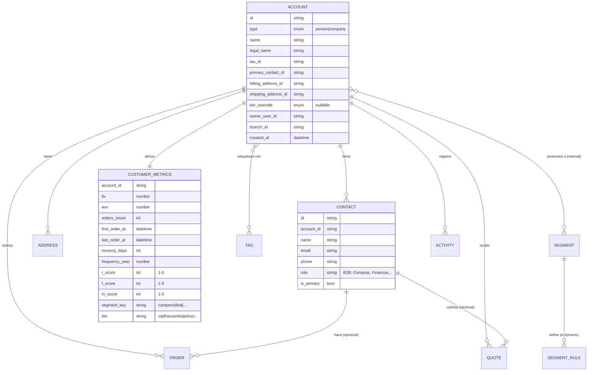
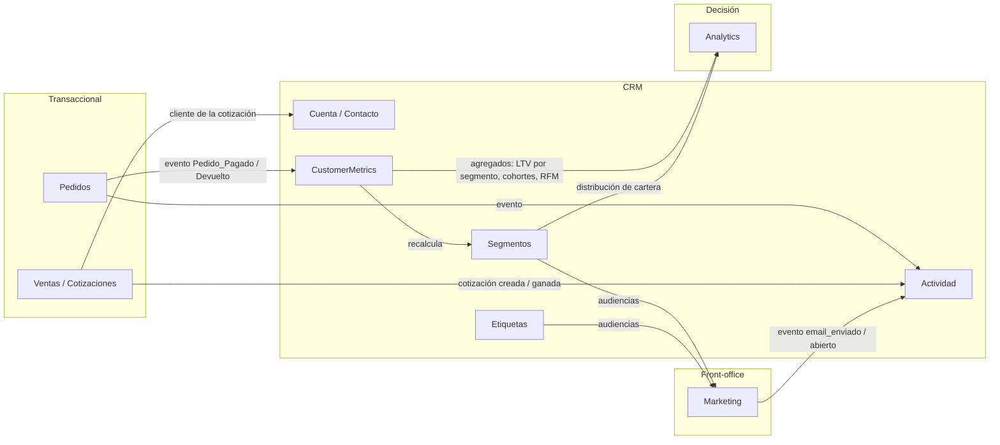

# Módulo Clientes / CRM — Arquitectura Funcional y UX

> **Consultar junto con [`ARCHITECTURE.md`](../ARCHITECTURE.md).** Decisiones tomadas: modelo
> **Cuenta + Contactos**, segmentación **RFM + segmentos smart + etiquetas manuales**, implementación
> **por fases**.
>
> **Estado (2026-09): Fases 1, 2 y 3 implementadas** en `src/modules/clientes/` con datos mock y la
> capa `data/` · `lib/` · `api/clientsApi.js`. La UI habla sólo con `clientsApi`; migrar al backend
> Laravel = reescribir esa carpeta. El store de escritura vive en memoria (se resetea al recargar la
> página; las vistas guardadas van a `localStorage`).

---

## 1. Objetivo

Ofrecer una **vista Customer 360°**: cada persona o empresa con la que operamos, con todo su
contexto comercial, relacional y de valor en una sola pantalla, y las herramientas para segmentar,
etiquetar y accionar sobre esa base.

**El CRM no es dueño de las transacciones.** Los Pedidos y las Ventas viven en sus módulos; el CRM
los **lee, agrega y deriva valor**. El CRM sí es dueño de: la identidad del cliente, los contactos,
las direcciones, las etiquetas, los segmentos manuales, las notas y la bitácora de actividad.

### Alcance MVP vs. futuro

| Entra (Fases 1–3) | Queda fuera por ahora |
|---|---|
| Cuentas B2C y B2B con contactos | Jerarquías de cuentas (matriz/filial) |
| RFM + 8 segmentos smart + etiquetas | Motor visual de reglas AND/OR arbitrarias |
| Timeline de actividad + notas/tareas manuales | Bandeja de email integrada, telefonía |
| LTV histórico, AOV, recencia, frecuencia | LTV predictivo (ML), propensión de compra |
| Cotizaciones de la cuenta (lectura + convertir) | Forecast de pipeline, comisiones |
| Ganchos de eventos hacia Marketing/Analytics | Constructor de campañas (vive en Marketing) |

---

## 2. Modelo de dominio

### 2.1 Entidades

| Entidad | Descripción | Dueño |
|---|---|---|
| **Cuenta** (`Account`) | El "Cliente". Persona física o empresa. Centro relacional. | CRM |
| **Contacto** (`Contact`) | Persona vinculada a una cuenta (B2C: 1 contacto = la persona; B2B: N contactos con rol). | CRM |
| **Dirección** (`Address`) | Domicilio de envío y/o facturación de una cuenta. | CRM |
| **Etiqueta** (`Tag`) | Marcador manual libre, reutilizable (ej. `mayorista`, `moroso`, `campaña-verano`). | CRM |
| **Segmento** (`Segment`) | Agrupación de cuentas. `dynamic` (por regla RFM/atributos) o `manual` (lista curada). | CRM |
| **Actividad** (`Activity`) | Evento en la línea de tiempo de la cuenta (pedido, pago, nota, email, cambio de segmento, tarea). Bitácora inmutable. | CRM (registra eventos de otros módulos) |
| **Métricas del cliente** (`CustomerMetrics`) | Valores **derivados**, recalculados por evento: LTV, AOV, nº pedidos, recencia, frecuencia, scores R/F/M, segmento actual, tier. No se editan a mano (salvo override de tier). | CRM (calculado) |

### 2.2 Relaciones internas



### 2.3 Relación con otros módulos



**Contratos entre módulos (quién escribe qué):**

| Dato | Lo escribe | Lo lee |
|---|---|---|
| Pedido, pago, devolución | Pedidos | CRM (deriva métricas + actividad) |
| Cotización, oportunidad, vendedor asignado | Ventas | CRM (tab Ventas de la cuenta) |
| Identidad del cliente, contacto, dirección | CRM | Pedidos, Ventas, Facturación (autocompletan datos) |
| Etiquetas, segmentos manuales | CRM | Marketing (audiencias), Analytics |
| `CustomerMetrics` (LTV, RFM, tier) | CRM (calculado) | Todos (badge VIP, prioridad de soporte, pricing) |
| Evento `email_enviado`, `campaña_click` | Marketing | CRM (timeline de actividad) |

**Regla de eventos (conceptual, hoy sin bus real):**
`Pedido_Pagado` → `recalcularMetricas(cuenta)` → `reevaluarSegmentosDinamicos(cuenta)` →
`si cambia de segmento: registrar Activity + emitir Segmento_Cambiado` → Marketing puede
disparar automatizaciones (ej. entró a "En riesgo" → email de recuperación).

En el MVP esto se implementa como **selectores puros en el front** (`derivarMetricas(cuenta, pedidos)`)
que se recalculan al render. La forma de los datos y eventos queda lista para moverse al backend.

---

## 3. Valor del cliente

Métricas que definen "cuánto vale" una cuenta. Todas **derivadas de Pedidos**, nunca tipeadas.

| Métrica | Fórmula | Uso |
|---|---|---|
| **LTV** (Lifetime Value) | Σ total de pedidos pagados − devoluciones | Ranking, VIP, prioridad |
| **AOV** (Ticket promedio) | LTV / nº pedidos pagados | Salud de la relación |
| **Recencia** (R) | días desde el último pedido | Riesgo de fuga |
| **Frecuencia** (F) | pedidos por año (o en ventana de 12m) | Fidelidad |
| **Monto** (M) | = LTV (o gasto en 12m) | Segmento de valor |
| **Antigüedad** | días desde el primer pedido | Contexto |
| **Margen** (fase futura) | requiere costo por línea | Rentabilidad real |

**RFM score:** cada dimensión se puntúa 1–5 por quintiles de la cartera (o umbrales fijos
configurables). El trío `R-F-M` (ej. `5-4-5`) mapea a un **segmento smart**.

---

## 4. Segmentación

### 4.1 Segmentos smart (dinámicos, calculados por RFM)

| Segmento | Regla (orientativa, umbrales configurables) | Acción típica |
|---|---|---|
| **Lead** | 0 pedidos pagados | Nurturing, primera compra |
| **Nuevo** | 1 pedido, recencia < 30d | Onboarding, 2ª compra |
| **Prometedor** | 2–3 pedidos, recencia < 45d | Incentivo de recompra |
| **Leal / Frecuente** | F alto (≥ 4/año), recencia < 60d | Programa de fidelidad |
| **Campeón / VIP** | R≥4 y F≥4 y M≥4 (o top 10% por LTV) | Trato preferencial, early access |
| **En riesgo** | Buen histórico (F≥3, M≥3) pero recencia 60–120d | Campaña de recuperación |
| **Durmiente** | recencia 120–240d | Reactivación agresiva |
| **Perdido** | recencia > 240d | Win-back / archivar |

- **Tier** (`vip` / `frecuente` / `activo` / `en riesgo` / `durmiente` / `lead`) se **deriva** del
  segmento smart. Se permite un **override manual** (`tier_override`) para casos que el operador
  conoce mejor que la regla (ej. cuenta estratégica nueva sin histórico).
- Una cuenta pertenece a **exactamente un** segmento smart, pero puede estar en **N** segmentos
  manuales y tener **N** etiquetas.

### 4.2 Segmentos manuales

Listas curadas a mano (ej. "Cuentas estratégicas 2026", "Beta testers"). Se administran en
`/clientes/segmentos`. Marketing los usa como audiencias.

### 4.3 Etiquetas manuales

Chips libres, reutilizables, sin semántica de sistema (ej. `mayorista`, `evento-feria`, `no-llamar`).
Autocomplete sobre las existentes. Gestión global en `/clientes/etiquetas` (renombrar, fusionar,
color, contar usos).

### 4.4 Vistas rápidas (no son entidades, son filtros guardados)

`Todos` · `VIP` · `Frecuentes` · `En riesgo` · `Durmientes` · `Leads` — tabs sobre el listado que
aplican el filtro de segmento correspondiente. El usuario puede guardar sus propias vistas
(combinaciones de filtros).

---

## 5. Las 12 áreas — funcional + UX

### 5.1 Listado (`/clientes`)

- **Qué es:** tabla maestra de cuentas.
- **Columnas:** Cliente (avatar + nombre + email/razón social), Tipo, Segmento (badge), Tier,
  LTV, Nº pedidos, Última compra (con color por recencia), Etiquetas.
- **Filtros:** segmento smart, tier, tipo (persona/empresa), etiquetas (multi), rango de LTV,
  rango de fecha de alta / última compra, vendedor/owner, sucursal.
- **Vistas rápidas:** tabs `Todos / VIP / Frecuentes / En riesgo / Durmientes / Leads`.
- **Vistas guardadas:** el usuario nombra y guarda un set de filtros.
- **Acciones fila:** abrir perfil (click), menú `⋮` (ver pedidos, agregar etiqueta, agregar a
  segmento, registrar nota).
- **Acciones masivas:** etiquetar, agregar a segmento manual, exportar (permiso aislado), enviar a
  campaña (handoff a Marketing).
- **UX:** `PageHeader` + fila de `StatCard` (Total, VIP, LTV promedio, En riesgo) + `DataTable` con
  `toolbar` (tabs + búsqueda + filtros) — mismo patrón que Pedidos/Ventas ya rediseñados.

### 5.2 Perfil — Customer 360 (`/clientes/:id`)

Layout: **hero fijo arriba + tabs**.

- **Hero:**
  - Identidad: avatar, nombre / razón social, tipo, badge de segmento + tier, etiquetas.
  - Contacto primario: email, teléfono; para B2B, selector de contacto.
  - Tira de valor: LTV · Pedidos · AOV · Recencia (mismo componente que ya se hizo).
  - Acciones: Editar, Enviar mensaje (Marketing), Nueva cotización (Ventas), Nuevo pedido (Pedidos).
- **Tabs:** `Resumen` · `Historial` · `Pedidos` · `Ventas` · `Actividad` · `Direcciones` ·
  `Segmentación`. (`Etiquetas` y `Valor` viven dentro de `Resumen` y `Segmentación`; no necesitan
  tab propia.)
- **Tab Resumen:** los últimos pedidos + actividad reciente + panel de valor + etiquetas +
  segmentos actuales, todo condensado (dashboard de la cuenta).

### 5.3 Historial (tab `Historial`)

- **Qué es:** **timeline unificado y cronológico** de todo lo que le pasó a la cuenta.
- **Fuentes:** pedidos (creado/pagado/despachado/entregado/devuelto), cotizaciones
  (enviada/ganada/perdida), pagos y reembolsos, notas y tareas del equipo, emails y clicks de
  campañas (Marketing), cambios de segmento, cambios de datos (auditoría).
- **UX:** componente `ActivityTimeline` (generalización del timeline que ya existe en
  `PedidoDetalle`/`ClienteDetalle`). Filtro por tipo de evento. Ítems con icono por tipo, actor,
  fecha relativa, y link a la entidad (pedido, cotización).

### 5.4 Pedidos (tab `Pedidos`)

- Tabla de **todos** los pedidos de la cuenta (no solo recientes), con estado de pago y logística,
  total, link al detalle del módulo Pedidos.
- Resumen arriba: total facturado, nº pedidos, AOV, nº devoluciones, % devolución.
- Acción: "Nuevo pedido" pre-carga la cuenta y su dirección predeterminada.
- **El CRM no edita pedidos** — solo lista y enlaza.

### 5.5 Ventas (tab `Ventas`)

- Cotizaciones / oportunidades de la cuenta (del módulo Ventas), con estado (borrador/enviada/
  aceptada/perdida), monto, vendedor asignado, fecha.
- Acciones: "Nueva cotización", "Convertir a venta/pedido" (handoff a Ventas → Pedidos).
- Mini-pipeline visual de la cuenta (cuánto hay en cada etapa).

### 5.6 Actividad (tab `Actividad`)

- **Feed de interacciones** + **registro manual**: nota, llamada, reunión, email manual.
- **Tareas / seguimientos:** "llamar el viernes", con responsable y vencimiento; aparecen en el
  dashboard del vendedor (fase futura) y como recordatorio.
- Distinto del Historial: Actividad es lo que el **equipo hace y anota**; Historial es la
  cronología completa (incluye lo automático). Comparten el `ActivityTimeline`, con vistas
  distintas.

### 5.7 Direcciones (tab `Direcciones`)

- CRUD de direcciones. Marcar **predeterminada de envío** y **de facturación** (pueden diferir).
- Validación de campos, país/provincia/CP.
- Ya prototipado en el rediseño actual; falta el CRUD real y la marca envío/facturación separada.

### 5.8 Segmentación (tab `Segmentación`)

- **Segmento smart actual** (read-only) con el "**por qué**": muestra los scores R/F/M y qué regla
  matcheó. Historial de cambios de segmento.
- **Override de tier:** control para fijar el tier manualmente (con motivo).
- **Segmentos manuales:** a los que pertenece; add/remove.
- **Simulador (fase 2):** "si esta cuenta no compra en 30 días, pasa a *En riesgo*".

### 5.9 Etiquetas (dentro de `Resumen` + submódulo `/clientes/etiquetas`)

- En el perfil: `TagEditor` — chips add/remove con autocomplete.
- Submódulo global: lista de todas las etiquetas, nº de cuentas por etiqueta, renombrar, fusionar,
  eliminar, asignar color. Mismo patrón que "Productos › Etiquetas".

### 5.10 Valor del cliente (panel en `Resumen` + expandible)

- **Scorecard RFM:** tres medidores R / F / M (1–5) + el segmento resultante.
- LTV, AOV, nº pedidos, antigüedad, recencia.
- **Comparativa:** "esta cuenta vs. promedio de su segmento" (LTV, AOV, frecuencia).
- Evolución del gasto acumulado (sparkline; placeholder hasta tener serie temporal real).

### 5.11 Clientes frecuentes (vista rápida + segmento `Leal/Frecuente`)

- Tab "Frecuentes" del listado = filtro `segment = leal`.
- Criterio: F ≥ 4 pedidos/año y recencia < 60d.
- KPIs propios: nº frecuentes, % de la cartera, LTV agregado, AOV.

### 5.12 Clientes VIP (vista rápida + segmento `Campeón/VIP`)

- Tab "VIP" del listado = filtro `segment = campeon` **o** `tier_override = vip`.
- Criterio: R≥4 ∧ F≥4 ∧ M≥4, **o** top 10% de la cartera por LTV.
- Efectos transversales: badge VIP visible en Pedidos y Ventas, prioridad en cola de Soporte
  (fase futura), posible pricing preferencial (fase futura).

---

## 6. Arquitectura de información / rutas

Bajo el ítem **Clientes** del sidebar (submenú, igual que Productos):

| Ruta | Pantalla |
|---|---|
| `/clientes` | Listado (con tabs de vistas rápidas) |
| `/clientes/:id` | Perfil 360 (tabs internas) |
| `/clientes/:id/pedidos` etc. | *(opcional)* deep-link a una tab |
| `/clientes/segmentos` | Gestión de segmentos (smart: ver/ajustar umbrales; manuales: CRUD) |
| `/clientes/etiquetas` | Gestión global de etiquetas |
| `/clientes/importar` | *(fase futura)* importación CSV |

---

## 7. Permisos (RBAC)

Formato `[Módulo]:[Recurso]:[Acción] @ [Alcance]` (ver `ARCHITECTURE.md` §4).

| Permiso | Notas |
|---|---|
| `clientes:cuenta:ver @ propios\|sucursal\|global` | Vendedor ve las suyas / su sucursal; Admin y CX global |
| `clientes:cuenta:crear` / `:editar` | |
| `clientes:cuenta:eliminar` | Solo Admin/Owner; soft-delete |
| `clientes:exportar` | **Aislado.** "Ver" nunca implica "Exportar". |
| `clientes:segmento:gestionar` | Marketing y Admin |
| `clientes:etiqueta:gestionar` | Marketing y Admin |
| `clientes:nota:crear` | CX, Vendedor, Marketing |
| `clientes:valor:ver` | Finanzas, Admin, Gerente (oculta LTV/margen al resto si aplica) |

Roles clave: **CX** = lectura global + notas + tareas, sin exportar ni ver margen. **Marketing** =
segmentos + etiquetas + audiencias, sin ver datos financieros sensibles. **Finanzas** = ve todo el
panel de valor.

---

## 8. Contrato de datos (shapes) y capa de acceso

### 8.1 Shapes (JS/JSDoc — listos para tipar y para el backend)

```js
// Account
{ id, type: "person"|"company", name, legalName?, taxId?,
  primaryContactId, billingAddressId?, shippingAddressId?,
  tierOverride?: "vip"|"frecuente"|null, ownerUserId, branchId,
  tagIds: string[], manualSegmentIds: string[], createdAt }

// Contact
{ id, accountId, name, email, phone?, role?, isPrimary }

// Address
{ id, accountId, label, line1, line2?, city, state, zip, country,
  isDefaultShipping, isDefaultBilling }

// Segment
{ id, key, name, kind: "dynamic"|"manual", rule?: RfmRule, color, description }

// Tag
{ id, name, color, usageCount }

// Activity
{ id, accountId, type, title, description?, actor: {kind,id,name},
  refType?: "order"|"quote"|"campaign", refId?, at }

// CustomerMetrics  (derivado — no se persiste como fuente de verdad en el MVP)
{ accountId, ltv, aov, ordersCount, firstOrderAt, lastOrderAt,
  recencyDays, frequencyYear, rScore, fScore, mScore,
  segmentKey, tier }
```

### 8.2 Capa de acceso (MVP, frontend)

```
src/modules/clientes/
  data/
    accounts.mock.js         # cuentas + contactos + direcciones
    tags.mock.js
    segments.mock.js
    activities.mock.js
  lib/
    rfm.js                   # scoreRFM(metrics, cartera) -> {r,f,m}
    deriveMetrics.js         # deriveMetrics(account, orders) -> CustomerMetrics
    resolveSegment.js        # resolveSegment(rfm, ltv, percentiles) -> segmentKey
  api/
    clientsApi.js            # hoy: lee mocks. mañana: fetch a /api/v1/accounts
```

`clientsApi` expone `listAccounts(filters)`, `getAccount(id)`, `getAccountOrders(id)` (cruza con
mocks de Pedidos), `getActivities(id)`, `saveTags(id, tagIds)`, etc. Toda la UI habla con
`clientsApi`, **nunca con los mocks directamente** → el día que exista el backend Laravel se cambia
solo esa carpeta.

### 8.3 Endpoints REST previstos (para el backend, fase posterior)

```
GET    /api/v1/accounts?segment=&tier=&tag=&q=&page=
GET    /api/v1/accounts/:id
POST   /api/v1/accounts        PUT /api/v1/accounts/:id
GET    /api/v1/accounts/:id/orders
GET    /api/v1/accounts/:id/quotes
GET    /api/v1/accounts/:id/activities
POST   /api/v1/accounts/:id/activities            # nota / tarea
PUT    /api/v1/accounts/:id/tags                   # set completo
GET    /api/v1/accounts/:id/addresses  + CRUD
GET    /api/v1/segments  + CRUD (manual) / config (dynamic)
GET    /api/v1/tags      + CRUD
GET    /api/v1/analytics/customers/summary         # LTV por segmento, RFM dist.
```

---

## 9. Componentes

**Reutiliza (ya existen tras el rediseño):** `PageHeader`, `DataTable`, `StatCard`, `StatusBadge`,
`Modal`, `Button`, clases `.tier-badge--*`, `.tag-chip`, `.order-timeline`.

**Nuevos:**

| Componente | Uso |
|---|---|
| `CustomerHeader` | Hero del perfil 360 (identidad + valor + acciones). |
| `Customer360Tabs` | Contenedor de tabs del perfil. |
| `ActivityTimeline` | Timeline genérico con filtro por tipo (saca el CSS del timeline a componente). |
| `RfmScorecard` | 3 medidores R/F/M + segmento + "por qué". |
| `SegmentBadge` / `SegmentList` | Badge de segmento smart + lista de segmentos manuales. |
| `TagEditor` | Chips add/remove con autocomplete. |
| `AddressCard` / `AddressForm` | CRUD de direcciones con marca envío/facturación. |
| `SavedViews` | Selector de vistas guardadas sobre el `DataTable`. |
| `ValuePanel` | LTV/AOV/recencia + comparativa vs. segmento + sparkline. |
| `ContactSwitcher` | (B2B) selector de contacto activo en el hero. |

---

## 10. Plan de implementación por fases

### Fase 1 — Core 360 (la base usable)

**Objetivo:** listado real + perfil 360 con historial, pedidos, actividad, direcciones y valor.
Segmentos y VIP/frecuentes ya visibles pero calculados con una versión simple.

- `data/` y `lib/` con mocks de cuentas/contactos/direcciones/actividad y `deriveMetrics` + RFM básico.
- `api/clientsApi.js` (lee mocks, cruza con mocks de Pedidos existentes).
- Rehacer `Clientes.jsx` (listado): columnas nuevas, filtros, tabs de vista rápida sobre segmento.
- Rehacer `ClienteDetalle.jsx` → `CustomerHeader` + `Customer360Tabs`:
  - Resumen, Historial (`ActivityTimeline`), Pedidos (tabla real de la cuenta), Actividad
    (feed + alta de nota), Direcciones (CRUD), Valor (`ValuePanel` + `RfmScorecard`).
- Rutas: `/clientes` y `/clientes/:id` (ya existen); dejar el submenú preparado.
- **Aceptación:** puedo abrir una cuenta, ver sus pedidos reales, su LTV/AOV/recencia derivados,
  su timeline, agregar una nota, editar una dirección; el listado filtra por segmento y VIP.

### Fase 2 — Segmentación, etiquetas y vistas

- `lib/resolveSegment.js` con los 8 segmentos smart + umbrales configurables (`segments.config.js`).
- Tab `Segmentación` completa: segmento actual + "por qué" + historial + override de tier +
  segmentos manuales.
- Submódulo `/clientes/segmentos` (ver/ajustar umbrales; CRUD de manuales) y `/clientes/etiquetas`
  (gestión global) — mismo patrón que los submódulos de Productos.
- `TagEditor` con autocomplete y `SavedViews` en el listado.
- Recalcular segmento al cambiar datos; registrar `Activity` de "cambio de segmento".
- **Aceptación:** un cambio en los pedidos mueve la cuenta de segmento y queda registrado; puedo
  crear una etiqueta, fusionar dos, guardar una vista.

### Fase 3 — Ventas y ganchos Marketing / Analytics

- Tab `Ventas`: cotizaciones de la cuenta (mocks de Ventas), mini-pipeline, "convertir a pedido".
- Eventos salientes (stubs): `emitEvent("Segmento_Cambiado", ...)`, `sendToCampaign(segmentId)` →
  handoff a Marketing; `getCustomerAnalytics()` → resumen para Analytics.
- Registro en el timeline de eventos de Marketing (email enviado/abierto) desde mocks.
- **Aceptación:** desde una cotización de la cuenta puedo convertir a pedido; "enviar a campaña"
  desde el listado abre el flujo de Marketing con la audiencia pre-cargada.

---

## 11. Verificación

- Recorrer `/clientes`, `/clientes/:id` (todas las tabs), `/clientes/segmentos`, `/clientes/etiquetas`
  en **modo claro y oscuro**, sin errores de consola, contraste AA.
- Cambiar un mock de pedido y comprobar que LTV/recencia/segmento del cliente cambian.
- `npm run build` y `npm run lint` sin errores nuevos.
- Verificar que ningún componente importa mocks directamente (solo vía `clientsApi`).
- Responsive 1440 / 1024 / 768 / 375.
