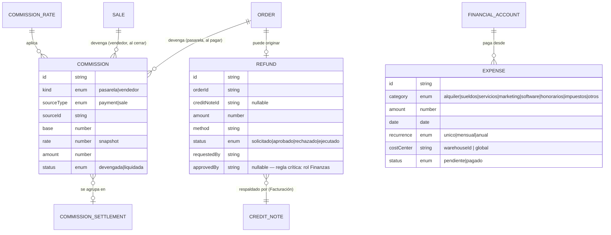
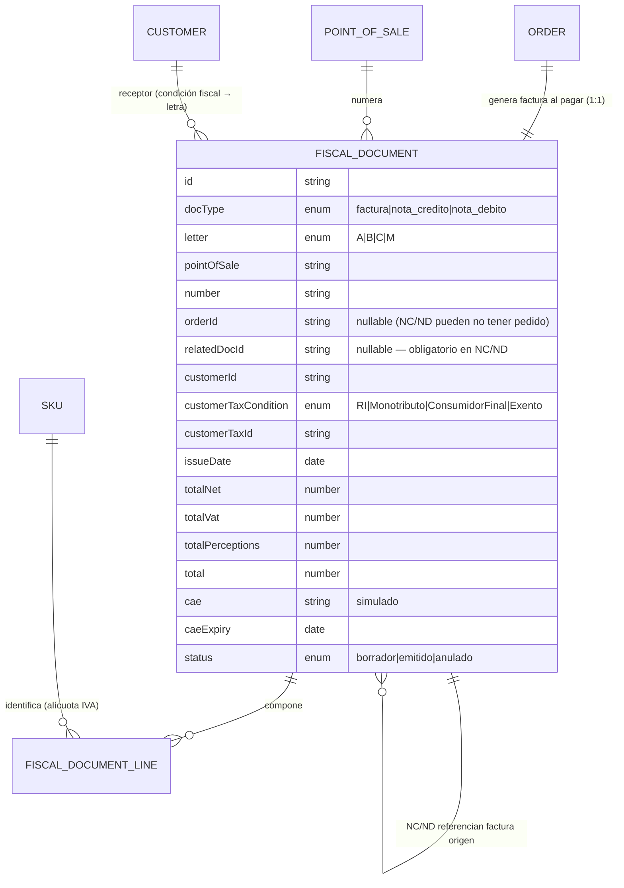
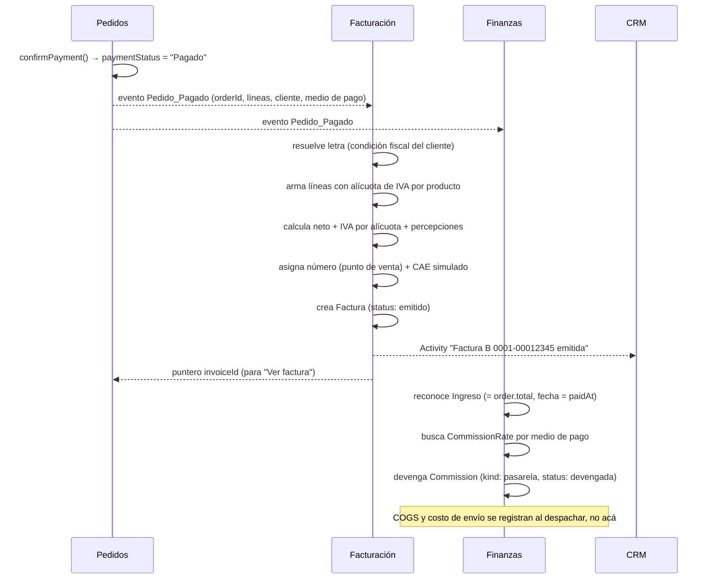
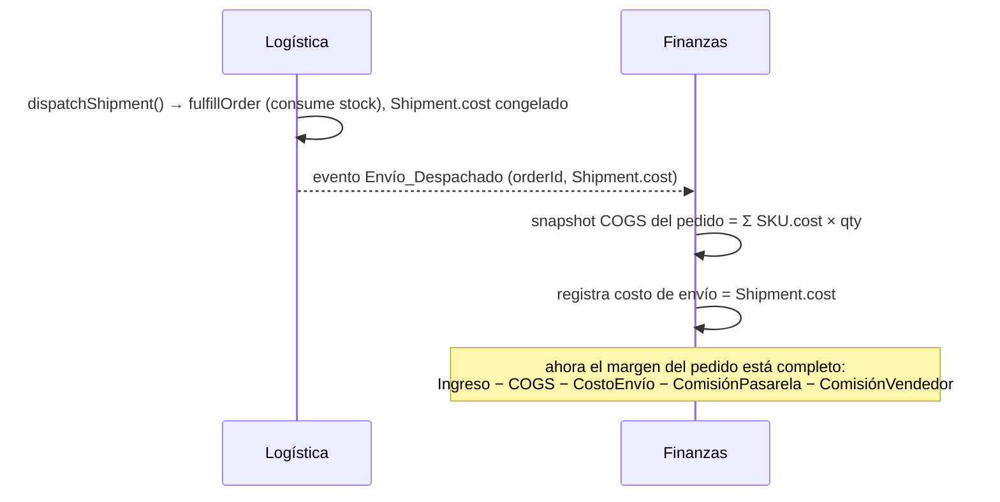
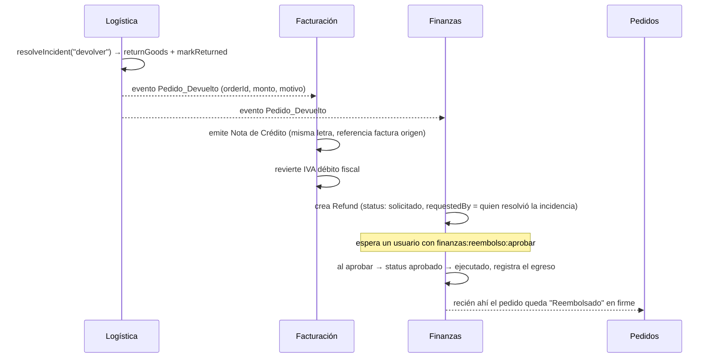
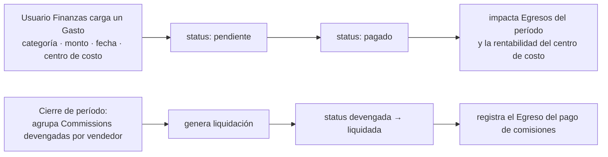

# Módulo Finanzas & Facturación — Modelo Funcional

> **Consultar junto con [`ARCHITECTURE.md`](../ARCHITECTURE.md)** (§1.4 ya anticipa `Pedido_Pagado`
> disparando un *Ingreso* en Finanzas; §2 nombra la **Capa Financiera** = Finanzas (Caja,
> Rentabilidad) + Facturación (Fiscal); §3 nombra el **Comprobante Fiscal**; §4 define el rol
> **Finanzas** y la regla crítica *"CX solicita el reembolso, Depósito recibe el producto, Finanzas
> aprueba el movimiento de dinero"*) y las specs de
> [`MODULO-LOGISTICA-FULFILLMENT.md`](MODULO-LOGISTICA-FULFILLMENT.md) (§5.4 ya dejó ganchos de solo
> lectura para este módulo: `getShipmentCost(orderId)`, "una devolución con reembolso es una nota de
> crédito"), [`MODULO-INVENTARIO-ABASTECIMIENTO.md`](MODULO-INVENTARIO-ABASTECIMIENTO.md) (COGS sale
> de `SKU.cost`; los egresos de compra salen de las Órdenes de Compra recibidas) y
> [`MODULO-CRM.md`](MODULO-CRM.md) (mismo criterio: *lee y deriva* las transacciones, no las posee).
>
> **Decisiones tomadas (2026-09-07, por AskUserQuestion — todas la opción recomendada):**
> 1. **Finanzas = capa de derivación + entidades propias acotadas.** Lee Pedidos / Compras /
>    Logística / Inventario y **calcula** ingresos, COGS, costo de envío y rentabilidad. Sólo **posee**
>    Gastos operativos, Comisiones (config + devengado) y Reembolsos/ajustes. **Sin libro de partida
>    doble.**
> 2. **Facturación = modelo AFIP/ARCA simulado, sin integración real.** Tipos A/B/C/M, punto de venta,
>    CAE simulado, condición de IVA del cliente, alícuotas reales (21 % / 10,5 % / 27 % / exento),
>    percepciones. NC y ND referencian el comprobante origen.
> 3. **Comisiones = pasarela + vendedores.** Fee de pasarela/marketplace = egreso automático por pago.
>    Comisión de vendedor = pasivo calculado por venta cerrada, se liquida aparte.
> 4. **1 Pedido = 1 Factura, emitida automáticamente al confirmarse el pago.** Devolución total → NC
>    total; parcial → NC parcial.
>
> **Estado (2026-09-07): la capa financiera está COMPLETA — modelo funcional, UX y las 3 fases de
> implementación.**
> - **F1** `src/modules/facturacion/` — Comprobantes, Detalle e Impuestos (Libro IVA + config).
>   Facturas y NC se materializan solas desde los pedidos pagados/devueltos; NC/ND manuales por modal.
> - **F2** `src/modules/finanzas/` — **Resumen** (`/finanzas`: cascada de P&L + flujo de fondos +
>   alertas + widgets) y **Rentabilidad** (6 cortes + drawer `MarginBreakdown`). Todo derivado.
> - **F3** `src/modules/finanzas/` — **Gastos** (`/finanzas/gastos`: ABM), **Comisiones**
>   (`/finanzas/comisiones`: tarifas editables de pasarela + vendedor, devengado, liquidación),
>   **Reembolsos** (`/finanzas/reembolsos`: cola de aprobación). Cierra el gate: `markReturned` en
>   `pedidosApi` se dividió en `markReturnRequested` (Logística) + `confirmRefund`/`rejectRefund`
>   (Finanzas) — un pedido devuelto queda **"Reembolso pendiente"** hasta que Finanzas aprueba.
>   Los gastos operativos y la comisión de vendedor ahora entran al P&L de F2.
>
> Campos nuevos agregados: `Account.taxCondition` (CRM), `SKU.taxRate` (catálogo), `order.returnedAt`
> + estado `"Reembolso pendiente"` (Pedidos). Verificado en el navegador (lint + build limpios,
> ambos temas), incluida la devolución de punta a punta Logística → cola de reembolsos → aprobación
> → pedido "Reembolsado".

---

## 1. Objetivo y alcance

La capa financiera responde dos preguntas distintas que **no deben mezclarse**:

- **Finanzas** → *"¿la operación gana plata, y dónde está la plata?"* — reconocimiento de ingresos y
  egresos, costos, rentabilidad, caja, comisiones, gastos y reembolsos.
- **Facturación** → *"¿qué documento legal respalda cada transacción, y cuánto impuesto se
  devengó?"* — comprobantes fiscales (facturas, notas de crédito/débito), numeración, CAE, IVA.

Son módulos separados a propósito (§4). Comparten datos pero tienen dueños, momentos y reglas
propias: **facturar no es cobrar, y una nota de crédito no es un reembolso.**

### 1.1 Qué NO es este módulo

- **No es un sistema contable.** No hay plan de cuentas, asientos de partida doble, balance ni estado
  de resultados formal. Finanzas produce un P&L de gestión (derivado), no contabilidad.
- **No vende, no cobra, no ajusta stock ni precios.** Lee lo que Pedidos / Ventas / Inventario /
  Logística ya decidieron. Sus únicas entidades de escritura son Gasto, Comisión, Reembolso y Ajuste.
- **No se integra con AFIP.** El comprobante fiscal es un modelo fiel pero simulado (CAE mock), igual
  que el tracking de Logística es simulado.

### 1.2 Alcance MVP vs. futuro

| Entra ahora | Queda fuera por ahora |
|---|---|
| Ingresos / Egresos / Costos **derivados** + P&L por pedido y roll-ups | Contabilidad de partida doble, plan de cuentas, balance |
| Gastos operativos (ABM propio) | Presupuesto / forecast financiero |
| Comisiones: tarifas de pasarela + esquema por vendedor + devengado + liquidación | Retenciones sufridas, SICORE, regímenes de información |
| Reembolsos con flujo de aprobación de Finanzas | Cuenta corriente, factura a 30 días, cobranzas parciales, anticipos |
| Rentabilidad por pedido / producto / canal / cliente / período / sucursal | LTV/margen predictivo (ML) |
| Facturación AFIP simulada: Factura A/B/C/M, NC, ND, CAE mock, punto de venta | Integración real AFIP (WSFE), controlador/impresión fiscal |
| Impuestos: IVA por alícuota, percepciones básicas, Libro IVA Ventas | Multi-moneda real, diferencias de cambio |
| Condición fiscal del cliente (campo nuevo en CRM) + alícuota IVA por producto (campo nuevo en catálogo) | Facturación recurrente / suscripciones |
| Eventos hacia CRM (`Activity`) y ganchos de Pedidos / Logística | Conciliación bancaria automática (matching de extractos) |

---

## 2. Finanzas — modelo de dominio

### 2.1 Datos **derivados** (los lee de otros módulos, no los posee)

| Concepto | Se deriva de | Regla de reconocimiento |
|---|---|---|
| **Ingresos** | Pedidos pagados (`total`, `paidAt`) + ventas B2B cerradas | **Al cobro** (`paidAt`) — no a la creación del pedido ni a la emisión de la factura |
| **Costos (COGS)** | `SKU.cost` (espejo de catálogo) × `qty` de las líneas del pedido | **Snapshot al despachar** el pedido — no se recalcula si el costo del catálogo cambia después |
| **Costo de envío** | `Shipment.cost` de Logística (ya congelado al despachar, expuesto por `getShipmentCost(orderId)`) | El real de Logística, **no** el `shipping` que se le cobró al cliente |
| **Egresos de compra** | Órdenes de Compra recibidas (`unitCost × qtyReceived`) de Abastecimiento | A la recepción |
| **Pagos (cobros)** | Registro de pago del Pedido (`paymentMethod`, `paymentRef`, `paidAt`) | El registro sigue viviendo en Pedidos; Finanzas lo **agrega** en la vista de caja |
| **Pagos (egresos a proveedor)** | Pagos de Compras | Ídem |
| **Rentabilidad** | Todo lo anterior | **100 % calculada, nunca persistida** (se puede snapshotear para reportes históricos, no editar) |

### 2.2 Entidades **propias** (Finanzas es el dueño)

| Entidad | Descripción | Notas |
|---|---|---|
| **Gasto operativo** (`Expense`) | Costo que **no** viene de una transacción comercial: alquiler, sueldos, servicios, marketing spend, software, honorarios. | `category`, `amount`, `date`, `recurrence` (único/mensual/anual), `costCenter` (sucursal \| global), `accountId`, `status` (pendiente/pagado). Es dato genuinamente nuevo. |
| **Tarifa de comisión** (`CommissionRate`) | Configuración. Fee de pasarela por medio de pago (ej. MercadoPago 4,99 % + IVA; transferencia 0 %) **o** esquema por vendedor (% sobre venta o sobre margen). | `kind` (pasarela \| vendedor), `key` (medio de pago \| `sellerId`), `percent`, `fixed`, `appliesOn` (venta \| margen), `taxOnFee`. |
| **Comisión devengada** (`Commission`) | El monto de comisión generado por un pago (pasarela) o por una venta cerrada (vendedor). | `kind`, `sourceType`/`sourceId`, `base`, `rate` (snapshot), `amount`, `status` (devengada \| liquidada), `settlementId`. |
| **Reembolso** (`Refund`) | El **lado dinero** de una devolución. | `orderId`, `creditNoteId?`, `reason`, `amount`, `method`, `status` (solicitado → aprobado → ejecutado \| rechazado), `requestedBy`, `approvedBy`, timestamps. |
| **Ajuste financiero** (`FinancialAdjustment`) | Correcciones manuales: conciliación, incobrable, descuento post-venta, nota interna. Cajón de lo que no encaja. | `type`, `refType`/`refId?`, `amount` (+/−), `note`, `createdBy`, `date`. |
| **Cuenta financiera** (`FinancialAccount`) | Etiqueta liviana de "dónde entró/salió la plata": caja, banco, pasarela. **No** es un libro con saldo persistido; el saldo es derivado. | `name`, `kind` (caja \| banco \| pasarela), `currency`. |

> **Movimiento de caja / flujo de fondos** es una **vista derivada**, no una entidad almacenada: la
> unión con signo de todos los cobros de pedidos + pagos a proveedores + gastos + liquidaciones de
> comisiones + reembolsos + pago de IVA. Promoverlo a un libro *single-entry* persistido es la
> mejora de una fase futura (sigue sin ser partida doble).

### 2.3 Rentabilidad — la fórmula

Unidad atómica = **el Pedido**. Para un pedido entregado:

```
Margen de contribución del pedido =
      Ingreso            (order.total cobrado, neto de IVA para el análisis de margen)
    − COGS               (Σ SKU.cost × qty, snapshot al despachar)
    − Costo de envío real (Shipment.cost de Logística)
    − Comisión de pasarela (CommissionRate del medio de pago, snapshot al pagar)
    − Comisión de vendedor (si el pedido vino de una venta con vendedor asignado)
    ± Ajustes financieros  (descuentos post-venta, incobrables…)
```

- **Margen de envío** = `order.shipping` (lo que se le cobró al cliente) − `Shipment.cost` (lo que
  costó). Puede ser negativo — el modelo lo expone como línea propia.
- **Roll-ups**: el mismo margen por pedido se agrega por **período**, **producto / categoría /
  marca**, **canal** (tienda web / B2B / marketplace), **cliente / segmento RFM** y **sucursal /
  centro de costo**. Los gastos operativos se prorratean o se asignan directo al centro de costo.
- Un pedido **reembolsado** revierte su ingreso y su comisión de pasarela; el COGS puede recuperarse
  o no según el estado de la mercadería devuelta (Logística ya repuso el stock con `returnGoods`).

### 2.4 Relación ER — Finanzas



---

## 3. Facturación — modelo de dominio

### 3.1 Entidades **propias**

| Entidad | Descripción |
|---|---|
| **Comprobante** (`FiscalDocument`) | Entidad base de todo documento fiscal emitido. Subtipos por `docType`. |
| ↳ **Factura** | `docType: factura`, `letter` A/B/C/M. Emitida automáticamente al pagarse el pedido. 1:1 con el Pedido. |
| ↳ **Nota de Crédito** | `docType: nota_credito`. Reversa total o parcial de una factura. **Referencia obligatoria** al comprobante origen. Disparada por devolución / anulación. |
| ↳ **Nota de Débito** | `docType: nota_debito`. Cargo posterior a la factura (intereses por mora, diferencia, gastos). **Referencia obligatoria** al origen. |
| **Línea de comprobante** (`FiscalDocumentLine`) | `skuId?`, `description`, `qty`, `unitNetPrice`, `taxRate`, `lineNet`, `lineVat`. |
| **Punto de venta** (`PointOfSale`) | Numeración independiente por PV (`0001`, `0002`…), opcionalmente atada a una sucursal. Config. |
| **Configuración impositiva** (`TaxConfig`) | Alícuota de IVA por categoría de producto (con override por SKU), padrón de percepción por jurisdicción, y el mapeo condición fiscal → letra de comprobante. |

### 3.2 La letra del comprobante

Emisor asumido **Responsable Inscripto** (CheCAT). La letra la determina la **condición frente al
IVA del cliente** (dato que se le pide al CRM — ver §7.3):

| Cliente | Comprobante | IVA |
|---|---|---|
| Responsable Inscripto | **A** | Discriminado (neto + IVA por alícuota) |
| Monotributista / Consumidor Final / Exento | **B** | Incluido en el precio (no se discrimina) |
| (emisor Monotributo, a futuro) | **C** | Sin discriminar |
| Cliente del exterior (exportación, a futuro) | **E** | — |

Sin condición fiscal cargada → **Factura B** (consumidor final) por defecto.

### 3.3 Impuestos

"Impuestos" no es una pantalla de ABM sino **la descomposición impositiva de cada comprobante** más
su configuración:

- **IVA débito fiscal** por alícuota: 21 % (general), 10,5 % (algunos alimentos, ciertos servicios),
  27 % (servicios públicos), exento, no gravado. Cada línea lleva su alícuota (del producto).
- **Percepciones**: IIBB por jurisdicción, IVA percepción (según padrón simulado). Se calculan sobre
  el neto y se suman al total del comprobante.
- **Retenciones**: sufridas por CheCAT en cobros B2B (futuro) / practicadas a proveedores (futuro).
- **Libro IVA Ventas** = vista agregada del período: Σ neto y Σ IVA débito por alícuota, menos las
  NC. El **pago de la posición de IVA** (débito − crédito de compras) es un **Egreso** en Finanzas —
  ejemplo perfecto de la frontera §4: Facturación *devenga* el impuesto, Finanzas *lo paga*.

### 3.4 Relación ER — Facturación



---

## 4. La frontera Finanzas ↔ Facturación

El usuario pidió explícitamente mantenerlos separados. La regla es:

| | **Facturación** | **Finanzas** |
|---|---|---|
| Pregunta que responde | ¿Qué documento legal respalda esto? | ¿Dónde está la plata y ganamos? |
| Entidad central | `FiscalDocument` (Factura / NC / ND) | (derivado) P&L + `Expense` / `Commission` / `Refund` |
| Momento del registro | Factura: al confirmarse el pago · NC: al aprobarse la devolución | Ingreso: al cobro · Egreso: al pagar · Comisión: al devengar |
| Una **Factura**… | …es un documento fiscal con CAE y numeración | …**no** es un cobro. El cobro es el Pago (vive en Pedidos). |
| Una **Nota de Crédito**… | …es el documento que revierte el IVA débito | …**no** es un reembolso. El reembolso es el movimiento de dinero (`Refund`). |
| Los **Impuestos**… | …se **devengan** en el comprobante (IVA débito, percepciones) | …se **pagan** como un egreso (posición de IVA a pagar) |
| Dueño de la numeración / CAE | **Sí** | No |
| Dueño de la rentabilidad | No | **Sí** (calculada) |
| Dueño del reembolso | No (sólo emite la NC) | **Sí** (registra y **aprueba** el movimiento) |

**Regla de oro:** *Facturar ≠ Cobrar. Nota de Crédito ≠ Reembolsar.* En el MVP ("factura al pagar")
suelen ocurrir juntos, pero el modelo los mantiene como **eventos separados** para no volver a
acoplarlos cuando aparezcan factura B2B a 30 días (factura sin cobro) o anticipos (cobro sin
factura).

---

## 5. Flujos de negocio

### 5.1 Pedido pagado → Factura + Ingreso + Comisión de pasarela



### 5.2 Pedido despachado → COGS + costo de envío (rentabilidad completa)



### 5.3 Devolución → Nota de Crédito + Reembolso (con aprobación de Finanzas)



> **Cambio respecto de hoy:** `markReturned` en `pedidosApi.js` marca "Reembolsado" de inmediato.
> El modelo funcional inserta el **gate de aprobación de Finanzas** (regla crítica `ARCHITECTURE.md`
> §4). En implementación, `markReturned` pasaría a dejar el pedido en "Reembolso pendiente" y
> Finanzas lo confirma.

### 5.4 Gasto operativo (100 % manual) y liquidación de comisiones



---

## 6. Reglas de negocio (resumen normativo)

1. **Facturar ≠ Cobrar; Nota de Crédito ≠ Reembolsar.** Son eventos separados aunque en el MVP
   ocurran casi juntos.
2. Toda Factura se emite **automáticamente al confirmarse el pago** del Pedido. Relación **1 Pedido =
   1 Factura**.
3. La letra del comprobante la determina la **condición frente al IVA del cliente** (emisor asumido
   Responsable Inscripto). Sin condición cargada → Factura B.
4. Toda **Nota de Crédito y Nota de Débito referencia obligatoriamente** un comprobante origen. No
   existe NC/ND "suelta".
5. La suma de las NC sobre una factura **nunca supera** el total facturado.
6. El **reconocimiento de Ingreso es al cobro** (`paidAt`) — no a la creación del pedido ni a la
   emisión de la factura.
7. El **COGS se congela al despachar** el pedido (snapshot de `SKU.cost`), no se recalcula si el
   costo del catálogo cambia — mismo criterio de "snapshot" que la tarifa de Logística y el costo de
   una Recepción.
8. El costo de envío que entra a la rentabilidad es el **real de Logística** (`Shipment.cost`), no el
   `shipping` cobrado al cliente. La diferencia es el **margen de envío** y puede ser negativa.
9. La **comisión de pasarela** se devenga por cada Pago, con la tasa **vigente al momento del pago**
   (snapshot).
10. La **comisión de vendedor** se devenga cuando el pedido asociado queda cerrado y se **liquida en
    un pago aparte** — nunca se descuenta del cobro del pedido.
11. **Un Reembolso lo solicita quien gestiona la devolución (CX / Logística) y lo aprueba un usuario
    de Finanzas** (regla crítica `ARCHITECTURE.md` §4). El Pedido/Cliente no pasa a "Reembolsado" en
    firme hasta la aprobación.
12. Finanzas **nunca** modifica precios, catálogo, stock ni el estado físico de un envío — sólo lee.
    Sus únicas entidades de escritura son `Expense`, `Commission` (config + devengado), `Refund` y
    `FinancialAdjustment`.
13. **Rentabilidad es siempre un cálculo derivado**, nunca un dato persistido editable. Se puede
    snapshotear para reportes históricos, no editar.
14. Todo comprobante emitido obtiene un **CAE simulado con vencimiento**. Un comprobante sin CAE está
    en borrador y no cuenta para el Libro IVA.
15. El **pago de la posición de IVA** (débito − crédito) es un Egreso de Finanzas, no un evento de
    Facturación — Facturación sólo lo devenga.
16. **Regla dura de capa de datos** (igual que los demás módulos): la UI habla exclusivamente con
    `financeApi` / `billingApi`. Nunca importa `data/*.mock.js` directo. Migrar a backend Laravel =
    reescribir sólo esas carpetas `api/`.

---

## 7. Relación con otros módulos

### 7.1 Pedidos — la fuente principal (bidireccional, acoplamiento por evento)

- **Lee:** `total`, `subtotal`, `tax`, `shipping`, líneas (`skuId`, `qty`, `unitPrice`),
  `paymentStatus`, `paidAt`, `paymentMethod`, `paymentRef`, `customerEmail`, `warehouseId`,
  `fulfillmentStatus`, `refundedAt`.
- **Frontera exacta:** `Pedido_Pagado` → Facturación emite la Factura + Finanzas reconoce el Ingreso
  y devenga la comisión de pasarela. `Pedido_Despachado` (de Logística) → Finanzas snapshotea COGS y
  costo de envío. `Pedido_Devuelto` → Facturación emite NC + Finanzas abre el Refund.
- **Escribe de vuelta:** sólo un puntero `invoiceId` en el pedido (para el link "Ver factura", mismo
  patrón que "Ver envío"). Y el flujo de `markReturned` pasa a requerir la aprobación de Finanzas.
- **Discrepancia a resolver:** hoy Pedidos cobra `shipping: 3500` fijo y `tax: subtotal × 0,21`
  plano. El `tax`/`shipping` de Pedidos es una **estimación de UI**; la cifra fiscal la calcula
  Facturación (IVA por alícuota real de cada línea) y la financiera la calcula Finanzas (envío real
  de Logística). El modelo explicita que esas dos cifras "de verdad" viven acá, no en Pedidos.

### 7.2 Ventas — canal y comisión de vendedor

- **Lee:** cotizaciones aceptadas / ventas B2B cerradas, vendedor asignado, canal.
- **Frontera:** una venta B2B cerrada que se convierte en Pedido sigue el flujo de Pedidos. La
  **comisión de vendedor** se devenga cuando ese pedido queda cerrado. Finanzas expone la
  liquidación; Ventas muestra el avance vs. objetivo (hoy con datos mock — se conecta a datos reales).
- **Deriva:** rentabilidad **por canal** y **por vendedor** (margen real, no sólo volumen de venta —
  hoy "Rendimiento vendedores" sólo mira `sales` vs `target`).

### 7.3 Clientes (CRM) — identidad fiscal y timeline

- **Lee:** identidad, `taxId` y `legalName` (ya existen en `Account`), dirección de facturación
  (`isDefaultBilling`, ya existe), y **condición frente al IVA** — campo nuevo `taxCondition` a
  agregar al `Account` (RI / Monotributo / ConsumidorFinal / Exento), mismo patrón que `weightKg` se
  agregó al SKU para Logística.
- **Escribe de vuelta (eventos):** cada Factura / NC / Reembolso es una `Activity` en el timeline de
  la cuenta — mismo patrón que Pedidos/Ventas ya usan.
- **Deriva:** rentabilidad **por cliente** y **por segmento RFM**. La "cuenta corriente" (facturado −
  cobrado) queda para el futuro; con factura-al-pagar el saldo es siempre 0.

### 7.4 Productos (Catálogo) — costo y alícuota

- **Lee:** `SKU.cost` (para COGS — ya existe en el espejo `skus.mock.js`, hoy lo usa Inventario) y la
  **alícuota de IVA** por producto/categoría — campo nuevo `taxRate` en el espejo de catálogo, mismo
  patrón que `cost` y `weightKg` (se reemplaza por lectura real cuando Productos tenga su `api/`).
- **Deriva:** rentabilidad **por producto / categoría / marca** — margen unitario (precio − costo),
  margen %, contribución al margen total. Insight muy pedido: *"¿qué productos me dan plata?"*.
- **No escribe nada** en el catálogo (regla `ARCHITECTURE.md` §4: Finanzas no toca precios).

### 7.5 Logística — costo de envío y logística inversa

- **Lee:** `Shipment.cost` (real, congelado al despachar — ya expuesto como `getShipmentCost(orderId)`
  en `logisticaApi.js`), zona, transportista.
- **Frontera:** el costo real de envío entra como línea de costo en la rentabilidad del pedido; la
  diferencia con `order.shipping` es el margen de envío.
- **Devoluciones:** cuando Logística resuelve una incidencia como "Devolver" (ya implementado:
  `returnGoods` + `markReturned` + evento de tracking), además dispara el evento que Finanzas toma
  para abrir el `Refund` y Facturación para la NC — el eslabón del **Refund con aprobación** es lo
  que este módulo agrega.
- **Fuera de alcance:** costo de la logística inversa (el envío de vuelta de una devolución).

### 7.6 Mapa de eventos (arquitectura orientada a eventos — `ARCHITECTURE.md` §1.4)

| Evento (emisor) | Facturación hace | Finanzas hace |
|---|---|---|
| `Pedido_Pagado` (Pedidos) | Emite Factura + CAE | Reconoce Ingreso + devenga comisión de pasarela |
| `Envío_Despachado` (Logística) | — | Snapshot COGS + costo de envío |
| `Pedido_Entregado` (Logística) | — | Devenga comisión de vendedor (si aplica) |
| `Pedido_Devuelto` (Logística/Pedidos) | Emite Nota de Crédito | Abre `Refund` (pendiente de aprobación) |
| `Pedido_Cancelado` (Pedidos, pre-pago) | — (no hubo factura) | — (no hubo ingreso) |
| `Compra_Recibida` (Abastecimiento) | — | Registra Egreso de compra + IVA crédito |
| `Gasto_Cargado` (Finanzas, manual) | — | Egreso del período |

---

## 8. Mapa de las sub-áreas pedidas → dónde viven

### Finanzas

| Sub-área | Dónde vive |
|---|---|
| **Ingresos** | Derivado de Pedidos pagados + ventas cerradas. Reconocimiento al cobro. |
| **Egresos** | Derivado: Compras recibidas + costo de envío de Logística + Gastos operativos + Comisiones + pago de IVA. |
| **Costos** | COGS: Σ `SKU.cost × qty` de pedidos despachados. Derivado (Catálogo + Pedidos), snapshot al despachar. |
| **Pagos** | Cobros (de Pedidos) + pagos a proveedores (de Compras) + liquidaciones (comisiones, IVA). Finanzas **agrega**; el registro del pago del pedido sigue en Pedidos. Vista "flujo de fondos" derivada. |
| **Comisiones** | **Entidad propia.** `CommissionRate` (pasarela + vendedor) + `Commission` devengada + liquidación. |
| **Gastos** | **Entidad propia** (`Expense`). Costos operativos no transaccionales, con centro de costo y recurrencia. |
| **Rentabilidad** | **100 % calculada, no persistida.** P&L por pedido → roll-up por período / producto / canal / cliente / sucursal. |
| **Reembolsos** | **Entidad propia** (`Refund`). Lado dinero de una devolución: solicitado → aprobado (Finanzas) → ejecutado. |

### Facturación

| Sub-área | Dónde vive |
|---|---|
| **Comprobantes** | Entidad base `FiscalDocument` — todo documento fiscal emitido. |
| **Facturas** | `docType: factura` (A/B/C/M). Emitida al pagarse el pedido. 1:1 con el Pedido. |
| **Notas de crédito** | `docType: nota_credito`. Reversa total/parcial. Referencia obligatoria a la factura origen. |
| **Notas de débito** | `docType: nota_debito`. Cargo posterior (mora, ajuste). Referencia obligatoria al origen. |
| **Impuestos** | Descomposición impositiva de cada comprobante (IVA débito por alícuota, percepciones) + configuración (alícuota por producto, padrón por jurisdicción, condición por cliente) + **Libro IVA Ventas** (vista agregada). El pago de la posición de IVA es un Egreso en Finanzas. |

---

## 9. UX — pantallas

Mismo patrón visual que los demás módulos (`ARCHITECTURE.md` §5): `PageHeader` + fila de `StatCard` +
`DataTable` con `toolbar`, estilo "premium sobrio", un solo acento, sin librería de charts (los
gráficos se resuelven con listas + barras CSS, mismo criterio que los mocks "prolijos" del resto).

**El control global persistente de Finanzas es el `período`** (mes actual / mes anterior / trimestre
/ rango) — lo que un responsable financiero cambia todo el tiempo, igual que el operador de depósito
vive filtrando por estado del pipeline en Logística. Va en la query string para poder compartir el
link. Facturación no tiene un control global único; filtra por tipo y por punto de venta.

Todo en estos dos módulos es **la misma transacción vista desde ángulos distintos** — por eso cada
pantalla cruza links: Pedido ↔ Factura ↔ Envío ↔ Comisión ↔ Reembolso ↔ Nota de Crédito.

### 9.1 Finanzas · Resumen (`/finanzas`)

- **Qué es:** la mesa de decisión. Responde de un vistazo *"¿este período ganamos plata y dónde
  está?"*.
- **KPIs (`StatCard`, con delta vs. período anterior):** Ingresos, Egresos, Margen de contribución
  (%), Resultado neto (margen − gastos operativos).
- **P&L en cascada** (`PnlWaterfall`): Ingresos → −COGS → **Margen bruto** → −costo de envío real →
  −comisiones → **Margen de contribución** → −gastos operativos → **Resultado**. Lista vertical con
  subtotal corriente y una barra CSS de % sobre ingresos por línea. Cada línea enlaza a su detalle
  (COGS → rentabilidad por producto, envío → Logística, etc.).
- **Flujo de fondos** (tarjeta de desglose): entradas (cobros) vs. salidas (pagos a proveedores,
  gastos, liquidación de comisiones, reembolsos, pago de IVA), saldo del período. Vista derivada, no
  un libro.
- **Widgets** (mini, con link a `/finanzas/rentabilidad`): "Rentabilidad por canal" y "Top 5
  productos por contribución al margen" (barras CSS).
- **Alertas** (banda superior si hay algo): *N reembolsos pendientes de tu aprobación*, *gastos
  vencidos*, *posición de IVA a pagar antes del DD/MM*.

### 9.2 Finanzas · Rentabilidad (`/finanzas/rentabilidad`)

- **Qué es:** el explorador del P&L. Todo calculado en vivo, nada editable — mismo espíritu que
  Reposición en Abastecimiento.
- **Corte** (segmented control): `Por pedido · Por producto · Por categoría · Por canal · Por
  cliente · Por sucursal`. La `DataTable` cambia de columnas según el corte:
  - **Por pedido:** Pedido/Factura (links), Cliente, Fecha, Ingreso neto, COGS, Envío real,
    Comisiones, **Margen $**, **Margen %**. Fila → drawer `MarginBreakdown`.
  - **Por producto:** Producto/SKU, Unidades, Ingreso, COGS, Margen unitario, Margen $, Margen %,
    Contribución al margen total %.
  - **Por canal / cliente / sucursal:** dimensión, Ingreso, Margen $, Margen %, Nº pedidos, Ticket
    promedio.
- **`MarginBreakdown`** (drawer al click en una fila "por pedido"): la cascada de ese pedido —
  Ingreso − COGS − envío − comisión de pasarela − comisión de vendedor = Margen — con cada línea
  trazable (link a la factura, al envío, a la comisión devengada).
- **Toolbar:** filtros (rango de margen, canal, sucursal) + **Exportar** (permiso `exportar`
  aislado, `ARCHITECTURE.md` §4).

### 9.3 Finanzas · Gastos (`/finanzas/gastos`)

- **Qué es:** ABM de gastos operativos — el único dato de Finanzas que se carga a mano.
- **KPIs:** Total del período, Recurrentes activos, Pendientes de pago, Centro de costo con más
  gasto.
- **Tabs:** `Todos · Pendientes · Pagados · Recurrentes`.
- **Columnas:** Concepto, Categoría, Centro de costo (sucursal \| global), Monto, Fecha, Recurrencia
  (badge), Estado (`StatusBadge` pendiente/pagado), acción ⋮ (marcar pagado / editar / eliminar).
- **Modal alta/edición:** categoría (select), descripción, monto, fecha, recurrencia
  (único/mensual/anual), centro de costo (select), cuenta (caja/banco), adjunto (`FileUploader`,
  opcional).

### 9.4 Finanzas · Comisiones (`/finanzas/comisiones`)

- **Tabs:** `Devengadas · Liquidaciones · Tarifas`.
- **Devengadas:** `DataTable` de `Commission` — Origen (pago #X / venta #Y, links), Tipo
  (pasarela/vendedor badge), Base, Tasa, Monto, Estado (devengada/liquidada), Período. Filtros por
  vendedor / medio de pago / estado.
- **Liquidaciones:** agrupado por vendedor y período — Vendedor, Nº comisiones, Total devengado,
  Estado, acción **"Liquidar"** (genera el egreso y marca las comisiones como liquidadas — el "pago
  aparte" de la regla §6.10).
- **Tarifas** (config): tabla de **pasarela** (medio de pago → % + fijo + IVA sobre el fee) y tabla
  de **vendedores** (vendedor → % + aplica sobre venta \| margen). Edición inline / modal.
- **KPIs:** Devengado del período, Pendiente de liquidar, Comisión de pasarela del período, %
  promedio de comisión sobre ventas.

### 9.5 Finanzas · Reembolsos (`/finanzas/reembolsos`)

- **Qué es:** la cola de aprobación. Hace visible el *"CX solicita → Finanzas aprueba"* de
  `ARCHITECTURE.md` §4.
- **Tabs:** `Pendientes · Aprobados · Ejecutados · Rechazados` (default: Pendientes = la cola de
  trabajo).
- **KPIs:** Pendientes de aprobación ($ y #), Aprobados sin ejecutar, Reembolsado en el período,
  Tiempo promedio de aprobación.
- **Columnas:** Pedido/Factura (links), Cliente, Motivo, Monto, Solicitado por, Fecha de solicitud,
  NC asociada (link a Facturación), Estado, acción.
- **`RefundApprovalModal`** (al click en una fila pendiente): resumen del pedido + la Nota de Crédito
  + monto + motivo + quién lo solicitó. Acciones: **"Aprobar reembolso"** (primary) — pide el medio
  (mismo medio de pago original / transferencia / nota de crédito a favor) y al confirmar deja el
  pedido en "Reembolsado" en firme — o **"Rechazar"** (danger, con nota). Banda de advertencia:
  *"Esto ejecuta el movimiento de dinero."*

### 9.6 Facturación · Comprobantes (`/facturacion`)

- **Qué es:** todo comprobante fiscal emitido. **No hay botón "Nueva factura"** — la factura la
  emite el evento `Pedido_Pagado`. Sí hay **"Emitir NC / ND"** (secundario).
- **KPIs:** Facturado del período (neto), IVA débito del período, Notas de crédito del período,
  Comprobantes emitidos (#).
- **Tabs:** `Todos · Facturas · Notas de crédito · Notas de débito · Borradores`.
- **Columnas:** Comprobante (`FC A 0001-00012345`), Cliente (+ badge de condición IVA), Fecha, Neto,
  IVA, Total, CAE (✓ / pendiente), Estado (emitido/anulado). Fila → detalle.
- **Filtros:** tipo, letra, punto de venta, rango de fecha, cliente.

### 9.7 Facturación · Detalle de comprobante (`/facturacion/:id`)

Layout **estilo documento** + sidebar de contexto.

- **Header:** tipo + letra + `PV-número`, estado, **CAE + vencimiento**, botones "Descargar PDF"
  (mock), "Anular" (sólo facturas, permiso restringido) o "Emitir NC" (atajo).
- **Cuerpo (`FiscalDocumentView`):** emisor (CheCAT — CUIT, condición, IIBB, inicio de actividades),
  receptor (cliente — CUIT, condición, domicilio fiscal), fecha, líneas (descripción, cantidad,
  precio unitario neto, alícuota, subtotal), y `TaxBreakdown` (neto e IVA por alícuota, percepciones,
  total).
- **Referencias:** si es NC/ND → link al comprobante origen. Si es factura → links a Pedido origen,
  a las NC/ND que la referencian, y a "Ver envío".
- **Sidebar:** timeline del comprobante (emitido → CAE obtenido → NC emitida…), datos del pedido,
  link al reembolso si corresponde.

### 9.8 Facturación · Emisión de NC / ND (`/facturacion/nueva`, o modal desde §9.6)

- **Paso 1:** elegir el comprobante origen (buscador de facturas).
- **Paso 2:** tipo (NC / ND) y alcance (total \| parcial — si parcial, elegir líneas / montos).
- **Paso 3:** motivo + preview del `TaxBreakdown` a revertir (NC) o agregar (ND).
- **Emitir** → obtiene CAE simulado y aparece en el listado. Una NC nunca deja la factura origen en
  negativo (regla §6.5).

### 9.9 Facturación · Impuestos (`/facturacion/impuestos`)

- **Tab "Libro IVA Ventas":** selector de período + `DataTable` con columnas fiscales (fecha, tipo,
  cliente, CUIT, neto gravado por alícuota, IVA, percepciones, total), fila de totales, **Exportar**
  (permiso aislado). Es la vista agregada de §3.3.
- **Tab "Configuración":** alícuota de IVA por categoría de producto (+ override por SKU), puntos de
  venta, percepciones por jurisdicción (provincia → % IIBB), y datos del emisor.

---

## 10. Arquitectura de información / rutas

| Ruta | Pantalla | Permiso sugerido |
|---|---|---|
| `/finanzas` | Resumen — P&L del período + flujo de fondos | `finanzas:rentabilidad:ver @ global\|sucursal` |
| `/finanzas/rentabilidad` | Rentabilidad por pedido / producto / canal / cliente / sucursal | `finanzas:rentabilidad:ver` |
| `/finanzas/gastos` | ABM de gastos operativos | `finanzas:gasto:gestionar @ sucursal` |
| `/finanzas/comisiones` | Devengadas + Liquidaciones + Tarifas | `finanzas:comision:gestionar @ global` · `finanzas:comision:liquidar @ global` |
| `/finanzas/reembolsos` | Cola de reembolsos con aprobación | `finanzas:reembolso:aprobar @ global` **(aislado)** |
| `/facturacion` | Listado de comprobantes | `facturacion:comprobante:ver @ sucursal` |
| `/facturacion/:id` | Detalle de comprobante (líneas, impuestos, CAE) | `facturacion:comprobante:ver` |
| `/facturacion/nueva` | Emisión manual de NC / ND (la factura es automática) | `facturacion:comprobante:emitir @ sucursal` |
| `/facturacion/impuestos` | Libro IVA Ventas + configuración impositiva | `facturacion:impuesto:configurar @ global` |

- **Sidebar:** sección nueva **FINANZAS** con dos ítems y submenú — **Finanzas** (Resumen /
  Rentabilidad / Gastos / Comisiones / Reembolsos) y **Facturación** (Comprobantes / Impuestos).
  Hoy "Facturación" vive en "GESTIÓN E-COMMERCE" como `disabled` — se mueve a esta sección y se
  activa.

---

## 11. Permisos (RBAC)

Formato `[Módulo]:[Recurso]:[Acción] @ [Alcance]` (`ARCHITECTURE.md` §4). Este módulo **no crea roles
nuevos** — da pantalla al rol **Finanzas** que §4 ya nombraba.

| Permiso | Notas |
|---|---|
| `finanzas:rentabilidad:ver @ global\|sucursal` | Gerencia global; Gerente de Sucursal ve su corte |
| `finanzas:gasto:gestionar @ sucursal` | Cargar/pagar gastos del centro de costo propio |
| `finanzas:comision:gestionar @ global` | Editar tarifas de pasarela y esquemas de vendedor — impactan todos los pedidos futuros |
| `finanzas:comision:liquidar @ global` | Generar la liquidación (mueve dinero) |
| `finanzas:reembolso:aprobar @ global` | **Aislado del resto.** Ejecuta el movimiento de dinero de una devolución — sólo Finanzas / Owner, nunca CX (regla crítica `ARCHITECTURE.md` §4) |
| `facturacion:comprobante:ver @ sucursal\|global` | |
| `facturacion:comprobante:emitir @ sucursal` | Emisión manual de NC / ND (la factura es automática) |
| `facturacion:comprobante:anular @ global` | Más restrictivo — anular una factura ya emitida |
| `facturacion:impuesto:configurar @ global` | Alícuotas, puntos de venta, percepciones, datos del emisor |
| `exportar` | El más restringido del sistema (`ARCHITECTURE.md` §4): Libro IVA, reportes de rentabilidad. "Ver" no implica "Exportar" |

---

## 12. Componentes

**Reutiliza:** `PageHeader`, `DataTable` (+ `toolbar`), `StatCard`, `StatusBadge`, `Modal`, `Button`,
`Tabs`, `FileUploader`, clases globales `.page` / `.entity-card` / `.card-title`.

**Nuevos:**

| Componente | Uso |
|---|---|
| `PeriodPicker` | Selector de período (mes actual / anterior / trimestre / rango). Control global de Finanzas y del Libro IVA; persiste en la query string. |
| `PnlWaterfall` | Cascada de P&L: lista con subtotal corriente y barra CSS de % sobre ingresos. Sin librería de charts. |
| `MarginBreakdown` | Drawer con el desglose del margen de **un** pedido (Ingreso − COGS − envío − comisiones = margen), cada línea con link a su origen. |
| `FiscalDocumentView` | Render "documento" de un comprobante (emisor / receptor / líneas / totales / CAE). Reutilizable para factura / NC / ND y para el "PDF" mock. |
| `TaxBreakdown` | Tabla de neto e IVA por alícuota + percepciones. En el detalle de comprobante y en la preview de emisión de NC/ND. |
| `RefundApprovalModal` | Aprobación de un reembolso: resumen del pedido + NC + monto + acción aprobar/rechazar + medio del reembolso. |
| `CommissionRateTable` | Editor de tarifas (pasarela y vendedores). |
| `ConditionBadge` | Badge de condición frente al IVA del cliente (RI / Monotributo / CF / Exento) — se usa en listados y en el detalle de comprobante. |

---

## 13. Plan de implementación por fases

### Fase 1 — Facturación — IMPLEMENTADA (2026-09-07)

`src/modules/facturacion/`:

- **`data/`** — `documents.mock.js` (5 comprobantes sembrados, coherentes con los pedidos: FC A ABC,
  FC B + NC B Ana, FC B Carlos, FC A Juan; #10253 sigue "Pendiente" → sin factura),
  `fiscalConfig.mock.js` (emisor, puntos de venta, alícuota por categoría, percepciones por
  jurisdicción — configuradas pero inactivas).
- **`lib/`** — `fiscal.js` (`DOC_TYPES` / `DOC_STATUS` / `TAX_CONDITIONS`, `resolveLetter`,
  `formatFullNumber`, `simulateCae` determinístico), `taxes.js` (`buildLines` con línea de "Envío"
  no gravada para que el total cierre con `order.total`, `buildBreakdown` — IVA sobre el neto
  agregado por alícuota), `time.js`.
- **`api/billingApi.js`** — única puerta. `ensureDocsForOrder` materializa la factura de todo pedido
  pagado y la NC de todo pedido devuelto (mismo patrón que `ensureShipment`). `listDocuments`,
  `getDocument`, `getInvoiceForOrder` (para "Ver factura" desde Pedidos), `emitNote` (NC/ND manual,
  total o parcial, valida que la suma de NC ≤ neto de la factura), `voidDocument`, `getVatBook`,
  `getBillingSummary`, getters/setters de configuración. Deps unidireccionales:
  `billingApi → pedidosApi + inventoryApi + clientsApi`, ninguno vuelve.
- **Pantallas** — `Comprobantes.jsx` (listado + KPIs + tabs + botón "Emitir NC/ND"),
  `ComprobanteDetalle.jsx` (layout documento con `FiscalDocumentView` + `TaxBreakdown` + historial +
  acciones), `Impuestos.jsx` (tabs Libro IVA Ventas / Configuración). `EmitirNotaModal.jsx`.
- **Cambios fuera del módulo:** `Account.taxCondition` (CRM `accounts.mock.js`), `SKU.taxRate`
  (`inventario/data/skus.mock.js`), tarjeta "Facturación" en `PedidoDetalle.jsx`, sección **FINANZAS**
  en el sidebar (Facturación activa; Finanzas presente pero deshabilitada hasta F2), rutas en
  `AppRouter.jsx`.

### Fase 2 — Finanzas núcleo — IMPLEMENTADA (2026-09-07)

`src/modules/finanzas/`:

- **`lib/pnl.js`** — cálculos puros: `GATEWAY_RATES` (MercadoPago 4,99 % · Transferencia/Efectivo
  0 % · resto 3,5 %, sólo lectura en F2), `contributionMargin`, `grossMargin`, `marginPct`,
  `addPnl`. `lib/time.js` (`monthKey`, `prevMonthKey`, `monthLabel`, `percent`, `money` con signo).
- **`api/financeApi.js`** — única puerta, todo derivado. `getOrderPnlList` (P&L por pedido, sólo
  ventas concretadas: `Despachado`/`Entregado`/`Devuelto` — un pedido pagado sin despachar tiene
  ingreso reconocido pero COGS todavía no, queda fuera). `getPnlSummary` / `getPnlWaterfall` (la
  cascada Ingresos → −COGS → Margen bruto → −envío → −pasarela → Margen de contribución → −gastos
  [F3] → Resultado). `getProfitabilityBy(dim)` con 6 cortes (pedido / producto / categoría / canal /
  cliente / sucursal — producto y categoría prorratean envío + pasarela por peso de venta).
  `getCashFlow` (parcial: cobros − pasarela − envíos − reembolsos), `getFinanceAlerts`,
  `getAvailableMonths`. Deps: `financeApi → pedidosApi + inventoryApi + logisticaApi + clientsApi`.
- **Reglas aplicadas:** ingreso = `subtotal + shipping` (neto de IVA, pass-through); COGS sólo si
  el pedido salió del depósito; costo de envío = `getShipmentCost` real (la diferencia con lo
  cobrado es el "margen de envío"); una devolución revierte el ingreso y el COGS pero **no** el
  flete ni la comisión de pasarela ya pagados.
- **Pantallas:** `Resumen.jsx` (`/finanzas` — KPIs con delta vs. mes anterior, `PnlWaterfall`,
  flujo de fondos, alertas, widgets "por canal" y "top productos"), `Rentabilidad.jsx`
  (`/finanzas/rentabilidad` — `PeriodPicker` + `ToggleButtonGroup` de 6 cortes + `DataTable`
  adaptativa + `MarginBreakdown` al click en una fila "por pedido"). Período y corte en la query
  string.
- **Componentes:** `PeriodPicker`, `PnlWaterfall` (cascada con barras CSS, sin lib de charts),
  `MarginBreakdown` (modal con la cascada de un pedido + links + badge).
- **Seed:** 3 pedidos históricos entregados agregados a `pedidos/data/orders.mock.js` (#10248
  Distribuidora Norte B2B/Transferencia, #10247 Sofía Ruiz B2C, #10245 Juan Pérez) + sus envíos
  `SHP-005/006/007` (entregados) en `logistica/data/shipments.mock.js`. No mueven stock real (igual
  que #10250) pero materializan factura y alimentan el P&L.
- **Sidebar:** "Finanzas" pasa de `disabled` a activa con submenú Resumen / Rentabilidad; Gastos /
  Comisiones / Reembolsos siguen deshabilitados hasta F3.

**Simplificaciones F2:** comisión de pasarela con tabla fija (F3 la hace editable + devengado +
liquidación); comisión de vendedor = 0 (Ventas todavía es mock estático, los pedidos no tienen
vendedor); flujo de fondos parcial; "canal" se infiere del tipo de cuenta del CRM (`company` →
Mayorista B2B, si no Tienda web).

### Fase 3 — Gastos + Comisiones + Reembolsos — IMPLEMENTADA (2026-09-07)

`src/modules/finanzas/`:

- **`data/expenses.mock.js`** (8 gastos: alquiler, sueldos, servicios, software, marketing,
  honorarios, mantenimiento — mensuales y únicos, pagados y pendientes) y
  **`data/commissions.mock.js`** (`commissionRates`: 4 de pasarela + 3 de vendedor).
- **`lib/finance.js`** — mapas de presentación (`EXPENSE_CATEGORIES`, `RECURRENCE`, `EXPENSE_STATUS`,
  `COMMISSION_KIND`, `COMMISSION_STATUS`, `REFUND_STATUS`, `REFUND_METHODS`).
- **`api/financeApi.js`** — se le sumó:
  - **Gastos:** `listExpenses`, `getExpensesSummary`, `createExpense`, `updateExpense`,
    `markExpensePaid`, `deleteExpense`. El P&L de F2 ahora resta los gastos del período
    (`getPnlSummary.operatingExpenses`, base devengado por `expense.date`) y el flujo de fondos
    resta los pagados (base caja).
  - **Comisiones:** `getCommissionRates` / `updateCommissionRate` (config editable que el P&L lee en
    vivo — reemplaza la constante `GATEWAY_RATES` de `lib/pnl.js`). `listCommissions` deriva el
    devengado: **pasarela** (una por pedido pagado, estado "descontada" — la pasarela ya se la
    quedó) y **vendedor** (una por venta B2B concretada, atribuida al `ownerUserId` de la cuenta
    CRM, 3 % sobre venta neta). `getPendingSettlements` agrupa por vendedor, `settleCommissions`
    genera la liquidación (`_settlements`) y marca las comisiones "liquidada". El P&L de F2 ahora
    incluye `sellerCommission` en el margen de contribución.
  - **Reembolsos:** `listRefunds` los materializa solos desde los pedidos en "Reembolso pendiente"
    (`ensureRefunds`, mismo patrón perezoso; enlaza la NC vía `getInvoiceForOrder`).
    `approveRefund({method, note})` → llama a `pedidosApi.confirmRefund` (pedido → "Reembolsado") +
    marca el `Refund` "ejecutado". `rejectRefund({note})` → `pedidosApi.rejectRefund` (pedido vuelve
    a "Pagado"). `getRefundsSummary`, `getFinanceAlerts` (reembolsos + gastos pendientes).
- **Pantallas:** `Gastos.jsx` (KPIs + tabs Todos/Pendientes/Pagados/Recurrentes + `ExpenseModal` +
  menú ⋮), `Comisiones.jsx` (tabs Devengadas / Liquidaciones / Tarifas con `CommissionRateTable`),
  `Reembolsos.jsx` (tabs Pendientes/Ejecutados/Rechazados/Todos + `RefundApprovalModal` con banda de
  advertencia "aprobar ejecuta el movimiento de dinero" + links a pedido y NC).
- **El gate** (§5.3 / §6.11): `pedidosApi.markReturned` se dividió en:
  - `markReturnRequested` — lo llama `logisticaApi.resolveIncident("devolver")`: pedido →
    `paymentStatus: "Reembolso pendiente"`, `fulfillmentStatus: "Devuelto"`, `returnedAt`.
  - `confirmRefund` / `rejectRefund` — sólo los llama `financeApi`.
  `StatusBadge` reconoce el estado nuevo (tono warning). `billingApi.ensureDocsForOrder` acepta
  "Reembolso pendiente" para emitir la factura/NC. La seed de Ana (#10251) pasó de "Reembolsado" a
  "Reembolso pendiente" para poblar la cola.
- **Sidebar:** "Finanzas" queda con los 5 sub-ítems activos (Resumen / Rentabilidad / Gastos /
  Comisiones / Reembolsos).

### Simplificaciones conscientes de la Fase 3

- La comisión de vendedor sólo aplica a pedidos de canal **Mayorista B2B** (cuentas `company`),
  atribuida al dueño de la cuenta en el CRM — los pedidos mock no tienen un campo `sellerId` propio.
- La comisión de pasarela no tiene liquidación (la pasarela la descuenta en el cobro); sólo la de
  vendedor se liquida en un pago aparte.
- Los gastos recurrentes son filas individuales fechadas (no se auto-generan ocurrencias futuras).
- El flujo de fondos ya suma gastos pagados y liquidaciones de comisiones; pagos a proveedores
  (Compras) y la posición de IVA siguen fuera.

### Simplificaciones conscientes de la Fase 1

- El "Envío" va como línea **no gravada** en el comprobante para que `invoice.total === order.total`
  exacto (en Argentina el flete real sigue la alícuota del bien; se revisa si hace falta).
- Las **percepciones** están configuradas pero **no se aplican** — mantendrían el total del
  comprobante por encima de lo cobrado en el pedido. Se activan en F2/F3.
- La factura se materializa **en la primera lectura** posterior al pago (no hay un evento real
  `Pedido_Pagado`; `pedidosApi` no importa `billingApi`) — mismo criterio "perezoso" que Logística.
- El cliente del pedido se resuelve contra el CRM **por nombre** (los pedidos mock no tienen
  `customerId`); si no matchea, cae a "Consumidor Final" + domicilio del pedido.
