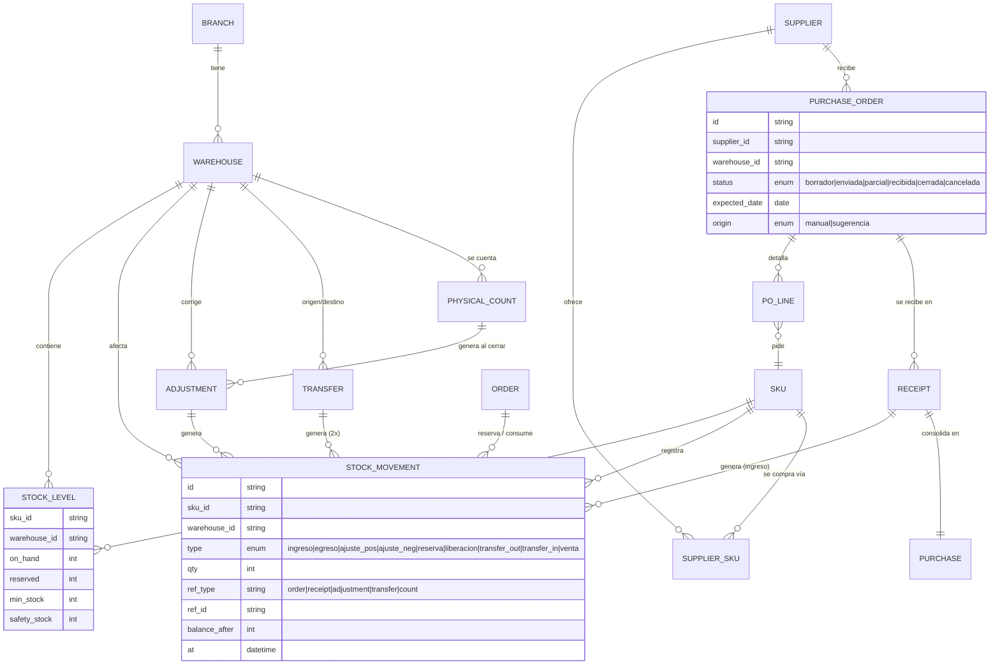
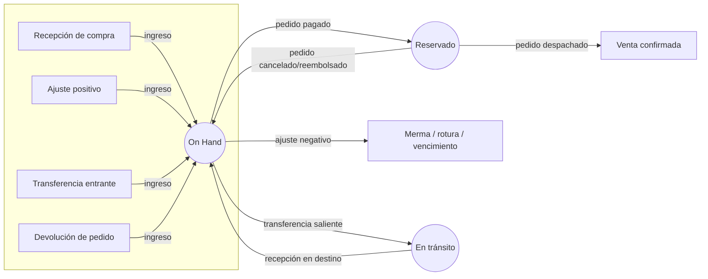
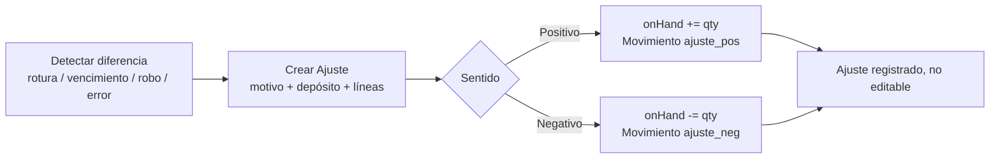
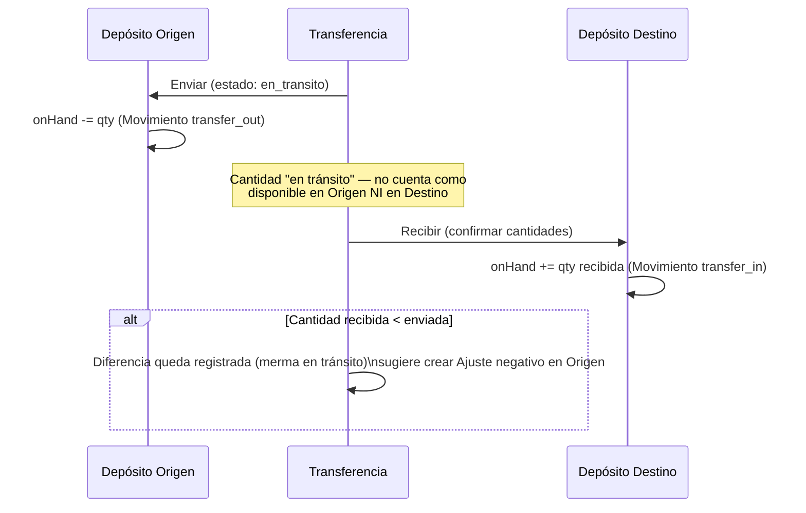
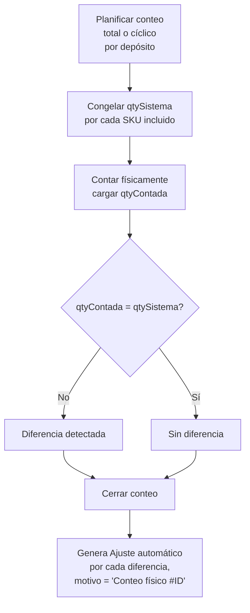
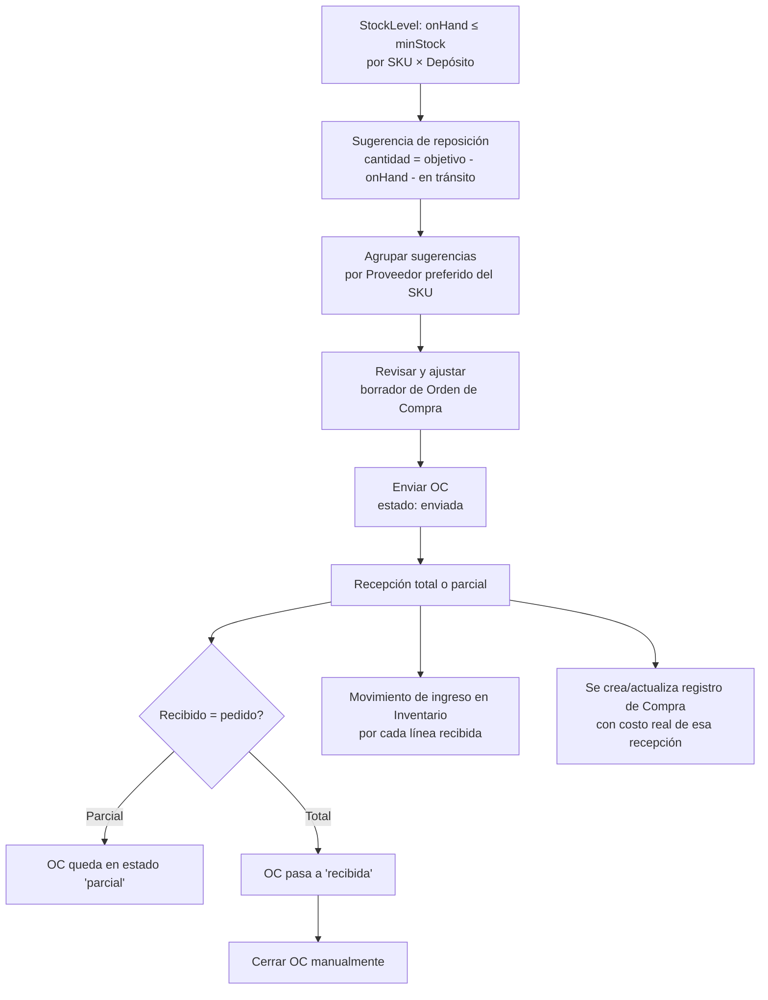

# Módulos Inventario y Abastecimiento — Arquitectura Funcional, Reglas de Negocio y UX

> **Consultar junto con [`ARCHITECTURE.md`](../ARCHITECTURE.md)** (principios §1, entidades core §3) y
> [`MODULO-CRM.md`](MODULO-CRM.md) (mismo patrón de capas `data/` · `lib/` · `api/`).
>
> **Decisiones tomadas (2026-09-04):** jerarquía **Sucursal → Depósitos**, reserva de stock **al
> confirmar el pago del pedido**, Órdenes de Compra **sin flujo de aprobación**, motor de Reposición
> de **sugerencias revisables** (no automático).
>
> **Estado (2026-09-04): Fases 1, 2 y 3 implementadas — Inventario y Abastecimiento completos.**
>
> **Fase 1 — Núcleo de Inventario:** Sucursales/Depósitos, Stock (disponible/reservado, con vista
> agrupada por SKU), Movimientos (kardex), Ajustes y Transferencias, en
> `panel-dashboard/src/modules/inventario/` (`data/` · `lib/` · `api/inventoryApi.js`).
>
> **El ciclo de Pedidos ↔ reserva de stock (§3.2) está conectado de punta a punta (2026-09-04).**
> Pedidos ahora tiene su propia capa `data/` · `lib/` · `api/pedidosApi.js` (mismo patrón que los
> demás módulos): confirmar el pago llama a `reserveForOrder` (si no alcanza, la línea queda en
> **backorder** — verificado con el pedido #10253 sobre un SKU agotado, banner + flag por línea, el
> pago se confirma igual), despachar llama a `fulfillOrder` (consume la reserva: `onHand` y
> `reserved` bajan juntos), y reembolsar llama a `releaseReservation` (antes de despachar) o a la
> nueva `returnGoods` (después de despachado/entregado — 5ª causa de cambio de `onHand`, devolución
> real de mercadería). Verificado en el navegador con navegación cliente: despachar el pedido #10254
> consumió al instante la reserva sembrada en Inventario (Stock consolidado pasó de 1/2 reservado a
> 0 reservado, kardex con movimiento "Venta").
>
> **Fase 2 — Núcleo de Abastecimiento:** Proveedores, catálogo Proveedor×SKU, Órdenes de Compra
> (sin aprobación) y Compras (derivado), en `panel-dashboard/src/modules/abastecimiento/`
> (`data/` · `lib/` · `api/supplyApi.js`). **La frontera del §1 (la Recepción) es real, no sólo
> documentada:** al registrar una recepción, `supplyApi` llama a `inventoryApi.receiveGoods` — el
> stock de Inventario sube en el momento, verificado en el navegador (recepción de una OC en
> Abastecimiento → mismo instante el Stock consolidado de Inventario refleja la suba, y el kardex
> enlaza "Recepción #REC-…" de vuelta a la Orden de Compra). Es la única llamada entre módulos de
> toda la implementación — todo lo demás sigue aislado detrás de su propio `api/`.
>
> **Fase 3 — Cierre del ciclo:** Inventario físico (wizard Planificado → En conteo → Revisión →
> Cerrado, en `panel-dashboard/src/modules/inventario/`) y motor de Reposición (sugerencias
> calculadas cruzando `StockLevel` con `SupplierSku`, en `.../abastecimiento/`). Ambos verificados
> de punta a punta: un conteo cerrado generó su Ajuste automático y el Stock consolidado lo reflejó
> al instante; la Reposición calculó cantidades correctas (redondeadas al mínimo de compra del
> proveedor preferido, descontando lo ya "en tránsito" por una Transferencia pendiente) y su botón
> "Crear Orden de Compra" abrió el formulario de OC con proveedor, depósito y líneas pre-cargadas.
>
> Navegación: **Inventario** y **Abastecimiento** son dos ítems de primer nivel en el sidebar, cada
> uno con su submenú completo.

---

## 1. Objetivo y alcance

Dos módulos **relacionados pero separados**, como ya distingue `ARCHITECTURE.md` (capa "Operativa &
Supply Chain"):

- **Inventario** responde *"¿cuánto tengo, dónde, y cuánto de eso puedo prometer vender?"*. Es dueño
  del stock físico y lógico: cantidades, movimientos, ajustes, transferencias y conteo físico.
- **Abastecimiento** responde *"¿qué necesito comprar, a quién, y qué de eso ya llegó?"*. Es dueño de
  proveedores y del ciclo de compra: órdenes de compra, recepciones y el registro histórico de
  compras.

**La frontera entre ambos es la Recepción de mercadería.** Abastecimiento gestiona todo lo que pasa
*antes* de que la mercadería entre físicamente al depósito (elegir proveedor, negociar, ordenar,
esperar). En el instante en que se recibe, Abastecimiento emite el movimiento de ingreso y a partir
de ahí esa cantidad es responsabilidad exclusiva de Inventario. Inventario nunca decide qué comprar;
sólo expone los datos (stock actual, mínimo, seguridad) que Abastecimiento necesita para decidirlo.

Igual que el CRM no es dueño de los Pedidos, **ninguno de estos dos módulos es dueño del Catálogo**
(`Producto`). Ambos leen la **Variante/SKU** desde Productos (nombre, imagen, atributos) y no la
duplican. Ver [[panel-dashboard-design-system]] para el sistema visual con el que se construyen.

### Alcance MVP vs. futuro

| Entra ahora | Queda fuera por ahora |
|---|---|
| Multi-sucursal/depósito, stock disponible vs. reservado | Múltiples monedas, costos por lote FIFO/LIFO real |
| Movimientos, ajustes, transferencias, inventario físico | Números de serie / trazabilidad unitaria |
| Proveedores, catálogo proveedor-SKU, OC, recepción parcial | EDI/integración directa con proveedores |
| Stock mínimo / seguridad por SKU × depósito | Pronóstico de demanda (ML), MRP multinivel |
| Sugerencias de reposición agrupadas por proveedor | Reposición 100% automática sin revisión |
| Registro de Compras (costeo) derivado de recepciones | Conciliación con facturación fiscal (AFIP/e-invoicing) |

---

## 2. Modelo de dominio

### 2.1 Entidades — Inventario

| Entidad | Descripción | Dueño |
|---|---|---|
| **Sucursal** (`Branch`) | Unidad de negocio con ubicación física (local, showroom, oficina). | Inventario |
| **Depósito** (`Warehouse`) | Espacio de almacenamiento físico, pertenece a **una** Sucursal. Tipos: `venta` (stock disponible para despacho), `reserva` (backroom/depósito no visible al público), `transito` (virtual, mercadería entre depósitos). | Inventario |
| **Variante/SKU** (`Sku`) | La unidad física real que se cuenta y mueve. Referencia a un `Producto` del catálogo (nombre/imagen) + atributos propios (talle/color) si aplica. **No se duplica el catálogo**: Inventario sólo guarda `productId`, `sku`, `attrs`. | Productos (identidad) / Inventario (existencia como unidad stockeable) |
| **Nivel de stock** (`StockLevel`) | Fila **SKU × Depósito**: `onHand`, `reserved`, `minStock`, `safetyStock`. `available` es siempre **derivado**, nunca se guarda. | Inventario |
| **Movimiento** (`StockMovement`) | Kardex: registro **inmutable** de cada cambio de cantidad. Toda alta/baja de `onHand` o `reserved` pasa por acá. | Inventario |
| **Ajuste** (`Adjustment`) | Documento que agrupa una o más correcciones manuales de `onHand` (rotura, vencimiento, merma, corrección de conteo) con motivo. Genera Movimientos. | Inventario |
| **Transferencia** (`Transfer`) | Documento que mueve cantidades de un Depósito a otro. Genera Movimientos de egreso/ingreso y un estado intermedio "en tránsito". | Inventario |
| **Inventario físico** (`PhysicalCount`) | Documento de conteo (total o cíclico) de un Depósito. Compara `qtySistema` vs. `qtyContada`; al cerrarse genera Ajustes automáticos por las diferencias. | Inventario |

### 2.2 Entidades — Abastecimiento

| Entidad | Descripción | Dueño |
|---|---|---|
| **Proveedor** (`Supplier`) | Persona o empresa que provee mercadería. Datos fiscales, contacto, condiciones de pago, lead time por defecto. | Abastecimiento |
| **Catálogo de proveedor** (`SupplierSku`) | Vínculo SKU ↔ Proveedor: costo, SKU del proveedor, lead time específico, cantidad mínima de compra, si es proveedor preferido para ese SKU. Un SKU puede tener N proveedores. | Abastecimiento |
| **Orden de Compra** (`PurchaseOrder`) | Documento operativo (equivalente de "Pedido" pero hacia afuera): qué se pidió, a quién, cuándo se espera. Vive en un ciclo de vida propio hasta cerrarse. | Abastecimiento |
| **Recepción** (`Receipt`) | Evento de mercadería que efectivamente entra a un Depósito contra una OC (total o parcial). Dispara Movimientos de ingreso en Inventario. | Abastecimiento (documento) → Inventario (efecto) |
| **Compra** (`Purchase`) | Registro **derivado y de solo lectura para costeo/analytics**: se genera/actualiza a partir de cada Recepción con el costo real. Es a la Orden de Compra lo que **Ventas es a Pedidos** en este mismo panel: la vista histórica/financiera, no el documento operativo. | Abastecimiento (calculado) |
| **Sugerencia de reposición** (`ReplenishmentSuggestion`) | **No es una entidad persistida**: se calcula on-demand cruzando `StockLevel` (Inventario) con `SupplierSku` (Abastecimiento). Se puede convertir en borrador de OC. | Abastecimiento (calculado, lee Inventario) |

### 2.3 Relaciones — diagrama ER



### 2.4 Relación con módulos existentes

- **Productos (Catálogo):** fuente de verdad de nombre/imagen/atributos. Inventario/Abastecimiento
  referencian `productId`/`sku`, nunca copian esos datos. Si Productos aún no modela variantes
  formalmente, cada `Producto` mock actúa como un SKU único por ahora (mismo criterio que usa hoy
  `Productos.jsx`, que ya tiene un campo `sku`).
- **Pedidos:** dispara la reserva y el consumo de stock. Ver flujo 3.2.
- **Ventas:** consume `StockMovement` tipo `venta` y el costo desde `Purchase` para calcular margen
  real (costo de mercadería vendida), no sólo precio de venta. No es responsabilidad de esta fase
  implementar ese cruce, pero el modelo lo deja disponible.
- **Clientes/CRM:** sin relación directa. (Fuera de alcance: "proveedor" y "cliente" no comparten
  modelo aquí, a diferencia de otros ERPs que unifican "Partner".)

---

## 3. Flujos de negocio

### 3.1 Ciclo de vida de una unidad de stock



`available` (lo que se puede prometer vender) **siempre** se calcula como `onHand − reserved`. No es
un campo propio: si lo fuera, se desincroniza. Lo mismo para "en tránsito": no es un depósito real,
es un estado de una Transferencia (ver 3.4).

### 3.2 Pedido ↔ Reserva de stock (regla de negocio central)

Decisión tomada: **se reserva al confirmar el pago**, no al crear el pedido. Un pedido "Pendiente de
pago" no bloquea stock — evita que carritos abandonados o pagos que fallan inmovilicen mercadería que
otro cliente sí puede pagar ahora.

```mermaid
sequenceDiagram
    participant P as Pedido
    participant I as Inventario

    P->>P: Pedido creado (pago: Pendiente)
    Note over I: Sin efecto en stock todavía
    P->>I: Pedido → pago Pagado
    I->>I: Por cada línea: reserved += qty (Movimiento "reserva")
    alt Stock disponible insuficiente
        I-->>P: available < qty solicitada
        Note over P: Pedido queda marcado con línea en backorder;<br/>no se permite reservar de más (available nunca negativo)
    end
    P->>I: Pedido → Despachado
    I->>I: onHand -= qty, reserved -= qty (Movimiento "venta")
    P->>I: Pedido → Cancelado / Reembolsado (antes de despachar)
    I->>I: reserved -= qty (Movimiento "liberación", onHand sin cambios)
    P->>I: Devolución (después de despachado)
    I->>I: onHand += qty (Movimiento "ingreso", motivo devolución)
```

**Regla dura de no-negativos:** `reserved` nunca puede superar `onHand`, y `available` nunca es
negativo. Si al confirmar el pago no alcanza el stock, esa línea queda señalada como **backorder**
(pendiente de asignar) en vez de forzar una reserva inconsistente; el operador decide manualmente
(reponer y reservar después, o contactar al cliente).

### 3.3 Ajustes de inventario



Un Ajuste, una vez guardado, **no se edita ni se borra** — es un documento contable del kardex. Para
corregir un ajuste mal cargado se crea un ajuste inverso, con referencia al original.

### 3.4 Transferencias entre depósitos



Por qué existe el estado intermedio: sin él, un reporte consolidado de "stock total de la empresa"
contaría la mercadería dos veces (restada tarde en origen, sumada temprano en destino) o ninguna vez
en la ventana entre el envío y la recepción.

### 3.5 Inventario físico (conteo)



Igual que en Ajustes, **la corrección de stock nunca se hace tipeando el nuevo total a mano**: siempre
pasa por el flujo de conteo → diferencia → ajuste generado, para que quede trazabilidad de *por qué*
cambió.

### 3.6 Reposición → Orden de Compra → Recepción → Compra



- **Cantidad sugerida** por SKU × Depósito = `max(minStock + safetyStock − onHand − enTransito, 0)`,
  redondeada hacia arriba al múltiplo de `minOrderQty` del proveedor preferido si existe.
- **Sólo se agrupan en un mismo borrador de OC** las sugerencias de SKUs que comparten proveedor
  preferido — evita mezclar proveedores en un solo documento.
- El motor de reposición **nunca envía la OC solo**; sólo arma el borrador. Enviarla es una acción
  humana explícita (decisión tomada).
- Una OC puede tener **N recepciones** (parciales). Cada Recepción es la que efectivamente mueve
  stock; la OC en sí misma nunca lo mueve directamente.
- Motivo de que "Compra" exista aparte de "Orden de Compra": la OC representa la *intención/pedido*
  (puede cambiar de cantidad, cancelarse); la Compra representa *lo que efectivamente costó y entró*,
  con el mismo criterio con el que este panel ya separa **Pedidos** (operativo) de **Ventas**
  (registro/analítica).

---

## 4. Reglas de negocio (resumen normativo)

1. `available = onHand − reserved` es siempre derivado; jamás se persiste ni se edita directamente.
2. `reserved` no puede superar `onHand`; si una reserva no puede satisfacerse completa, la línea
   sobrante queda en **backorder**, no se fuerza a negativo.
3. El stock reservado se genera **solo** cuando un Pedido pasa a pago **Pagado**, no al crearse.
4. Todo cambio de cantidad (alta o baja) queda en `StockMovement`, que es **append-only** — nunca se
   edita ni borra un movimiento; se revierte con un movimiento inverso referenciado.
5. `onHand` sólo cambia por 5 causas: Recepción, Ajuste, Transferencia (egreso/ingreso), Venta
   despachada, Devolución. Ninguna pantalla permite escribir `onHand` a mano fuera de esos flujos.
6. Stock mínimo y stock de seguridad son configurables **por SKU × Depósito**, no global — la demanda
   de un mismo producto puede variar por sucursal.
7. Una Transferencia enviada resta de Origen inmediatamente y no suma a Destino hasta confirmarse la
   recepción; mientras tanto la cantidad no es `available` en ningún depósito.
8. Un Inventario físico cerrado genera Ajustes automáticos por las diferencias; el conteo en sí no es
   editable una vez cerrado.
9. Toda Orden de Compra pertenece a **un** Proveedor y **un** Depósito destino.
10. Una OC puede recibirse en varias entregas parciales; su estado refleja `qtyRecibida` acumulada por
    línea, nunca se marca "recibida" manualmente si falta cantidad.
11. Cerrar una OC es una acción manual final (aun con todo recibido) y es irreversible — para
    corregir después de cerrada se genera una OC nueva.
12. Las sugerencias de reposición son **calculadas, no persistidas**; se recalculan en cada visita a
    la pantalla de Reposición contra el estado actual de `StockLevel` y `SupplierSku`.
13. **Regla dura de capa de datos** (mismo criterio que CRM): la UI de ambos módulos habla
    exclusivamente con `inventoryApi` / `supplyApi`. Nunca importa `data/*.mock.js` directo. Migrar a
    backend Laravel = reescribir sólo esas dos carpetas `api/`.

---

## 5. UX — Inventario

Patrón general (igual que Clientes/Pedidos ya rediseñados): `PageHeader` + fila de `StatCard` +
`DataTable` con `toolbar` (búsqueda + filtros + selector de ubicación). El selector de
**Sucursal / Depósito** es un filtro global persistente en el toolbar de las pantallas de Inventario
— casi ninguna vista tiene sentido "sin ubicación".

### 5.1 Stock — disponible y reservado (`/inventario`)

- **Qué es:** la pantalla principal. Una fila por **SKU × Depósito** (no por SKU global) — es la
  única forma de mostrar disponible/reservado de forma correcta cuando hay más de un depósito.
- **Columnas:** Producto (thumb + nombre + SKU, leído del catálogo), Depósito (con su Sucursal como
  subtítulo), **On hand**, **Reservado**, **Disponible** (destacado, `onHand − reserved`), Mínimo,
  Seguridad, estado visual (`StockLevelBadge`: ok / bajo mínimo / crítico bajo seguridad / agotado).
- **Filtros:** Sucursal → Depósito (cascada), categoría/marca (leído de Productos), estado de stock
  (bajo mínimo, agotado, con reserva), búsqueda por nombre/SKU.
- **KPIs (`StatCard`):** Valor total de inventario (a costo), SKUs bajo mínimo, SKUs agotados,
  unidades reservadas totales.
- **Acciones fila:** menú `⋮` → "Ver movimientos" (deep-link a Kardex filtrado), "Ajustar stock"
  (abre Ajuste pre-cargado con ese SKU/depósito), "Editar mínimo y seguridad" (`StockMinMaxEditor`).
- **Acciones masivas:** "Editar mínimos" en lote, "Transferir" (pre-carga una Transferencia con los
  SKUs seleccionados desde un depósito común), "Agregar a Orden de Compra" (handoff a Abastecimiento
  si hay SKUs bajo mínimo seleccionados).
- **Vista alternativa (toggle):** "Agrupar por SKU" — colapsa las filas de un mismo SKU en todos los
  depósitos en una sola fila con el total consolidado + un desglose expandible por ubicación. Es la
  vista que responde "¿cuánto tengo en total de este producto?" sin perder el detalle por depósito.

### 5.2 Movimientos — Kardex (`/inventario/movimientos`)

- **Qué es:** bitácora inmutable, de solo lectura. Es el historial "por qué el stock quedó en X".
- **Columnas:** Fecha/hora, SKU, Depósito, Tipo (badge con icono — `MovementBadge`: ingreso, egreso,
  ajuste +/−, reserva, liberación, transferencia salida/entrada, venta), Cantidad (con signo),
  Saldo resultante, Referencia (link al documento origen: Pedido, Ajuste, Transferencia, Recepción,
  Conteo).
- **Filtros:** SKU, Depósito, tipo de movimiento, rango de fechas, referencia.
- **Nunca hay acciones de edición acá** — coherente con la regla de append-only; el único CTA posible
  es "Ver documento origen".

### 5.3 Ajustes (`/inventario/ajustes`)

- **Listado:** fecha, Depósito, motivo (rotura/vencimiento/merma/corrección de conteo/otro), nº de
  líneas, autor, sentido neto (+/−). Click abre un **detalle de solo lectura** (no editable, una vez
  guardado).
- **Crear Ajuste (modal o pantalla, según cantidad de líneas):** elegir Depósito → agregar líneas
  (buscar SKU, cantidad actual visible, nueva cantidad o delta, motivo por línea opcional) → guardar.
  Al guardar se recalculan `onHand` y se emiten los `StockMovement` — no hay paso de "aprobación".
- **Pre-carga:** desde Stock (5.1) llega con SKU/Depósito ya seleccionados; desde Inventario físico
  (5.6) se genera automáticamente, sin pasar por este formulario.

### 5.4 Transferencias (`/inventario/transferencias`)

- **Listado:** Origen → Destino, nº de líneas, estado (`TransferPipeline`: Borrador · En tránsito ·
  Recibida · Cancelada), fecha de envío, fecha de recepción.
- **Detalle (`/inventario/transferencias/:id`):** header con pipeline visual de estado, tabla de
  líneas (SKU, cantidad enviada, cantidad recibida — esta última vacía hasta recibir), acciones según
  estado:
  - **Borrador:** editar líneas, "Enviar" (pasa a *en tránsito*, resta de Origen).
  - **En tránsito:** "Recibir" abre un formulario de confirmación por línea (cantidad recibida,
    puede ser menor a la enviada); al confirmar, suma a Destino y cierra la transferencia. Si hay
    diferencia, ofrece un atajo "Crear ajuste negativo en Origen por la diferencia".
  - **Recibida / Cancelada:** solo lectura.
- **Crear:** Depósito origen → Depósito destino (no puede ser el mismo) → agregar líneas (con el
  disponible de Origen visible en vivo para no transferir de más).

### 5.5 Sucursales y Depósitos (`/inventario/sucursales`)

- **Vista jerárquica:** lista de Sucursales, cada una expandible mostrando sus Depósitos (nombre,
  tipo — venta/reserva/tránsito virtual —, nº de SKUs con stock, estado activo/inactivo).
- **ABM simple:** crear/editar Sucursal (nombre, dirección), crear/editar Depósito dentro de una
  Sucursal (nombre, tipo). Desactivar en vez de eliminar si tiene stock o movimientos asociados
  (mismo criterio de integridad que ya usa el kardex).
- Es la pantalla de más bajo uso frecuente del módulo — configuración, no operación diaria.

### 5.6 Inventario físico (`/inventario/fisico`)

- **Listado de conteos:** Depósito, alcance (total/cíclico), estado (Planificado · En conteo ·
  Revisión · Cerrado), fecha, responsable, nº de diferencias detectadas (una vez en revisión).
- **Detalle/flujo (`/inventario/fisico/:id`), un wizard de 3 pasos dentro de la misma pantalla:**
  1. **Planificar:** elegir Depósito y alcance (todos los SKUs, una categoría, o una muestra para
     conteo cíclico). Al confirmar, se congela `qtySistema` de cada SKU incluido — a partir de acá
     el sistema no debería mostrar ese número como "el stock real" sino como snapshot de referencia.
  2. **Contar:** grilla editable con una fila por SKU — `qtySistema` (fijo), `qtyContada` (input),
     diferencia calculada en vivo con color (verde = sin diferencia, ámbar/rojo = falta/sobra).
     Pensada para completarse en planta con tablet: inputs grandes, orden por ubicación en góndola
     si existe ese dato.
  3. **Revisión y cierre:** resumen de diferencias (unidades y valor a costo), confirmación final →
     "Cerrar conteo" genera los Ajustes automáticos y navega al Ajuste resultante.
- Un conteo cerrado es de **solo lectura** permanente (igual que un Ajuste).

---

## 6. UX — Abastecimiento

Mismo patrón visual que Inventario y que Clientes. Acá el filtro global no es Sucursal/Depósito sino
**Proveedor** cuando aplica.

### 6.1 Proveedores (`/abastecimiento/proveedores`)

- **Listado:** nombre, contacto, lead time por defecto, nº de OC abiertas, monto comprado
  (histórico, desde `Purchase`), estado activo/inactivo.
- **Perfil (`/abastecimiento/proveedores/:id`)** — hero (`SupplierHeader`: nombre, contacto, datos
  fiscales, condiciones de pago, acciones "Nueva Orden de Compra" / "Editar") + tabs:
  - **Resumen:** KPIs (monto comprado 12m, OC abiertas, lead time real promedio vs. declarado, %
    de líneas recibidas completas a tiempo).
  - **Catálogo:** SKUs que provee (`SupplierSku`) — costo, SKU del proveedor, lead time específico,
    cantidad mínima de compra, marca de "preferido para este SKU". CRUD acá mismo.
  - **Órdenes de compra:** todas las OC de este proveedor con su estado.
  - **Compras (historial):** registro de `Purchase` — lo efectivamente recibido y su costo real, para
    ver evolución de precio del proveedor en el tiempo.

### 6.2 Órdenes de Compra (`/abastecimiento/ordenes-compra`)

- **Listado con tabs de estado:** `Todas · Borrador · Enviada · Parcial · Recibida · Cerrada`.
  Columnas: nº OC, Proveedor, Depósito destino, fecha esperada, monto, estado, % recibido (barra).
- **Detalle (`/abastecimiento/ordenes-compra/:id`):**
  - Header: nº OC, Proveedor, Depósito destino, fecha esperada, `POStatusPipeline` (Borrador →
    Enviada → Parcial/Recibida → Cerrada), origen (manual o desde sugerencia de Reposición).
  - Tabla de líneas: SKU, cantidad pedida, costo unitario, cantidad recibida acumulada, pendiente.
  - Acciones según estado: **Borrador** → editar líneas, "Enviar". **Enviada/Parcial** →
    **"Registrar recepción"** (ver 6.3). **Recibida** → "Cerrar OC". Sin flujo de aprobación
    (decisión tomada): de Borrador se pasa directo a Enviada.
  - Sidebar: notas internas, historial de estado (mini-timeline, mismo componente que Actividad de
    Clientes).
- **Crear:** elegir Proveedor (filtra el buscador de SKU a su catálogo) → Depósito destino → agregar
  líneas (con costo pre-cargado desde `SupplierSku`, editable) → guardar como Borrador.

### 6.3 Recepción (acción dentro de una OC, sin ruta propia)

- No es una pantalla de listado aparte — es un formulario que se abre desde el detalle de una OC en
  estado Enviada o Parcial: **"Registrar recepción"**.
- Grilla con las líneas pendientes: cantidad pendiente visible, input de cantidad recibida ahora
  (default = pendiente, editable a menos para parcial), Depósito ya fijo (el de la OC).
- Al confirmar: genera los `StockMovement` de ingreso, actualiza `qtyRecibida` de cada línea, mueve
  el estado de la OC (Parcial o Recibida), y genera/actualiza el registro de `Purchase` con el costo
  real de esa entrega. Todo en una sola acción — no hay un paso intermedio de "borrador de
  recepción".
- Cada recepción queda listada dentro del detalle de la OC (mini-historial: fecha, líneas, quién la
  registró) para trazabilidad de las parciales.

### 6.4 Reposición (`/abastecimiento/reposicion`)

- **Qué es:** la pantalla de trabajo del motor de sugerencias. No lista un recurso persistido —
  ejecuta el cálculo de la §3.6 contra el estado actual y lo muestra agrupado.
- **Layout:** tarjetas o secciones agrupadas **por Proveedor preferido**, cada una con su tabla de
  SKUs sugeridos (Depósito, stock actual, mínimo, sugerido a comprar, costo estimado, checkbox de
  inclusión) y un total. SKUs sin proveedor preferido configurado aparecen en un grupo aparte
  "Sin proveedor asignado" con CTA para asignarlo antes de poder generar la OC.
- **Filtros:** Depósito, urgencia (bajo mínimo vs. ya bajo seguridad — esto último con más énfasis
  visual, es el caso urgente), categoría.
- **Acción principal por grupo:** **"Crear Orden de Compra"** — toma las líneas tildadas de ese
  proveedor y navega a una OC en Borrador ya armada (6.2), lista para ajustar cantidades antes de
  enviar. Nunca envía la OC directamente (decisión tomada).
- **KPI de cabecera:** nº de SKUs bajo mínimo, nº bajo seguridad (crítico), monto estimado total a
  reponer.

### 6.5 Stock mínimo y de seguridad (configuración, sin ruta propia)

- No es una pantalla dedicada: es un **valor editable por SKU × Depósito** que vive físicamente en
  `StockLevel` (Inventario) pero cuyo consumidor principal es Abastecimiento (motor de Reposición).
- Punto de edición primario: `StockMinMaxEditor`, accesible desde **Stock** (5.1, fila o selección
  múltiple) y como atajo directo desde una fila de **Reposición** (6.4) — "esto siempre satura, subir
  el mínimo" sin salir de la pantalla de trabajo.
- Campos: Mínimo (dispara sugerencia de reposición) y Seguridad (colchón crítico — cuando `onHand`
  cae por debajo, el estado visual pasa de "bajo mínimo" a "crítico" en toda la UI, no sólo en
  Reposición).

### 6.6 Compras — registro histórico (`/abastecimiento/compras`)

- **Qué es:** vista de solo lectura/analítica, generada de `Purchase` — el equivalente de "Ventas"
  para el lado de compras. No tiene formulario de alta propio (se llena solo desde Recepciones).
- **Columnas:** fecha, Proveedor, OC de origen (link), Depósito, monto, nº de líneas/unidades.
- **Filtros:** Proveedor, rango de fechas, Depósito.
- **KPIs:** monto comprado en el período, comparativa vs. período anterior, top 5 proveedores por
  monto, top 5 SKUs por unidades compradas.
- Sirve de insumo para costeo (margen real en Ventas) — fuera de alcance de esta fase, pero el dato
  queda disponible con esta pantalla como su primera consumidora.

---

## 7. Arquitectura de información / rutas

Dos ítems de primer nivel en el sidebar (junto a Productos/Clientes/Pedidos/Ventas), cada uno con su
propio submenú — se mantienen **separados en la navegación**, igual que en el modelo de dominio.

| Ruta | Pantalla | Permiso sugerido |
|---|---|---|
| `/inventario` | Stock consolidado (disponible/reservado, por SKU × Depósito) | `inventario:stock:ver@sucursal\|global` |
| `/inventario/movimientos` | Kardex filtrable | `inventario:movimientos:ver@sucursal\|global` |
| `/inventario/ajustes` | Listado + crear Ajuste | `inventario:ajustes:crear@sucursal` |
| `/inventario/transferencias` | Listado | `inventario:transferencias:crear@sucursal` |
| `/inventario/transferencias/:id` | Detalle (enviar/recibir) | `inventario:transferencias:crear@sucursal` |
| `/inventario/fisico` | Inventario físico — listado de conteos | `inventario:conteo:gestionar@sucursal` |
| `/inventario/fisico/:id` | Wizard de conteo (planificar/contar/cerrar) | `inventario:conteo:gestionar@sucursal` |
| `/inventario/sucursales` | Sucursales y Depósitos (ABM) | `inventario:ubicaciones:gestionar@global` |
| `/abastecimiento/proveedores` | Listado de Proveedores | `abastecimiento:proveedores:gestionar@global` |
| `/abastecimiento/proveedores/:id` | Perfil de Proveedor (catálogo, OC, compras) | `abastecimiento:proveedores:gestionar@global` |
| `/abastecimiento/ordenes-compra` | Listado de OC (tabs por estado) | `abastecimiento:oc:gestionar@sucursal\|global` |
| `/abastecimiento/ordenes-compra/:id` | Detalle de OC + registrar recepción | `abastecimiento:oc:gestionar@sucursal\|global` |
| `/abastecimiento/reposicion` | Sugerencias agrupadas por proveedor | `abastecimiento:reposicion:ver@sucursal\|global` |
| `/abastecimiento/compras` | Registro histórico de Compras (costeo) | `abastecimiento:compras:ver@global` |

---

## 8. Permisos (RBAC)

Formato `[Módulo]:[Recurso]:[Acción] @ [Alcance]` (ver `ARCHITECTURE.md` §4).

| Permiso | Notas |
|---|---|
| `inventario:stock:ver @ sucursal\|global` | Todo el equipo de depósito ve su sucursal; Admin/Gerencia ve global |
| `inventario:ajustes:crear` | Encargado de depósito y Admin. Nunca "editar" — sólo crear (append-only) |
| `inventario:transferencias:crear` | Encargado de depósito. Recibir requiere estar en el depósito destino |
| `inventario:conteo:gestionar` | Encargado de depósito planifica y cierra; el conteo en sí lo puede cargar cualquier operador con `inventario:conteo:contar` |
| `inventario:ubicaciones:gestionar` | Sólo Admin/Owner — alta de sucursales y depósitos |
| `inventario:valor:ver` | Ver el inventario **a costo** (valorización) — Finanzas, Admin; oculto para roles de depósito |
| `abastecimiento:proveedores:gestionar` | Compras y Admin |
| `abastecimiento:oc:gestionar @ sucursal\|global` | Compras gestiona las de su alcance; Admin todas |
| `abastecimiento:oc:enviar` | Aislado de "crear/editar" — sin flujo de aprobación, pero sí se puede limitar quién efectivamente envía al proveedor |
| `abastecimiento:reposicion:ver` | Compras y Encargado de depósito (puede sugerir, no necesariamente enviar la OC) |
| `abastecimiento:compras:ver` | Finanzas, Compras, Admin — dato sensible de costos |

Roles clave nuevos: **Encargado de depósito** (Inventario operativo: stock, ajustes, transferencias,
conteo de su sucursal; sin ver costos). **Compras** (Abastecimiento completo + lectura de Inventario
para decidir reposición, sin poder ajustar stock directamente).

---

## 9. Componentes

**Reutiliza:** `PageHeader`, `DataTable` (+ `toolbar`, `stickyHeader`), `StatCard`, `StatusBadge`,
`Modal`, `Button`, `SavedViews`, clases `.order-timeline` / `.tag-chip`.

**Nuevos:**

| Componente | Uso |
|---|---|
| `WarehousePicker` | Selector cascada Sucursal → Depósito, filtro global persistente en Inventario. |
| `StockLevelBadge` | Estado visual de una fila de stock: ok / bajo mínimo / crítico (bajo seguridad) / agotado. |
| `MovementBadge` | Icono + tono por tipo de movimiento en el Kardex (ingreso/egreso/ajuste/reserva/venta/transferencia). |
| `StockMinMaxEditor` | Modal para editar mínimo/seguridad de un SKU (o varios) en uno o más depósitos. |
| `TransferPipeline` | Barra de estado visual de una Transferencia (Borrador · En tránsito · Recibida). |
| `PhysicalCountGrid` | Grilla de conteo con `qtySistema` fijo, `qtyContada` editable y diferencia calculada en vivo. |
| `SupplierHeader` | Hero del perfil de Proveedor (identidad + condiciones + acciones), mismo patrón que `CustomerHeader`. |
| `POStatusPipeline` | Barra de estado visual de una OC (Borrador · Enviada · Parcial/Recibida · Cerrada). |
| `ReceiptForm` | Formulario de "Registrar recepción" embebido en el detalle de una OC. |
| `ReplenishmentGroup` | Tarjeta de sugerencias agrupadas por proveedor en la pantalla de Reposición, con selección → crear OC. |

> Nota de implementación (Fases 1 y 2): `TransferPipeline` y `POStatusPipeline` no se extrajeron
> como componentes propios — quedaron inline en `TransferenciaDetalle.jsx` y `OrdenCompraDetalle.jsx`
> respectivamente (mismas ~10 líneas de JSX + CSS, sin lógica que valga la pena compartir todavía).
> Extraerlos es trivial si una tercera pantalla necesita el mismo patrón.

---

## 10. Plan de implementación por fases (propuesto)

Mismo criterio que el CRM: capa `data/` (mocks) · `lib/` (cálculos puros) · `api/` (única puerta de
la UI), sin tocar `backend/` ni `sitio-web/`.

- **Fase 1 — Núcleo de Inventario — IMPLEMENTADA:** §5.5 Sucursales/Depósitos, `StockLevel` +
  §5.1 Stock consolidado (disponible/reservado, con `WarehousePicker` y `StockLevelBadge`),
  §5.2 Movimientos (kardex), §5.3 Ajustes, §5.4 Transferencias. Los ganchos `reserveForOrder` /
  `releaseReservation` / `fulfillOrder` / `returnGoods` de §3.2 están implementados en
  `inventoryApi.js` **y conectados** — Pedidos ahora tiene su propia `pedidosApi.js` que los dispara
  en cada transición real de estado (ver §11).
- **Fase 2 — Núcleo de Abastecimiento — IMPLEMENTADA:** §6.1 Proveedores + catálogo Proveedor×SKU
  (con costo, SKU del proveedor y marca de preferido), §6.2 Órdenes de Compra (crear en borrador con
  costo pre-cargado del catálogo del proveedor elegido, editar líneas, enviar, cancelar), §6.3
  Recepción parcial/total embebida en la OC — cada recepción llama a `inventoryApi.receiveGoods`
  (la frontera real entre los dos módulos, no sólo documentada) y genera su registro de Compra solo,
  §6.6 Compras (registro derivado, filtrable por proveedor/depósito, con link de vuelta a la OC).
  No se implementó `POStatusPipeline`/`ReceiptForm` como componentes reutilizables aparte — quedaron
  inline en `OrdenCompraDetalle.jsx` (mismo criterio pragmático que `TransferPipeline` en Inventario).
- **Fase 3 — Cierre del ciclo — IMPLEMENTADA:** §5.6 Inventario físico — wizard de 4 estados
  (Planificado → En conteo → Revisión → Cerrado, cada uno con su acción propia: planificar congela
  `qtySistema`, iniciar habilita la carga, enviar a revisión valida que no falten líneas, cerrar
  genera un único `Ajuste` con todas las diferencias vía `createAdjustment` — nunca se tipea el
  stock nuevo a mano). §6.4 Reposición — `getReplenishmentSuggestions` cruza `StockLevel` (bajo
  mínimo/crítico/agotado) con `SupplierSku` (proveedor preferido + costo + cantidad mínima de
  compra) y con las Transferencias `en_transito` (para no sugerir de más lo que ya viene en
  camino), agrupa por proveedor × depósito y arma el borrador de OC al confirmar — nunca la envía
  sola. §6.5 Stock mínimo/seguridad ya estaba editable desde la Fase 1 (`StockMinMaxEditor`); no
  se agregó una pantalla aparte, tal como preveía el diseño. Indicadores cruzados (valor de
  inventario, rotura de stock, fill rate) quedan fuera de alcance — no estaban en el pedido
  original de esta fase y no hay un consumidor concreto todavía.

Con flujos, reglas de negocio y UX ya definidos, se implementó fase por fase sobre
`src/modules/inventario/` y `src/modules/abastecimiento/` — mismo patrón `data/` · `lib/` · `api/`
que ya probó el CRM. Con las 3 fases completas, quedaba un límite pendiente: el §3.2 de este mismo
documento (reserva de stock al pago) estaba implementado del lado de Inventario pero sin nadie que
lo disparara. La sección siguiente cierra eso.

---

## 11. Integración con Pedidos (2026-09-04) — IMPLEMENTADA

Pedidos no tenía antes un ciclo de vida real: `PedidoDetalle.jsx` mostraba contenido fijo sin
importar qué `:id` se abriera, y el listado y el detalle ni siquiera coincidían en los totales. Se
le dio a Pedidos su propia capa `data/` · `lib/` · `api/pedidosApi.js` (mismo patrón que los otros
tres módulos) para que el ciclo de vida documentado en §3.2 sea real:

| Transición | Acción del usuario | Qué dispara en `inventoryApi.js` |
|---|---|---|
| Pendiente → Pagado | "Confirmar pago" | `reserveForOrder` — si no alcanza el stock, la línea queda en **backorder** (nunca fuerza una reserva negativa); el pago se confirma igual |
| Pendiente → Cancelado | "Cancelar pedido" | Ninguna — nunca hubo reserva que liberar |
| Pagado + Sin despachar → Despachado | "Preparar envío" | `fulfillOrder` — consume la reserva: `onHand` y `reserved` bajan juntos, movimiento `venta` |
| Despachado → Entregado | "Marcar como entregado" | Ninguna — cambio de estado sin efecto de stock |
| Pagado + Sin despachar → Reembolsado/Cancelado | "Reembolsar" | `releaseReservation` — la mercadería nunca salió del depósito |
| Despachado/Entregado → Reembolsado/Devuelto | "Reembolsar" | **`returnGoods`** (función nueva) — devolución real, `onHand` sube (5ª causa de cambio de stock del §4.5, la única que faltaba implementar) |

**Verificado en el navegador con navegación cliente (sin recargar, para no perder el estado en
memoria):**
- El pedido #10254 ya traía una reserva sembrada del lado de Inventario (1 zapatilla + 2 remeras en
  Depósito Palermo). Despacharlo consumió esa reserva real al instante: el Stock consolidado pasó de
  "1/2 reservado" a "0 reservado" y el kardex registró el movimiento `venta`.
- El pedido #10253 (Short Deportivo Elite, agotado en ese depósito) demuestra el backorder: al
  confirmar el pago, el pedido pasa a "Pagado" igual, pero aparece un banner "Este pedido tiene
  stock pendiente (backorder)" + un flag "Backorder: faltan 2" en la línea del producto.

**Bug encontrado y corregido de paso:** el cálculo de "días de diferencia" para las fechas relativas
del pedido comparaba timestamps completos (con hora) contra la medianoche de hoy sin normalizar
ambos lados a medianoche primero — un pedido creado a las 14:30 se mostraba como "Ayer" en vez de
"Hoy" porque 14.5 horas redondeaban hacia arriba. Se corrigió `daysBetween` en
`pedidos/lib/time.js` para normalizar ambas fechas a medianoche antes de restar.
