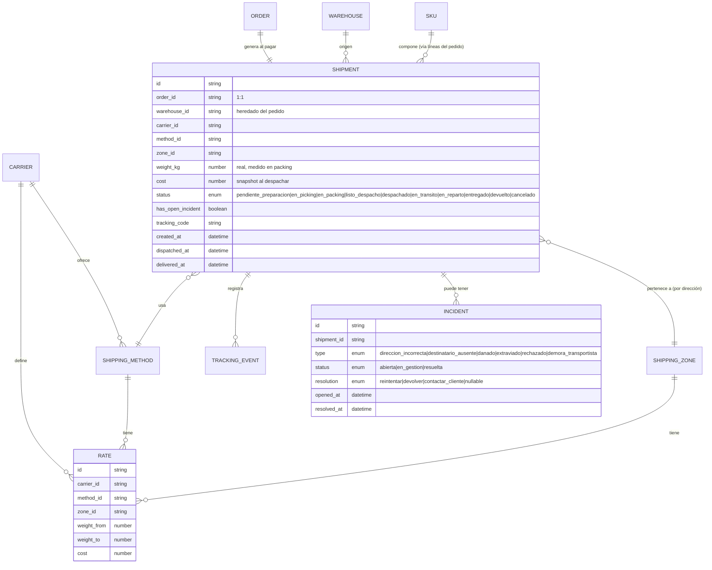
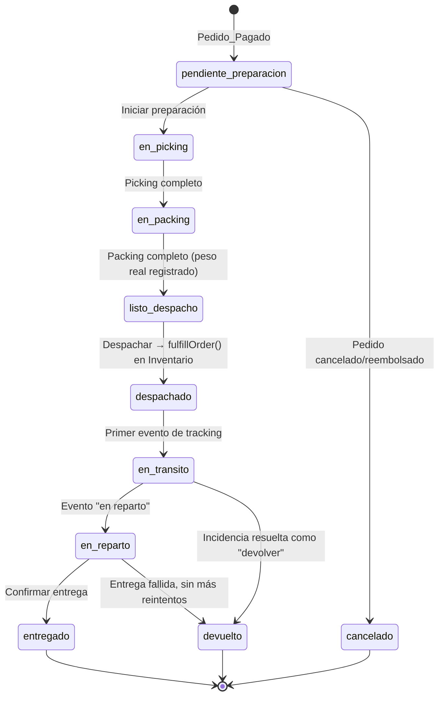
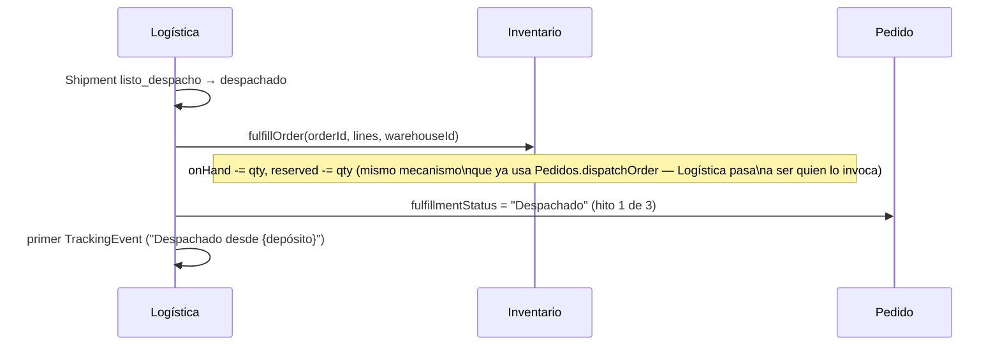

# Módulo Logística & Fulfillment — Procesos y Estados

> **Consultar junto con [`ARCHITECTURE.md`](../ARCHITECTURE.md)** (§1.4 ya anticipa el evento
> `Pedido_Pagado` disparando Logística; §3 ya nombra el `Envío (Shipment)`; §4 ya define los roles
> *Operador de Depósito* y *Agente de Soporte/RMA* que este módulo termina de darle sentido) y
> [`MODULO-INVENTARIO-ABASTECIMIENTO.md`](MODULO-INVENTARIO-ABASTECIMIENTO.md) (mismo patrón de
> capas `data/` · `lib/` · `api/`, y el módulo del que Logística consume `fulfillOrder`/`returnGoods`).
>
> **Decisiones tomadas (2026-09-04):** **1 Pedido = 1 Envío**, **Logística pasa a ser dueña del
> estado físico** post-pago (Pedidos sólo refleja 3 hitos gruesos), tarifas por **Zona × Transportista
> × Peso**, tracking **simulado** (sin integración real con APIs de transportistas).
>
> **Estado (2026-09-04): Fases 1 y 2 implementadas.** Transportistas, Métodos, Zonas,
> Tarifas y el pipeline completo del Envío (`panel-dashboard/src/modules/logistica/`,
> `data/` · `lib/` · `api/logisticaApi.js`). El despacho real (`fulfillOrder`) se movió de
> `pedidosApi.js` a `logisticaApi.js` — verificado en el navegador de punta a punta: preparar,
> pickear, empacar (con cálculo de tarifa real), despachar (consume stock real), agregar tracking y
> entregar un envío, con el Pedido reflejando los 3 hitos en cada paso y sin volver a tocar
> `dispatchOrder` (que ya no existe). Fase 2 (Incidencias, devoluciones y bloqueo por diferencia de
> picking) también implementada y verificada de punta a punta: resolver una incidencia como
> "Reintentar" la cierra sin tocar el envío; como "Devolver" mueve el Envío a `devuelto`, agrega el
> evento de tracking correspondiente, llama a `returnGoods` (stock repuesto, movimiento "Devolución"
> visible en el Kardex) y a `markReturnRequested` (Pedido pasa a "Devuelto"/"Reembolso pendiente" —
> el reembolso lo aprueba Finanzas, ver MODULO-FINANZAS-FACTURACION.md §5.3); reportar una
> incidencia nueva desde el Envío la deja "Abierta" y la resalta en el listado de Envíos (tab "Con
> incidencia" + ícono de alerta); el flujo de "¿Falta stock?" en picking bloquea "Picking completo"
> hasta que se marca la diferencia como resuelta. Verificado en ambos temas (claro/oscuro), sin
> errores de consola. **Fase 3 (Cierre) también implementada y verificada**: código de seguimiento
> simulado (`trackingCode`, generado al despachar con el prefijo del transportista) y ETA de entrega
> (despacho + días del método) con badge "A tiempo"/"Con demora" en el detalle del Envío; dos
> indicadores nuevos en `/logistica` — "% de envíos con incidencia" (KPI) y "Costo de envío promedio
> por zona" (tarjeta de desglose) — sumados al ya existente "Tiempo prom. de preparación".

---

## 1. Objetivo y alcance

Logística & Fulfillment responde *"¿qué pasa físicamente con un pedido entre que se paga y llega a
la puerta del cliente?"*. Es la capa operativa que ejecuta lo que Pedidos e Inventario ya decidieron
(qué se vendió, de qué depósito sale) y que hoy no existe: **el "Despacho" de Pedidos era hasta ahora
un solo click** (`dispatchOrder`) que saltaba directo de "Pagado, sin despachar" a "Despachado", sin
picking, sin packing, sin transportista, sin tracking, sin manejo de incidencias.

**Logística no vende, no cobra ni decide qué comprar.** Lee el Pedido (qué, para quién, desde qué
depósito) y el catálogo de Inventario (peso por SKU), y a cambio le devuelve a Pedidos únicamente
tres hitos: *Despachado*, *Entregado*, *Devuelto*. Todo lo que pasa en el medio (picking, packing,
tránsito, reparto) vive **sólo** en Logística — mismo criterio de frontera que ya separa a
Abastecimiento de Inventario (frontera = la Recepción) y a Inventario de Pedidos (frontera = la
reserva/consumo).

### Las 12 áreas pedidas → dónde viven en el modelo

| Área | Dónde vive |
|---|---|
| **Preparación** | Estado inicial del Envío (`pendiente_preparacion`), la etapa "está en cola para armarse" |
| **Picking** | Estado del Envío (`en_picking`) — recolectar los ítems físicos del depósito |
| **Packing** | Estado del Envío (`en_packing`) — empaquetar, pesar/medir el bulto real |
| **Despacho** | Transición `listo_despacho` → `despachado` — el punto exacto donde se consume stock real |
| **Envíos** | La entidad central (`Shipment`) — todo lo demás cuelga de ella |
| **Transportistas** | Entidad `Carrier` — quién ejecuta el traslado físico |
| **Métodos** | Entidad `ShippingMethod` — Standard/Express/Retiro en sucursal, cada uno de **un** transportista |
| **Zonas** | Entidad `ShippingZone` — agrupación geográfica (CABA/GBA/Interior/…) usada para tarifar |
| **Tarifas** | Entidad `Rate` — la función `(transportista, método, zona, peso) → costo` |
| **Tracking** | `TrackingEvent[]` del Envío — bitácora de ubicación/estado, simulada (sin API real) |
| **Entrega** | Estado terminal `entregado` del Envío — hito que Pedidos refleja como "Entregado" |
| **Incidencias** | Entidad `Incident` — problemas registrados contra un Envío, con su propia resolución |

### Alcance MVP vs. futuro

| Entra ahora | Queda fuera por ahora |
|---|---|
| 1 Envío por Pedido, ciclo completo Preparación→Entrega | Envíos parciales / multi-depósito, consolidación B2B |
| Transportistas, Métodos, Zonas, motor de Tarifas por peso | Cotización en vivo contra APIs reales de transportistas |
| Tracking simulado (eventos generados al cambiar de estado) | Webhooks/polling de transportistas reales, tracking público para el cliente |
| Incidencias con tipo, resolución y devolución a Inventario | SLA automático, escalamiento, penalización a transportistas |
| Picking/Packing como estados con checklist simple | Wave picking (agrupar N envíos en una ronda física) |
| Ganchos de evento hacia Clientes/Finanzas/Automatizaciones | Notificaciones reales (email/SMS) al cliente — eso lo dispara un futuro módulo de Automatizaciones, no Logística |

---

## 2. Modelo de dominio

### 2.1 Entidades

| Entidad | Descripción | Dueño |
|---|---|---|
| **Envío** (`Shipment`) | El "pedido" del lado físico. 1:1 con un Pedido pagado. Centro del módulo. | Logística |
| **Transportista** (`Carrier`) | Empresa que ejecuta el traslado (Andreani, Correo Argentino, flota propia…). | Logística |
| **Método de envío** (`ShippingMethod`) | Standard / Express / Retiro en sucursal — pertenece a **un** transportista, con tiempo estimado de entrega. | Logística |
| **Zona** (`ShippingZone`) | Agrupación geográfica (provincias/códigos postales) usada para tarifar y estimar tiempos. | Logística |
| **Tarifa** (`Rate`) | Costo para una combinación Transportista × Método × Zona × rango de peso. | Logística |
| **Evento de tracking** (`TrackingEvent`) | Entrada de bitácora del Envío: estado + ubicación + momento. Append-only. | Logística |
| **Incidencia** (`Incident`) | Problema registrado contra un Envío (dirección incorrecta, destinatario ausente, dañado, extraviado, rechazado). Tiene su propia resolución. | Logística |

### 2.2 Relaciones — diagrama ER



### 2.3 Relación con el catálogo (nota de implementación)

El motor de tarifas necesita **peso por SKU**, dato que hoy no existe en
`inventario/data/skus.mock.js`. Se agrega un campo `weightKg` de sólo lectura al espejo de catálogo
de Inventario (mismo criterio ya usado para `cost`) — Logística lo lee, nunca lo edita.

---

## 3. Flujos de negocio

### 3.1 Ciclo de vida de un Envío



Una **Incidencia** no es un estado del pipeline — es un evento lateral que puede abrirse en
`en_picking`, `en_packing`, `despachado`, `en_transito` o `en_reparto` sin sacar al Envío de su
estado actual (`hasOpenIncident: true`). Se resuelve con una de tres salidas: **reintentar** (el
Envío sigue su curso normal), **devolver** (fuerza la transición a `devuelto`), o **contactar
cliente** (no cambia el estado, sólo registra que Soporte/CX intervino — ver relación con Clientes).

### 3.2 Pedido → Envío (creación)

```mermaid
sequenceDiagram
    participant P as Pedido (pedidosApi)
    participant L as Logística (logisticaApi)
    participant I as Inventario (inventoryApi)

    P->>P: confirmPayment() → paymentStatus = "Pagado"
    P->>L: emite Pedido_Pagado (orderId, items, warehouseId, dirección)
    L->>L: crea Shipment (status: pendiente_preparacion)
    Note over L: Zona se resuelve de la dirección; Transportista/Método\nse asignan por defecto según Zona (o quedan pendientes de elegir)
    L-->>P: (nada todavía — Pedidos no cambia de estado hasta el despacho)
```

**Por qué no antes:** crear el Envío recién cuando el pedido está pagado (no al crearse el pedido)
mantiene la misma regla que ya usa Inventario para la reserva — no se ejecuta trabajo físico sobre
algo que todavía puede no cobrarse.

### 3.3 Despacho (el punto de no retorno)



**Regla dura:** el consumo de stock (`fulfillOrder`) ocurre **una sola vez**, exactamente en esta
transición — nunca en `en_picking` ni en `en_packing`. Antes de este punto, si el picking detecta
una diferencia física (el sistema decía que había stock reservado pero no está físicamente), se abre
una Incidencia bloqueante y el Envío no puede avanzar a `listo_despacho` hasta que Inventario
resuelva la diferencia con un Ajuste.

### 3.4 Entrega e Incidencia con devolución

```mermaid
flowchart TD
    A[en_reparto] --> B{¿Entrega exitosa?}
    B -->|Sí| C[entregado]
    C --> D[Pedido.fulfillmentStatus = Entregado]
    B -->|No| E[Abrir Incidencia\ntipo: destinatario_ausente / dirección_incorrecta / rechazado]
    E --> F{Resolución}
    F -->|Reintentar| A
    F -->|Devolver| G[devuelto]
    G --> H[returnGoods() en Inventario\nonHand += qty]
    G --> I[refundOrder() en Pedido\nsi corresponde reembolso]
    F -->|Contactar cliente| J[CX interviene(CRM: nueva actividad)\nel envío sigue en su estado actual]
```

Este es el mismo mecanismo de devolución que Pedidos ya usa para "Reembolsar después de
despachado" — Logística no reinventa `returnGoods`/`refundOrder`, los reutiliza cuando la causa es
una incidencia de entrega en vez de un pedido de reembolso directo del cliente.

### 3.5 Cálculo de tarifa

```mermaid
flowchart LR
    A[Dirección del pedido] --> B[Resolver Zona]
    C[Ítems del pedido] --> D[Sumar peso real( packing )]
    E[Transportista + Método elegidos] --> F[Buscar Tarifa]
    B --> F
    D --> F
    F --> G{¿Existe tarifa\npara ese rango de peso?}
    G -->|Sí| H[Costo = tarifa.cost]
    G -->|No| I[Sin tarifa configurada\nrequiere carga manual antes de despachar]
```

El costo se calcula y se **congela** (`Shipment.cost`) en el momento de pasar a `listo_despacho`
(peso real ya conocido) — no se recalcula después, aunque la tabla de Tarifas cambie más tarde. Es
el mismo criterio de "snapshot" que ya usa Abastecimiento con el costo de una Recepción.

---

## 4. Reglas de negocio (resumen normativo)

1. Un Envío se crea automáticamente cuando un Pedido pasa a `Pagado` — Logística nunca decide *si*
   preparar un pedido, sólo *cómo* y *cuándo* dentro de su propio pipeline.
2. Relación 1:1 entre Pedido y Envío (decisión tomada) — un pedido nunca genera más de un envío ni
   comparte uno con otro pedido.
3. El Envío hereda el `warehouseId` del Pedido — nunca se despacha desde un depósito distinto al que
   reservó el stock.
4. El picking y el packing **no mueven stock**. El único movimiento de stock del ciclo de fulfillment
   ocurre en la transición `listo_despacho → despachado`, vía `fulfillOrder`.
5. Si el picking detecta una diferencia física, el Envío no puede avanzar sin que Inventario registre
   un Ajuste que la explique — nunca se despacha "lo que hay", se corrige el sistema primero.
6. El costo del envío (`Rate` aplicable) se calcula por **Transportista × Método × Zona × Peso real**
   y se congela al llegar a `listo_despacho` — cambios posteriores en la tabla de Tarifas no afectan
   envíos ya despachados.
7. Toda Incidencia queda vinculada a exactamente un Envío; su resolución es una de tres:
   **reintentar** (el envío sigue), **devolver** (fuerza `devuelto` + `returnGoods` + `refundOrder`
   si corresponde), o **contactar cliente** (no cambia el estado del envío, deriva a CX).
8. Logística escribe el `fulfillmentStatus` de Pedidos **sólo** en tres hitos: `Despachado`,
   `Entregado`, `Devuelto`. Los estados intermedios (picking/packing/tránsito/reparto) son invisibles
   para Pedidos — mismo criterio de "opacidad" que ya usa Inventario frente a Abastecimiento.
9. `TrackingEvent` es **append-only** (mismo criterio kardex que Inventario): nunca se edita o borra
   un evento de tracking, sólo se agregan nuevos.
10. Un Envío cancelado (porque el pedido se canceló antes de despachar) nunca pasó por
    `fulfillOrder` — no hay nada que revertir en Inventario, sólo se cierra el Envío.
11. **Regla dura de capa de datos** (mismo criterio que los demás módulos): la UI habla exclusivamente
    con `logisticaApi`. Nunca importa `data/*.mock.js` directo. Migrar a backend Laravel = reescribir
    sólo esa carpeta `api/`.

---

## 5. Relación con otros módulos

### 5.1 Pedidos — bidireccional

- **Lee:** items, `warehouseId`, dirección de envío, datos del cliente, al crear el Envío.
- **Escribe:** `fulfillmentStatus` en los 3 hitos (§4.8). A partir de esta implementación,
  `pedidosApi.dispatchOrder()` deja de ser quien decide despachar — pasa a ser **Logística** quien
  llama a `fulfillOrder()` y actualiza Pedidos; el botón "Preparar envío" de `PedidoDetalle.jsx` se
  convierte en un enlace al Envío correspondiente dentro de Logística (ver nota de implementación).
- **Frontera exacta:** el evento `Pedido_Pagado` (ya disparado hoy por `confirmPayment()`) crea el
  Envío; los eventos `Envío→Despachado/Entregado/Devuelto` actualizan el Pedido.

### 5.2 Inventario — consumidor de sus funciones existentes

- Logística no reserva ni libera stock (eso ya lo hace Pedidos al pagar/cancelar, vía
  `reserveForOrder`/`releaseReservation`). Logística consume dos funciones que **ya existen** en
  `inventoryApi.js`: `fulfillOrder` (al despachar) y `returnGoods` (al resolver una incidencia como
  devolución) — hoy las llama `pedidosApi.js`, van a pasar a ser responsabilidad de `logisticaApi.js`.
- Lee el peso por SKU del catálogo (`weightKg`, campo nuevo — ver §2.3) para el motor de tarifas.
- Un Ajuste generado por una diferencia detectada en picking sigue siendo 100% responsabilidad de
  Inventario — Logística sólo bloquea el avance del Envío hasta que ese Ajuste exista.

### 5.3 Clientes (CRM) — fuente de actividad

- Cada hito relevante del Envío (Despachado, Entregado, Incidencia abierta/resuelta) se registra como
  una `Activity` más en el `ActivityTimeline` del cliente — mismo patrón que ya usan Pedidos/Ventas.
- Una Incidencia resuelta como "contactar cliente" es, en los hechos, un gancho hacia el equipo de
  CX que el CRM ya modela (rol *Agente de Soporte*, permiso de creación de RMA en `ARCHITECTURE.md`
  §4) — Logística abre la puerta, CX la gestiona.
- Fuera de alcance ahora: métricas agregadas de calidad de servicio por cliente (ej. "% de envíos con
  incidencia") — el dato queda disponible (`Incident` referencia `Shipment` → `Order` → cliente) para
  cuando exista un consumidor concreto.

### 5.4 Finanzas — de solo lectura (módulo todavía no existe)

- El costo real de cada Envío (`Shipment.cost`, congelado al despachar) es insumo directo para
  calcular rentabilidad por pedido (precio de venta − costo de mercadería − costo de envío). Logística
  expone `getShipmentCost(orderId)` de solo lectura para cuando ese módulo se construya.
- Una devolución con reembolso (`refundOrder` disparado desde una Incidencia) es, del lado financiero,
  una nota de crédito — mismo evento que ya generaría un reembolso solicitado directo por el cliente.
  Logística no calcula ni registra el asiento contable, sólo dispara el evento.

### 5.5 Automatizaciones — de solo lectura (módulo todavía no existe)

- Cada transición de estado del Envío (`emitEvent`, mismo mecanismo que ya usa el CRM) es un disparador
  natural: *"Envío despachado → enviar tracking al cliente"*, *"Incidencia abierta hace más de 48hs
  sin resolver → notificar a Soporte"*. Logística **emite** estos eventos a un log; no envía ningún
  email ni SMS — eso es responsabilidad exclusiva de un futuro módulo de Automatizaciones que se
  suscriba a ese log.

---

## 6. UX — pantallas

Mismo patrón visual que los demás módulos: `PageHeader` + fila de `StatCard` + `DataTable` con
`toolbar`. El filtro global persistente acá no es Sucursal/Depósito (aunque existe como columna) —
es **estado del pipeline**, porque es lo que un operador de depósito escanea todo el día.

### 6.1 Envíos — listado (`/logistica`)

- **Qué es:** la mesa de trabajo diaria. Una fila por Envío.
- **Columnas:** Envío/Pedido (`#ENV-001` + link a `#10254`), Cliente, Origen (depósito), Transportista
  + Método, Zona, Peso, Costo, Estado (`ShipmentStatusBadge`, con ⚠ superpuesto si `hasOpenIncident`).
- **Tabs de estado:** `Todos · Por preparar · En proceso (picking/packing) · Listos para despachar ·
  En tránsito · Entregados · Con incidencia`. "Con incidencia" es una vista transversal (cruza
  cualquier estado con `hasOpenIncident = true`), no un estado propio — coherente con que la
  Incidencia es lateral, no parte del pipeline (§3.1).
- **KPIs (`StatCard`):** Envíos por preparar hoy, En tránsito, Con incidencia abierta, Tiempo
  promedio de preparación (creación → despacho).
- **Filtros:** Depósito de origen, Transportista, rango de fechas.
- **Acción de fila:** click abre el detalle. Sin acciones masivas en esta fase — cada Envío se opera
  individualmente desde su detalle (el volumen no justifica una acción en lote todavía).

### 6.2 Detalle de Envío (`/logistica/:id`)

Layout: **header con pipeline + panel principal según el estado actual + sidebar de contexto**. Es
la pantalla donde vive el 90% del trabajo del módulo.

- **Header:** `#ENV-001`, link "Pedido #10254", `ShipmentPipeline` (barra de 8 pasos —
  `cancelado`/`devuelto` se muestran como badge de estado terminal en vez de un paso más, mismo
  criterio que ya usan `TransferPipeline`/`POStatusPipeline`), acción principal según estado (una
  sola, para no dar lugar a saltarse pasos):
  - `pendiente_preparacion` → **"Iniciar picking"**
  - `en_picking` → checklist de líneas del pedido (marcar cada una recolectada) → **"Picking
    completo"** (deshabilitado hasta marcar todas)
  - `en_packing` → input de **peso real** + si no vino preasignado, elegir Transportista → Método
    (filtra por Zona ya resuelta de la dirección) → **"Packing completo"** (calcula y muestra la
    Tarifa aplicable; si no hay tarifa configurada para ese rango, banner de aviso y bloquea el paso
    siguiente en vez de despachar con costo $0)
  - `listo_despacho` → resumen de costo congelado + **"Despachar"** (dispara `fulfillOrder`)
  - `despachado` / `en_transito` / `en_reparto` → **"Agregar evento de tracking"** (selector simple:
    próximo estado lógico + ubicación en texto libre) + **"Marcar entregado"** (sólo visible en
    `en_reparto`) + **"Reportar incidencia"** (visible en cualquiera de estos tres)
  - `entregado` / `devuelto` / `cancelado` → sin acciones, sólo lectura
- **Panel principal:** líneas del pedido (SKU, cantidad, peso unitario) con el checklist de picking
  cuando corresponde; debajo, línea de tiempo de tracking (`TrackingTimeline`, incluye el hito de
  creación) — igual espíritu que el `ActivityTimeline` del CRM pero sin filtro por tipo, son pocos
  eventos.
- **Sidebar:** datos del cliente y dirección (leídos del Pedido), resumen de tarifa (Transportista ·
  Método · Zona · Peso · Costo — vacío hasta `en_packing`), y **Incidencias** de este envío si las
  hay (`IncidentCard` por cada una, con su estado y acción de resolución inline).

### 6.3 Transportistas (`/logistica/transportistas`)

- Listado con Accordion por transportista (mismo patrón que `Sucursales.jsx`): nombre, contacto,
  activo/inactivo, y expandido muestra sus **Métodos** (nombre, tiempo estimado de entrega,
  activo/inactivo) con alta/edición inline.
- Acciones: nuevo transportista, nuevo método dentro de uno existente, activar/desactivar (nunca
  eliminar si tiene envíos asociados — mismo criterio de integridad que Sucursales/Depósitos).

### 6.4 Zonas (`/logistica/zonas`)

- Listado simple + modal de alta/edición: nombre de la zona (CABA, GBA, Interior, Patagonia…) y las
  provincias/códigos postales que agrupa (chips editables, sin validación geográfica real en esta
  etapa — es texto libre agrupado).
- Pantalla de bajo uso frecuente, como Sucursales — configuración, no operación diaria.

### 6.5 Tarifas (`/logistica/tarifas`)

- **Qué es:** la tabla que alimenta el cálculo de costo (§3.5). Una fila = una regla completa
  (Transportista, Método, Zona, rango de peso, costo).
- **Filtros:** por Transportista y por Zona (la tabla puede crecer rápido: N transportistas × M
  métodos × Z zonas × rangos de peso).
- **Alta/edición:** modal con los 4 campos + costo. Validación simple: los rangos de peso de una
  misma combinación Transportista+Método+Zona no pueden superponerse.
- **Aviso visual:** si una combinación Transportista+Método+Zona que ya se usó en algún Envío no
  tiene tarifa para cierto rango de peso, se destaca (mismo caso que dispara el bloqueo en 6.2).

### 6.6 Incidencias (`/logistica/incidencias`)

- **Qué es:** vista transversal de solo trabajo — todas las incidencias, de cualquier Envío,
  agrupadas por estado (`Abiertas · En gestión · Resueltas`). Es la pantalla de CX/Soporte, no la
  del depósito.
- **Columnas:** Envío/Pedido (link), Cliente, Tipo, Antigüedad (relevante: una incidencia abierta
  hace 48hs+ se destaca — es el mismo umbral que en el futuro dispararía Automatizaciones, ver §5.5),
  Estado.
- **Acción de fila:** abre un panel de resolución (`IncidentResolutionModal`) con las 3 opciones —
  Reintentar / Devolver / Contactar cliente — y un campo de nota. "Devolver" muestra una advertencia
  si corresponde reembolso ("esto va a generar una devolución de stock y un reembolso — lo aprueba
  Finanzas", coherente con la regla crítica de `ARCHITECTURE.md` §4).

---

## 7. Arquitectura de información / rutas

| Ruta | Pantalla | Permiso sugerido |
|---|---|---|
| `/logistica` | Envíos — listado con tabs por estado | `logistica:envio:ver@sucursal\|global` |
| `/logistica/:id` | Detalle de Envío (pipeline, tracking, incidencias) | `logistica:envio:gestionar@sucursal` |
| `/logistica/transportistas` | Transportistas + Métodos que ofrecen | `logistica:transportista:gestionar@global` |
| `/logistica/zonas` | Zonas de envío | `logistica:zona:gestionar@global` |
| `/logistica/tarifas` | Tabla de Tarifas (Transportista × Método × Zona × Peso) | `logistica:tarifa:gestionar@global` |
| `/logistica/incidencias` | Incidencias — vista transversal (todos los envíos) | `logistica:incidencia:gestionar@sucursal` |

Un ítem de primer nivel nuevo en el sidebar, **Logística**, con submenú (Envíos / Transportistas /
Zonas / Tarifas / Incidencias) — mismo patrón que Inventario y Abastecimiento.

---

## 8. Permisos (RBAC)

Formato `[Módulo]:[Recurso]:[Acción] @ [Alcance]` (ver `ARCHITECTURE.md` §4). Este módulo no crea
roles nuevos — activa dos que `ARCHITECTURE.md` ya nombraba sin tener todavía una pantalla propia.

| Permiso | Notas |
|---|---|
| `logistica:envio:ver @ sucursal\|global` | Operador de Depósito ve su sucursal; Admin/Gerencia global |
| `logistica:envio:gestionar` | Avanzar el pipeline (picking/packing/despacho/tracking) — Operador de Depósito |
| `logistica:incidencia:ver` | CX (global, para atender a cualquier cliente) y Operador de Depósito (su sucursal) |
| `logistica:incidencia:resolver:reintentar\|contactar` | CX — no requiere aprobación adicional |
| `logistica:incidencia:resolver:devolver` | **Aislado del resto.** Inicia la devolución física; si implica reembolso, el movimiento de dinero lo aprueba Finanzas, no CX — misma regla crítica ya escrita en `ARCHITECTURE.md` §4 |
| `logistica:transportista:gestionar` / `:zona:gestionar` / `:tarifa:gestionar` | Sólo Admin/Owner — impactan el costo de todos los envíos futuros |

---

## 9. Componentes

**Reutiliza:** `PageHeader`, `DataTable` (+ `toolbar`), `StatCard`, `StatusBadge`, `Modal`, `Button`,
clases `.tier-badge--*` / `.tag-chip` / `.order-timeline`.

**Nuevos:**

| Componente | Uso |
|---|---|
| `ShipmentStatusBadge` | Estado del Envío + indicador superpuesto de incidencia abierta. |
| `ShipmentPipeline` | Barra de 8 pasos del pipeline (Preparación → Entrega); `cancelado`/`devuelto` como badge terminal aparte. |
| `PickingChecklist` | Líneas del pedido con checkbox de recolectado, deshabilita "Picking completo" hasta completar todas. |
| `TrackingTimeline` | Línea de tiempo de eventos de tracking (creación + cada evento simulado), mismo espíritu que `ActivityTimeline` del CRM. |
| `CarrierMethodPicker` | Selector encadenado Transportista → Método (filtra métodos por transportista elegido). |
| `RateCalculator` | Muestra la tarifa resuelta (o el aviso de "sin tarifa configurada") dado Transportista+Método+Zona+Peso. |
| `IncidentCard` | Tarjeta de una incidencia con tipo, estado, antigüedad y acción de resolución inline. |
| `IncidentResolutionModal` | Las 3 resoluciones + nota, con advertencia especial en "Devolver". |

---

## 10. Plan de implementación por fases (propuesto)

Mismo criterio que los módulos anteriores: capa `data/` (mocks) · `lib/` (cálculos puros) ·
`api/logisticaApi.js` (única puerta de la UI), sin tocar `backend/` ni `sitio-web/`.

- **Fase 1 — Núcleo del Envío — IMPLEMENTADA:** §6.3 Transportistas + Métodos, §6.4 Zonas
  (resolución por palabra clave), §6.5 Tarifas (Transportista×Método×Zona×peso); §6.1 Envíos
  (listado con tabs por estado + KPIs) + §6.2 Detalle con el pipeline completo — Planificado
  (`pendiente_preparacion`) → Picking (checklist) → Packing (peso real + tarifa calculada y
  congelada) → Despacho (consume stock real) → Tránsito/Reparto (tracking simulado) → Entrega.
  El Envío se materializa solo (`ensureShipment`, en lectura) para cualquier pedido pagado que
  todavía no tenga uno. El despacho real (`fulfillOrder`) se movió de `pedidosApi.dispatchOrder()`
  (ya no existe) a `logisticaApi.dispatchShipment()`; `pedidosApi.js` expone `markDispatched` /
  `markDelivered` de escritura exclusiva para que Logística actualice los 3 hitos. El botón
  "Preparar envío" de `PedidoDetalle.jsx` pasó a ser "Ver envío" (link al Envío en Logística).
- **Fase 2 — Incidencias y devoluciones — IMPLEMENTADA:** modelo de Incidencia
  (`lib/incidents.js`) con las 3 resoluciones, §6.6 vista transversal de Incidencias
  (`Incidencias.jsx`, tabs Todas/Abiertas/En gestión/Resueltas), devolución completa conectada
  (`resolveIncident("devolver")` llama a `returnGoods` + `markReturnRequested` + agrega evento de tracking
  "Devuelto"), bloqueo de despacho por diferencia de picking (`reportStockDifference` /
  `clearStockDifference`, botón "¿Falta stock?" por línea + banner de bloqueo con link a
  `/inventario/ajustes`). "Reportar incidencia" disponible desde el detalle del Envío en
  `despachado`/`en_transito`/`en_reparto`.
- **Fase 3 — Cierre — IMPLEMENTADA:** tracking más rico (`trackingCode` simulado por transportista,
  generado una sola vez al despachar; ETA de entrega = despacho + días del método, comparada contra
  la entrega real o "ahora" con badge `DELIVERY_PERFORMANCE` "A tiempo"/"Con demora", puramente
  informativo); indicadores nuevos en `Envios.jsx` — "% de envíos con incidencia" (KPI, sobre
  despachados) y "Costo de envío promedio por zona" (tarjeta de desglose por zona) — más el "Tiempo
  promedio de preparación" ya existente desde la Fase 1.
