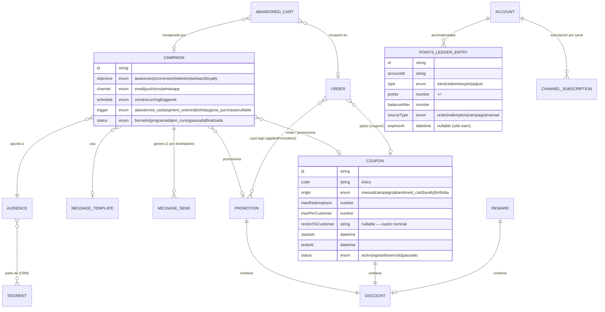
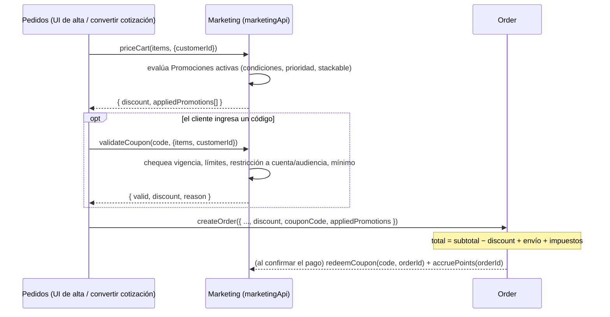
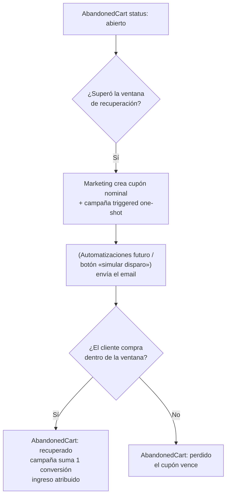
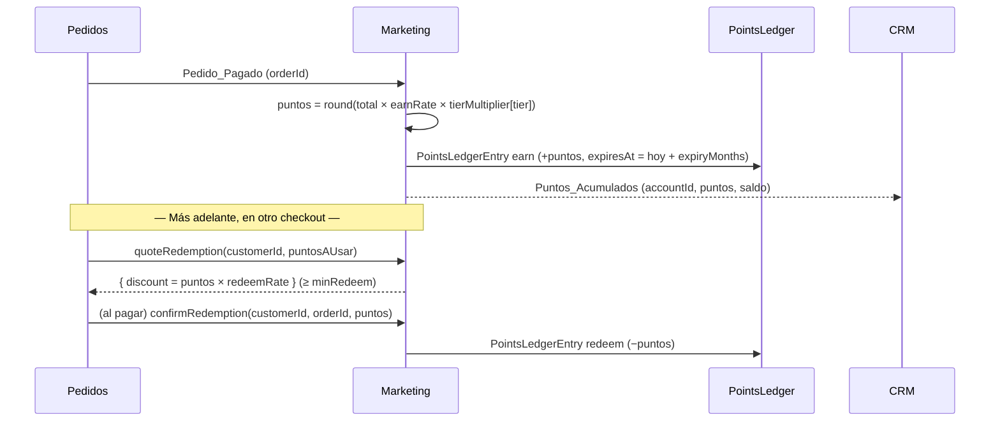
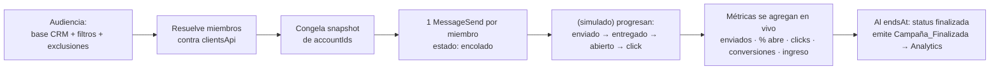

# Módulo Marketing — Arquitectura Funcional y UX

> **Consultar junto con [`ARCHITECTURE.md`](../ARCHITECTURE.md)** (§2 ubica Marketing en la *Capa
> Comercial & Marketing*; §4 ya define el rol **Marketing** = "Catálogo, Promociones y Tienda, sin
> acceso a stock o finanzas") y las specs de:
> - [`MODULO-CRM.md`](MODULO-CRM.md) — el CRM es dueño de la segmentación (RFM + 8 segmentos smart +
>   segmentos manuales + etiquetas). Ya tiene `sendToCampaign`, `getCustomerAnalytics`, un event-bus
>   stub y **ya consume** eventos `email_enviado/abierto/click` (`clientes/data/marketing.mock.js`) en
>   el timeline de cada cuenta. La regla ya escrita: *"Constructor de campañas → vive en Marketing"*.
> - [`MODULO-FINANZAS-FACTURACION.md`](MODULO-FINANZAS-FACTURACION.md) — el descuento es **margen
>   sacrificado**, no un costo: el P&L lo resta del ingreso neto. Facturación factura el total ya
>   con descuento.
>
> **Decisiones tomadas (2026-09-07, por AskUserQuestion — todas la opción recomendada):**
> 1. **Marketing es dueño del motor de descuentos.** Posee `Promoción` / `Cupón` / `Descuento` y
>    expone `priceCart` / `validateCoupon` / `redeemCoupon`. El `Order` gana campos pasivos
>    (`discount`, `couponCode`, `appliedPromotions[]`) — mismo patrón que Logística calcula la tarifa
>    y Pedidos la refleja.
> 2. **Audiencia = segmento del CRM + filtros de marketing + exclusiones.** Marketing **no** redefine
>    RFM ni los segmentos smart.
> 3. **Fidelización = programa de puntos con ledger propio** (`PointsLedgerEntry`) + beneficios por
>    `tier` del CRM como capa declarativa encima.
> 4. **Carritos abandonados = entidad propia simulada** (`AbandonedCart`, seed + "generar"). La
>    Tienda real los alimentaría por evento.
>
> **Estado (2026-09-07): arquitectura + UX definidas; Fases 1, 2 y 3 IMPLEMENTADAS.**
> - **F1 (motor de descuentos):** pantallas Promociones y Cupones. `priceCart` / `validateCoupon` /
>   `quoteDiscount`; el `Order` gana `discount` / `couponCode` / `appliedPromotions` (pasivos);
>   `PedidoDetalle` con "Aplicar cupón / promoción". Finanzas resta el descuento del ingreso neto;
>   Facturación emite la factura con línea de descuento.
> - **F2 (campañas):** pantallas Resumen, Campañas (+ detalle con `CampaignWizard` de 5 pasos),
>   Audiencias (`AudienceBuilder`), Comunicación (Plantillas / Envíos / Suscripciones). `Audience`
>   resuelve contra `clientsApi`; `Campaign` con envíos simulados (`ensureSends`), métricas y
>   atribución last-touch; `ChannelSubscription` bloquea el envío. El CRM lee la actividad de
>   marketing vía `getAccountMarketingActivity` (`ClienteDetalle` la inyecta en `getActivities`) —
>   `clientes/data/marketing.mock.js` **eliminado**.
> - **F3 (carritos abandonados + fidelización):** pantallas Carritos abandonados y Fidelización
>   (tabs Programa / Recompensas / Movimientos). `AbandonedCart` simulado (seed + "generar carrito de
>   ejemplo"); `sendCartRecovery` crea cupón nominal `RESCATE-*` + campaña one-shot en curso;
>   `ensureCartRecovery` marca `recuperado`. `LoyaltyProgram` (config editable) + `PointsLedgerEntry`
>   (bitácora materializada en lectura por `ensurePointsLedger` — earn de pedidos pagados, redeem por
>   `order.pointsRedeemed`, reversa por devolución §6.6, vencimiento §7) + `Reward` (catálogo CRUD con
>   `DiscountForm`). El `Order` gana `pointsRedeemed` (pasivo); `PedidoDetalle` ofrece canje de puntos
>   en el checkout (`quoteRedemption`). `priceCart` aplica `tierBenefits` (envío gratis / % extra) al
>   cotizar. El CRM suma la actividad de puntos al timeline vía `getAccountLoyaltyActivity`.
>
> Verificado en el navegador (lint + build limpios).

---

## 1. Objetivo y alcance

Marketing es la capa que **atrae, convierte, retiene y reactiva** clientes. Responde: *"¿a quién le
hablamos, con qué oferta, por qué canal, y funcionó?"*.

**Marketing no es dueño de las transacciones ni de los clientes.** Lee el CRM (segmentos), el
Catálogo (productos), Pedidos y Ventas (comportamiento e historial), y a cambio:
- **posee** las ofertas (Promociones, Cupones, Descuentos), las Campañas, las Audiencias, el programa
  de Fidelización, las plantillas de Comunicación y los Carritos abandonados;
- **escribe** en Pedidos sólo el descuento a aplicar (campo pasivo) y emite eventos hacia el CRM,
  Analytics y Automatizaciones.

### 1.1 Qué NO es este módulo

- **No redefine la segmentación.** RFM, los 8 segmentos smart y los segmentos manuales son del CRM.
  Marketing arma *Audiencias* encima.
- **No envía mensajes de verdad.** La Comunicación es un modelo fiel pero **simulado** (estados de
  envío generados como el tracking de Logística), sin integración con un ESP / gateway de SMS.
- **No ejecuta las automatizaciones.** Marketing *define* los disparadores ("carrito abandonado hace
  2 h → …"); un futuro módulo de **Automatizaciones** los ejecuta. En el MVP hay un botón "simular
  disparo".
- **No ve el margen.** Marketing ve el descuento otorgado y el ingreso atribuido; cuánto de
  rentabilidad se sacrificó lo calcula **Finanzas** (cruzando `Descuento_Aplicado` con el COGS).

### 1.2 Alcance MVP vs. futuro

| Entra ahora | Queda fuera por ahora |
|---|---|
| Motor de descuentos: Promociones (automáticas) + Cupones (con código) + `Discount` | Precios de lista / tarifas escalonadas (eso es Catálogo/Ventas) |
| Campañas (email/push/SMS/WhatsApp simulados) con objetivo, calendario y métricas | A/B testing, personalización dinámica de contenido |
| Audiencias sobre segmentos del CRM + filtros de comportamiento | Constructor de reglas AND/OR arbitrario propio |
| Carritos abandonados (simulados) + flujo de recuperación | Journeys / flows visuales multi-paso (→ Automatizaciones) |
| Fidelización: programa de puntos (`PointsLedger`) + recompensas + beneficios por tier | Niveles de membresía pagos, gamificación, referidos |
| Comunicación: plantillas + envíos simulados + suscripción/consentimiento por canal | Editor visual de emails, landing pages, formularios, redes sociales, pauta paga |
| Atribución last-touch dentro de ventana | Atribución multi-touch, modelos de mix de medios |
| Eventos hacia CRM / Pedidos / Analytics / Automatizaciones | Motor de automatizaciones (lo consume, no lo implementa) |

---

## 2. Modelo de dominio

### 2.1 Entidades

| Entidad | Descripción | Dueño |
|---|---|---|
| **Descuento** (`Discount`) | *Value object*, nunca vive solo. `type` (percent \| fixed \| free_shipping \| points), `value`, `appliesTo` (order \| line \| shipping), `maxAmount` (tope), `scope` (categorías/SKUs/marcas o "todo"). | Marketing |
| **Promoción** (`Promotion`) | Descuento **automático**, sin código. Se aplica si se cumplen las `conditions` al armar el carrito. `stackable`, `priority`, `status`, `startsAt`/`endsAt`, `channel`. | Marketing |
| **Cupón** (`Coupon`) | Descuento activado por un **código** que el cliente ingresa. `code`, `conditions`, `limits` (`maxRedemptions`, `maxPerCustomer`), `restrictToAudience` / `restrictToCustomer` (nominal), `origin` (manual \| campaign \| abandoned_cart \| loyalty \| birthday). | Marketing |
| **Campaña** (`Campaign`) | Orquesta **audiencia + mensaje + oferta + calendario + objetivo**. `objective` (awareness \| conversion \| retention \| winback \| loyalty), `audienceId`, `templateId` + `channel`, `offer` (none \| coupon \| promotion), `schedule` (once \| recurring \| triggered), `status`, `metrics` (derivadas). | Marketing |
| **Audiencia** (`Audience`) | El **target**. `base` (segmento smart / segmento manual / etiqueta / todos — del CRM), `filters` (comportamiento de marketing: abrió/no abrió, tiene cupón sin usar, carrito abandonado, suscripto al canal, días sin comprar), `exclusions`. `memberCount` derivado; `snapshot` al lanzar. | Marketing (resuelve contra el CRM) |
| **Plantilla** (`MessageTemplate`) | Contenido reutilizable por canal. `channel`, `subject`, `body` (con variables `{{nombre}}`, `{{cupon}}`, `{{producto}}`), `previewProductIds`, `category`. | Marketing |
| **Envío** (`MessageSend`) | Una instancia de envío a un destinatario. `campaignId`, `accountId`, `channel`, `status` (encolado → enviado → entregado → abierto → click \| rebotado \| baja), `events[]` (append-only), `couponCode`. **Simulado.** | Marketing |
| **Suscripción** (`ChannelSubscription`) | Consentimiento por cuenta y canal. `status` (suscripto \| baja \| no_confirmado), `unsubscribedAt`, `source`. **Bloquea el envío.** | Marketing (el CRM lo muestra) |
| **Carrito abandonado** (`AbandonedCart`) | Snapshot de un carrito que no llegó a pedido. `items[]`, `subtotal`, `lastActivityAt`, `status` (abierto \| recuperado \| perdido), `recoveryCampaignId`, `recoveredOrderId`. **Simulado** (la Tienda lo alimentaría). | Marketing |
| **Programa de puntos** (`LoyaltyProgram`) | Config única. `earnRate` (puntos por $), `redeemRate` (valor de canje), `minRedeem`, `expiryMonths`, `tierMultipliers` (VIP acumula ×2), `tierBenefits` (VIP → envío gratis + % + early access). | Marketing |
| **Movimiento de puntos** (`PointsLedgerEntry`) | Bitácora **inmutable** por cuenta. `type` (earn \| redeem \| expire \| adjust), `points` (+/−), `balanceAfter`, `sourceType`/`sourceId`, `at`, `expiresAt`. | Marketing |
| **Recompensa** (`Reward`) | Catálogo de canje. `pointsCost` + `discount` embebido (o `productId` para producto gratis), `status`. | Marketing |

### 2.2 Relación ER

### 2.3 Descuento, Promoción y Cupón — la misma mecánica, dos disparadores

Un **`Discount`** describe *qué* se descuenta. Una **`Promotion`** lo aplica automáticamente si el
carrito cumple las condiciones; un **`Coupon`** lo aplica cuando el cliente ingresa un código. El
cálculo (`applyDiscount(cart, discount) → montoDescontado`) es el mismo. Una **`Reward`** de
fidelización también entrega un `Discount` (canjeando puntos). Por eso **Descuentos no tiene pantalla
propia** — se configura dentro de cada Promoción / Cupón / Recompensa.

---

## 3. Cómo Marketing **usa** información de otros módulos

### 3.1 Clientes (CRM) — a quién apuntar

- **Lee** (vía `clientsApi`): segmentos RFM + smart + manuales, etiquetas, `CustomerMetrics`
  (LTV, AOV, recencia, frecuencia, `tier`), datos de contacto (email/teléfono), historial de
  segmento. `getManualSegments`, `getSegmentDistribution`, `getAllTags`, `getCustomerAnalytics`,
  `listAccounts`.
- **Frontera:** Marketing arma `Audience` = base del CRM + filtros de marketing + exclusiones —
  nunca recalcula RFM. La **suscripción por canal** es dato de Marketing, pero el CRM la muestra en
  el perfil (mismo patrón que el timeline de campañas).

### 3.2 Productos (Catálogo) — con qué tentar

- **Lee:** producto / SKU / categoría / marca / precio de lista / imagen / estado, para definir el
  `scope` de un descuento (ej. "20 % en Calzado", "2×1 en `REM-BAS-BL-M`") y el bloque de productos
  de un email. **Stock** (de Inventario) — no promocionar ni recomendar productos agotados.
- No requiere campos nuevos en el catálogo (usa el espejo `inventario/data/skus.mock.js` +
  `productos` para el precio de lista).

### 3.3 Ventas — retargeting y canal

- **Lee:** cotizaciones B2B abiertas/perdidas → audiencia "cotización sin cerrar" (nudge); el canal
  de la venta (tienda web / B2B) para segmentar campañas por canal.

### 3.4 Pedidos — comportamiento y medición

- **Lee:** historial de compra por cliente (qué compró → cross-sell / up-sell), fecha del último
  pedido (alimenta el filtro "días sin comprar"), primera compra vs. recompra.
- **Atribución:** qué pedidos se generaron dentro de la ventana de una campaña o con su cupón →
  `conversions` y `revenue` de la campaña.
- El **carrito abandonado** es, conceptualmente, un "pre-pedido" que no se concretó.

### 3.5 Analytics (módulo futuro) — hoy el proxy es `getCustomerAnalytics()` del CRM

- Consumiría cohortes de retención, funnels, atribución multi-touch, forecast de demanda,
  **elasticidad de precio** (¿el 20 % de descuento generó volumen suficiente para compensar el margen
  perdido?).
- En el MVP, Marketing calcula sus propias métricas de campaña y expone `getMarketingAnalytics()`
  como contrato hacia el futuro Analytics.

---

## 4. Eventos que Marketing **genera** hacia otros módulos

### 4.1 Clientes (CRM) — aterrizan en el `ActivityTimeline` de la cuenta

Ya existe `marketingToActivity` en `clientsApi`; el módulo Marketing **reemplaza**
`clientes/data/marketing.mock.js` por eventos reales del `marketingApi`.

| Evento | Cuándo |
|---|---|
| `Campaña_Enviada` / `Email_Entregado` / `Email_Abierto` / `Email_Click` | progreso del `MessageSend` |
| `Baja_De_Canal` | el cliente se da de baja |
| `Cupón_Emitido` (nominal) / `Cupón_Canjeado` | campaña asigna un cupón / se usa en un pedido |
| `Puntos_Acumulados` / `Puntos_Canjeados` / `Puntos_Vencidos` | movimientos del ledger |
| `Recompensa_Canjeada` | canje de una `Reward` |
| `Segmento_Sugerido` | Marketing **propone** mover una cuenta a un segmento manual (ej. "candidato a VIP") — el CRM lo registra, no lo aplica solo |

### 4.2 Pedidos — al armar el carrito y al confirmar el pago

| Evento / llamada | Efecto |
|---|---|
| `priceCart(items, {customerId})` | Marketing evalúa las promociones activas y devuelve el descuento total + `appliedPromotions[]` |
| `validateCoupon(code, {items, customerId})` | devuelve `{valid, discount, reason}` |
| `Descuento_Aplicado` | Pedidos persiste `discount` / `couponCode` / `appliedPromotions` en el `Order` (campos nuevos pasivos). `total = subtotal − discount + envío + impuestos` |
| `redeemCoupon(code, orderId)` (al pagar) | registra la redención, incrementa el uso |
| `accruePoints(orderId)` (al pagar) | acredita `total × earnRate × tierMultiplier` en el ledger |
| `Pedido_Devuelto` (de Logística/Finanzas) | Marketing **revierte** los puntos y **restituye** el cupón usado — mismo criterio que Finanzas revierte el ingreso |

### 4.3 Analytics (futuro)

- `Campaña_Finalizada` con el snapshot de métricas (enviados, aperturas, clicks, conversiones,
  ingreso atribuido, costo, ROI).
- `Descuento_Aplicado` con el detalle (tipo, monto, margen sacrificado) → análisis de rentabilidad
  promocional (cruza con el P&L de Finanzas).
- `Carrito_Abandonado` / `Carrito_Recuperado` → funnel de recuperación.

### 4.4 Automatizaciones (futuro) — Marketing **define** los disparadores, no los ejecuta

- `Disparador_Definido`: *"carrito abandonado hace 2 h → campaña C con cupón"*, *"cliente entró a
  segmento En riesgo → campaña de recuperación"*, *"cumpleaños → cupón"*, *"primera compra hace 7 d
  sin segunda → nudge"*.
- Marketing publica *"condición cumplida para la campaña triggered X, destinatario Y"*; un futuro
  motor de Automatizaciones lo toma y ejecuta el envío. **En el MVP hay un botón "simular disparo"**
  (mismo patrón: Logística emite eventos de tracking y no manda emails).

---

## 5. Flujos de negocio

### 5.1 Cupón y promoción en el checkout

### 5.2 Carrito abandonado → recuperación

### 5.3 Acumular y canjear puntos

### 5.4 Lanzar una campaña

---

## 6. Reglas de negocio (resumen normativo)

1. **Marketing no es dueño de la segmentación.** El CRM define RFM y los segmentos; Marketing arma
   *Audiencias* encima (base + filtros de marketing + exclusiones). Nunca recalcula RFM.
2. **Un `Discount` nunca vive solo** — se entrega vía una `Promotion` (automática) o un `Coupon`
   (con código) o una `Reward` (canjeando puntos). Misma mecánica de cálculo, distinto disparador.
3. **Por defecto los descuentos no se apilan.** Si más de una promo/cupón aplica, gana el de mayor
   `priority` (o el más beneficioso para el cliente, configurable); `stackable: true` es la excepción
   explícita.
4. El descuento se calcula sobre el **neto** y se refleja en el `Order` como una línea propia
   (`discount`), separada de subtotal / impuestos / envío. **Finanzas lo resta del ingreso**
   (margen sacrificado, no un costo). **Facturación** factura el total ya con descuento.
5. **Marketing no envía a un canal con `baja`.** El consentimiento por canal bloquea el envío, sin
   excepción.
6. Una **devolución revierte** lo que Marketing otorgó: los puntos acumulados por ese pedido se
   debitan y el cupón usado se restituye (mismo criterio que Finanzas revierte el ingreso y
   Facturación emite la NC).
7. Los **puntos vencen** a los `expiryMonths` de acumulados. El vencimiento es un
   `PointsLedgerEntry` type `expire`.
8. Un **cupón nominal** (`restrictToCustomer`) sólo lo puede canjear esa cuenta. Un cupón genérico
   respeta `maxRedemptions` y `maxPerCustomer`.
9. **Atribución last-touch dentro de ventana:** un pedido se atribuye a la última campaña que tocó a
   ese cliente en los `N` días previos, o al cupón que usó. Sin multi-touch en el MVP.
10. Las **campañas `triggered`** definen la condición pero **no se auto-ejecutan** — las ejecuta el
    futuro módulo de Automatizaciones; en el MVP hay un botón "simular disparo".
11. Marketing ve el **descuento otorgado** y el **ingreso atribuido**; el **margen** promocional
    (rentabilidad sacrificada) lo ve **Finanzas** (regla `ARCHITECTURE.md` §4: Marketing sin acceso
    a finanzas).
12. **Regla dura de capa de datos:** la UI habla sólo con `marketingApi`. Nunca importa
    `data/*.mock.js` directo. Deps **unidireccionales**: `marketingApi` lee de `clientsApi` +
    Productos + `pedidosApi`; **Pedidos NO importa `marketingApi`** — la validación de cupón /
    promoción se dispara desde la UI de alta de pedido y el resultado se le pasa a `pedidosApi` como
    dato. Los puntos y las redenciones se **materializan en lectura** (`ensurePointsLedger`,
    mismo patrón que `ensureShipment` / `ensureDocsForOrder`).

---

## 7. Mapa de las 8 sub-áreas → dónde viven

| Sub-área | Dónde vive |
|---|---|
| **Campañas** | Entidad `Campaign` — orquesta audiencia + mensaje + oferta + calendario + objetivo. `/marketing/campanas` (+ `/:id`). |
| **Promociones** | Entidad `Promotion` — descuento automático por reglas, sin código. Motor `priceCart`. `/marketing/promociones`. |
| **Cupones** | Entidad `Coupon` — descuento por código. Motor `validateCoupon` / `redeemCoupon`. `/marketing/cupones`. |
| **Descuentos** | *Value object* `Discount` embebido en Promoción / Cupón / Recompensa. **Sin pantalla propia** — se configura dentro de cada uno (`DiscountForm`). |
| **Segmentación** | **No la posee Marketing.** Entidad `Audience` = segmento CRM + filtros de marketing + exclusiones. `/marketing/audiencias`. |
| **Carritos abandonados** | Entidad `AbandonedCart` (simulada). Flujo de recuperación = campaña triggered + cupón nominal. `/marketing/carritos`. |
| **Fidelización** | `LoyaltyProgram` (config) + `PointsLedgerEntry` (bitácora por cuenta) + `Reward` (catálogo de canje) + `tierBenefits` (capa declarativa sobre el `tier` del CRM). `/marketing/fidelizacion`. |
| **Comunicación** | `MessageTemplate` (contenido) + `MessageSend` (envío simulado con estados) + `ChannelSubscription` (consentimiento por canal). `/marketing/comunicacion` + integrado en cada campaña. |

---

## 8. UX — pantallas

Mismo patrón visual que los demás módulos (`ARCHITECTURE.md` §5): `PageHeader` + fila de `StatCard` +
`DataTable` con `toolbar`, estilo "premium sobrio", sin librería de charts (embudos y barras con
CSS). El control global recurrente acá es el **período** (para las métricas) — se reutiliza el
`PeriodPicker` de Finanzas.

### 8.1 Resumen (`/marketing`)

- **Qué es:** la mesa de decisión de marketing.
- **KPIs (`StatCard`):** Campañas activas, Ingreso atribuido (período), Tasa de conversión promedio,
  Puntos en circulación.
- **Widgets:** performance de las últimas campañas (`FunnelBar`: enviados → abiertos → clicks →
  conversiones), carritos abandonados pendientes de recuperar (valor + nº), cupones por vencer.
- **Calendario compacto** de campañas programadas del mes.

### 8.2 Campañas (`/marketing/campanas`, `/marketing/campanas/:id`)

- **Listado:** Nombre, Objetivo, Audiencia (+ nº miembros), Canal, Estado (`StatusBadge`),
  Programada para, Métricas resumidas (enviados · % abre · conversiones · ingreso). **Tabs:**
  Todas / Borradores / Programadas / En curso / Finalizadas / **Automáticas** (triggered).
- **Acción:** "Nueva campaña" → **`CampaignWizard`** de 5 pasos: objetivo → audiencia → mensaje
  (plantilla + canal) → oferta (ninguna / cupón / promoción) → calendario (una vez / recurrente /
  triggered) → revisar y lanzar.
- **Detalle:** `FunnelBar` (enviados → entregados → abiertos → clicks → conversiones), ingreso
  atribuido + ROI, lista de destinatarios con su estado de envío, la oferta con sus redenciones,
  acciones "Pausar" / "Duplicar" / "Simular disparo" (si triggered).

### 8.3 Promociones (`/marketing/promociones`)

- **Listado:** Nombre, Descuento (ej. *"20 % · Calzado · tope $10.000"*), Condiciones (resumen),
  Vigencia, Estado, Usos. **Tabs:** Activas / Programadas / Finalizadas / Borradores.
- **Modal (`DiscountForm` + condiciones):** nombre, tipo de descuento + valor + tope + a qué aplica
  (todo / categorías / productos / envío), condiciones (mínimo de compra, primera compra,
  segmento/tier, ventana de fechas), `stackable` + `priority`, canal.
- **`CartPreview`:** "así se vería en un carrito de ejemplo" (calcula con `priceCart`).

### 8.4 Cupones (`/marketing/cupones`)

- **Listado:** Código, Descuento, Límites (usos / por cliente), Vigencia, Origen (manual / campaña /
  carrito / fidelización), Estado, Redenciones (nº + $ total).
- **Modal:** código (o "generar"), `DiscountForm`, condiciones, límites, restricción a
  audiencia/cliente, vigencia.
- **Drawer de detalle:** quién lo usó (pedido + cliente + monto).

### 8.5 Audiencias (`/marketing/audiencias`)

- **Listado:** Nombre, Base (segmento/etiqueta del CRM), Filtros (resumen), Miembros (nº,
  recalculado), Campañas que la usan.
- **`AudienceBuilder`:** elegir base (segmento smart / segmento manual / etiqueta / todos) → agregar
  filtros de marketing (abrió campaña X, no compró en N días, tiene carrito abandonado, suscripto a
  email) → exclusiones → **"vista previa"** (lista de cuentas + nº). Link a `/clientes/segmentos`
  con la nota *"los segmentos se gestionan en el CRM"*.

### 8.6 Carritos abandonados (`/marketing/carritos`)

- **KPIs:** Valor en carritos abiertos, Tasa de recuperación, Ingreso recuperado.
- **Listado:** Cliente, Ítems (nº + $), Abandonado hace, Estado (abierto / recuperado / perdido),
  Campaña de recuperación (si hay), Pedido recuperado (link).
- **Acción por fila:** "Enviar recuperación" (crea cupón nominal + campaña one-shot) · "Generar
  carrito de ejemplo" (para demo).

### 8.7 Fidelización (`/marketing/fidelizacion`)

- **Tabs:** **Programa** (config: earn rate, redeem rate, mínimo de canje, vencimiento,
  multiplicadores por tier, beneficios por tier) · **Recompensas** (catálogo de canje — CRUD con
  `DiscountForm`) · **Movimientos** (`PointsLedgerTable` global: cuenta, tipo, puntos, saldo, origen,
  fecha).
- **KPIs:** Puntos en circulación, Puntos canjeados (período), Clientes con puntos, Puntos por
  vencer (30 días).

### 8.8 Comunicación (`/marketing/comunicacion`)

- **Tabs:** **Plantillas** (CRUD por canal — `MessageTemplateEditor` con variables `{{…}}` y
  preview) · **Envíos** (log global de `MessageSend` — cuenta, campaña, canal, estado, fecha) ·
  **Suscripciones** (por cuenta y canal — quién se dio de baja y cuándo).

---

## 9. Arquitectura de información / rutas

| Ruta | Pantalla | Permiso sugerido |
|---|---|---|
| `/marketing` | Resumen — performance + carritos + calendario | `marketing:campana:ver` |
| `/marketing/campanas` (+ `/:id`) | Campañas — listado + wizard + detalle | `marketing:campana:gestionar` |
| `/marketing/promociones` | Promociones — reglas de descuento automático | `marketing:promocion:gestionar` **(impacta precio)** |
| `/marketing/cupones` | Cupones — códigos de descuento | `marketing:cupon:gestionar` **(impacta precio)** |
| `/marketing/audiencias` | Audiencias — base CRM + filtros | `marketing:audiencia:gestionar` |
| `/marketing/carritos` | Carritos abandonados + recuperación | `marketing:campana:gestionar` |
| `/marketing/fidelizacion` | Programa de puntos + recompensas + movimientos | `marketing:fidelizacion:configurar @ global` |
| `/marketing/comunicacion` | Plantillas + envíos + suscripciones | `marketing:comunicacion:gestionar` |

- **Sidebar:** sección nueva **MARKETING** (o dentro de "GESTIÓN E-COMMERCE"), un ítem **Marketing**
  con submenú: Resumen · Campañas · Audiencias · Promociones · Cupones · Carritos · Fidelización ·
  Comunicación. Si 8 sub-ítems resulta mucho, agrupar Promociones + Cupones + Carritos bajo
  "Ofertas".

---

## 10. Permisos (RBAC)

El rol **Marketing** ya existe en `ARCHITECTURE.md` §4 — este módulo le da pantalla. **No crea roles
nuevos.**

| Permiso | Notas |
|---|---|
| `marketing:campana:ver` \| `:gestionar` | Crear/editar/lanzar campañas. Ver: también CX y Ventas (para responder consultas). |
| `marketing:promocion:gestionar` \| `marketing:cupon:gestionar` | **Impactan el precio de venta** → sólo Marketing / Admin (misma lógica que las tarifas de Logística y las de comisión de Finanzas). |
| `marketing:audiencia:gestionar` | Los segmentos base se gestionan en el CRM (`clientes:segmento:gestionar`, que Marketing ya tiene). |
| `marketing:fidelizacion:configurar @ global` | Cambiar el earn/redeem rate mueve un **pasivo** (puntos) → Admin / Owner. |
| `marketing:comunicacion:gestionar` | Plantillas y canales. |
| `marketing:enviar` | Disparar un envío real (cuando exista un ESP) — **aislado**, como `exportar`. |
| `exportar` | El más restringido (`ARCHITECTURE.md` §4): listas de audiencia, reportes de campaña. |

**Regla crítica de separación:** quien gestiona promociones/cupones **no ve el margen** (P&L de
Finanzas). Marketing emite `Descuento_Aplicado` con el detalle; Finanzas lo cruza con el COGS y
expone la rentabilidad promocional. Evita que se regalen descuentos sin control de rentabilidad.

---

## 11. Componentes

**Reutiliza:** `PageHeader`, `DataTable` (+ `toolbar`), `StatCard`, `StatusBadge`, `Modal`, `Button`,
`Tabs`, `PeriodPicker` (de Finanzas — o se promueve a `src/components/`), clases globales.

**Nuevos:**

| Componente | Uso |
|---|---|
| `CampaignWizard` | Flujo de 5 pasos: objetivo → audiencia → mensaje → oferta → calendario. |
| `AudienceBuilder` | Base (segmento/etiqueta CRM) + filtros de marketing + exclusiones + vista previa de miembros. |
| `DiscountForm` | Sub-formulario de descuento (tipo / valor / tope / scope). Reutilizado en Promoción, Cupón y Recompensa. |
| `FunnelBar` | Embudo enviados → entregados → abiertos → clicks → conversiones (barras CSS, sin lib). |
| `MessageTemplateEditor` | Editor de plantilla con variables `{{…}}` y preview. |
| `CartPreview` | "Cómo se vería este descuento en un carrito de ejemplo" (calcula con `priceCart`). |
| `PointsLedgerTable` | Bitácora de movimientos de puntos. |
| `ChannelBadge` / `ObjectiveBadge` | Badges de canal y objetivo de campaña. |

---

## 12. Próximas etapas

- **Implementación** (pendiente de "dale, arrancá con la implementación"): capa `data/` (mocks
  consistentes con los clientes, productos y pedidos ya sembrados) · `lib/` (cálculo puro de
  descuentos, resolución de audiencias, puntos) · `api/marketingApi.js` (única puerta), sin tocar
  `backend/` ni `sitio-web/`.

- **Campos nuevos a agregar:** `order.discount` / `order.couponCode` / `order.appliedPromotions[]`
  (Pedidos — pasivos; `total = subtotal − discount + envío + impuestos`, con el ajuste
  correspondiente en `enrichOrder`, el P&L de Finanzas y el neto de Facturación). `ChannelSubscription`
  y el saldo de puntos se muestran en el perfil del CRM (lectura).

- **Fasado propuesto:**
  - **F1 — Motor de descuentos — IMPLEMENTADA (2026-09-07):**
    - `data/promotions.mock.js` (5 promos: envío gratis >$80k, 15% Indumentaria, 10% primera compra,
      −5% mayorista >$250k, Semana del Calzado programada) · `data/coupons.mock.js` (BIENVENIDA15,
      VOLVE20 —restringido a segmentos en riesgo/durmiente/perdido—, ENVIOGRATIS, VERANO2026 vencido).
    - `lib/discounts.js` (`applyDiscount(discount, cart) → {amount, freeShipping}` con `scope` por
      categoría/SKU y `maxAmount`; mapas de estado; `describeDiscount`/`describeConditions`).
    - `api/marketingApi.js` — única puerta. `priceCart({items, customerName})` evalúa las promos
      automáticas activas (condiciones: mínimo, primera compra, segmento/tier, canal; resuelve
      no-apilables por prioridad, apilables suman). `validateCoupon(code, …)` chequea vigencia,
      límites (`maxRedemptions`/`maxPerCustomer`, contra las redenciones materializadas), condiciones
      y restricción a cliente/audiencia. `quoteDiscount({…, couponCode})` combina: el cupón **de
      valor** reemplaza a las promos de valor, el envío gratis se mantiene. `ensureRedemptions()`
      materializa las redenciones desde los pedidos pagados con `couponCode` (lazy, patrón
      `ensureShipment`). CRUD de promos y cupones. Deps unidireccionales:
      `marketingApi → pedidosApi + clientsApi + inventoryApi` (Pedidos **no** importa `marketingApi`).
    - **`order.discount` / `couponCode` / `appliedPromotions`** (campos pasivos). `pedidosApi.enrichOrder`
      calcula `total = subtotal − discount + envío + IVA(neto)`, con `shipping = 0` si aplicó envío
      gratis. `applyDiscountToOrder(id, quote)` / `clearOrderDiscount(id)` — sólo pedidos pendientes.
    - **Facturación:** `lib/taxes.js` `buildLines` agrega la línea de descuento negativa (reduce la
      base gravada); el total del comprobante sigue cuadrando con `order.total`.
    - **Finanzas:** `orderPnl` usa el ingreso neto de descuento; `getPnlSummary` expone
      `discountsGiven`; el corte por producto prorratea el descuento por línea.
    - **Pantallas:** `Promociones.jsx` (KPIs + tabs + `PromocionModal` con `DiscountForm` +
      `CartPreview` en vivo), `Cupones.jsx` (KPIs + tabs + `CuponModal` + drawer de redenciones).
      `PedidoDetalle.jsx` gana "Aplicar cupón / promoción" para pedidos pendientes (`quoteDiscount` →
      `applyDiscountToOrder`).
    - **Seed de demostración:** #10247 (Sofía, cupón BIENVENIDA15, −$6.000) y #10248 (Distribuidora,
      promo PRM-04, −$15.500) ya pagados; #10253 (María, pendiente) con BIENVENIDA15 aplicado.
    - **Sidebar:** sección **MARKETING** nueva; Promociones y Cupones activos, el resto del submenú
      deshabilitado hasta F2/F3. Rutas `/marketing/promociones` y `/marketing/cupones`.
    - **Simplificaciones F1:** la línea de descuento del comprobante va toda a la alícuota del primer
      producto (el catálogo mock es uniforme al 21 %); `convertQuoteToOrder` (CRM) no llama todavía
      al motor de descuentos (crea pedidos del lado del CRM, desconectados de Pedidos).
  - **F2 — Campañas, Audiencias, Comunicación — IMPLEMENTADA (2026-09-07):**
    - `data/audiences.mock.js` (4) · `data/campaigns.mock.js` (5: Newsletter/Reactivación
      finalizadas, Bienvenida triggered + Vuelta a clases en curso, Semana del Calzado programada) ·
      `data/templates.mock.js` (4) · `data/subscriptions.mock.js` (4 bajas/sin confirmar).
    - `lib/marketing.js` (`OBJECTIVES`, `CAMPAIGN_STATUS`, `CHANNELS` con costo/mensaje,
      `SEND_STATUS`, `hashPct` — distribución determinística del embudo) · `lib/audiences.js`
      (`AUDIENCE_FILTERS`, `describeBase`/`describeFilters`).
    - `api/marketingApi.js` +≈330 líneas: `resolveAudience` (base CRM segmento/etiqueta/todos +
      filtros de marketing [abrió/nunca abrió campaña, días sin comprar, LTV mínimo, suscripto a
      email, cupón nominal sin usar] + exclusiones) · `previewAudience` · CRUD de audiencias.
      `ensureSends(campaign)` materializa los `MessageSend` desde `audienceSnapshot` con embudo
      determinístico (≈4,5 % rebote, ≈48 % apertura, ≈34 % click), saltando los canales en baja.
      `launchCampaign` congela el snapshot; `pauseCampaign`/`resumeCampaign`/`finishCampaign`;
      `simulateTrigger` para las triggered. `getCampaignMetrics` (embudo + `roas` = ingreso/costo) ·
      `getCampaignConversions` (atribución: cupón de la campaña **o** envío entregado + pedido pagado
      dentro de la ventana de 14 días). Plantillas CRUD · suscripciones (`setSubscription`) ·
      `listSends` · `getMarketingSummary` · **`getAccountMarketingActivity`** (para el timeline del
      CRM, sin ciclo).
    - **CRM:** `getActivities(id, marketingActivities = [])` — `ClienteDetalle.jsx` le pasa
      `getAccountMarketingActivity(id)`; se **borró** `clientes/data/marketing.mock.js` y
      `marketingToActivity`. `ClienteDetalle → marketingApi → clientsApi` (sin ciclo:
      `clientsApi` ya no importa marketing).
    - Pantallas: `Resumen.jsx` (`/marketing`: KPIs + `FunnelBar` de las top campañas + próximas),
      `Campanas.jsx` (+ `CampanaDetalle.jsx`: embudo, resultado/ROAS, pedidos atribuidos,
      destinatarios, Pausar/Reanudar/Lanzar/Simular disparo), `Audiencias.jsx` (`AudienceBuilder`
      con vista previa en vivo), `Comunicacion.jsx` (tabs Plantillas [`MessageTemplateEditor`] /
      Envíos / Suscripciones). Componentes nuevos: `CampaignWizard`, `AudienceBuilder`, `FunnelBar`,
      `MessageTemplateEditor`.
    - **Simplificaciones F2:** envíos y aperturas simulados (determinísticos, no hay ESP);
      atribución sin dedup entre campañas (un pedido puede contarse en más de una si aplica); la
      `days_since_last_order` / segmento usan las `CustomerMetrics` del CRM (que derivan de los
      pedidos **del CRM**, distintos de los de Pedidos); `getActivities` recibe la actividad de
      marketing por parámetro en vez de un bus de eventos real.
  - **F3 — Carritos abandonados + Fidelización (IMPLEMENTADA):**
    - `data/`: `abandonedCarts.mock.js` (4 carritos: 2 abiertos, 1 recuperado, 1 perdido),
      `loyalty.mock.js` (`loyaltyProgram` config + 4 `rewards` + 3 movimientos sembrados).
      `lib/loyalty.js` (`LEDGER_TYPE`, `TIER_LABELS`, `CART_STATUS`, `REWARD_STATUS`, `earnedPoints`,
      `pointsToMoney`). `lib/time.js` gana `addMonths` y `relativeFromToday`.
    - `api/marketingApi.js` §F3: **Carritos** — `listAbandonedCarts` / `getAbandonedCart` /
      `getAbandonedCartsSummary` / `sendCartRecovery` (cupón nominal `RESCATE-*` + campaña one-shot
      en curso, `ensureSends` la materializa) / `generateSampleCart` / `ensureCartRecovery` (marca
      `recuperado` si la cuenta compró tras la recuperación). **Fidelización** — `getLoyaltyProgram` /
      `updateLoyaltyProgram`, `listRewards` / `getReward` / `createReward` / `updateReward` /
      `deleteReward`, `getPointsLedger(accountId?)` / `getPointsBalance` / `getLoyaltySummary`,
      `ensurePointsLedger` (lazy: earn de pedidos pagados con `expiresAt`; redeem de
      `order.pointsRedeemed`; reversa `type:"reverse"` + restitución de canje por devolución §6.6;
      `expire` §7), `quoteRedemption(customerName)` (canje del saldo completo ≥ `minRedeem`),
      `getAccountLoyaltyActivity` (timeline CRM, `type:"loyalty"`). `priceCart` aplica
      `tierBenefits` (envío gratis + % extra apilable).
    - `pedidosApi`: `Order` gana `pointsRedeemed` (pasivo); `applyDiscountToOrder` /
      `clearOrderDiscount` lo manejan. `PedidoDetalle` ofrece "Canjear N pts" en el checkout de un
      pedido pendiente (mutuamente excluyente con cupón, `couponCode: "PUNTOS"`).
    - Pantallas: `Carritos.jsx` (`/marketing/carritos`: KPIs + tabs + tabla con "Enviar
      recuperación" / "Generar carrito de ejemplo"), `Fidelizacion.jsx` (`/marketing/fidelizacion`:
      KPIs + tabs Programa [config editable] / Recompensas [CRUD, `RewardModal`] / Movimientos
      [`PointsLedgerTable`]). Sidebar: Carritos y Fidelización **activados**. Rutas en `AppRouter.jsx`.
    - **Simplificaciones F3:** carritos y su recuperación 100% simulados (no hay Tienda); el canje en
      checkout es "todo el saldo" (sin monto parcial); los puntos se debitan al pagar el pedido
      (materialización perezosa, no al aplicar); `tierBenefits` sólo VIP / Frecuente; vencimiento y
      canjes viejos van sembrados porque el histórico de pedidos es corto.

- **Fuera de alcance MVP:** envío real (ESP / gateway SMS), A/B testing, personalización dinámica de
  contenido, atribución multi-touch, journeys / flows visuales (→ Automatizaciones), landing pages /
  formularios, redes sociales, presupuesto de medios / pauta paga, programa de referidos.
