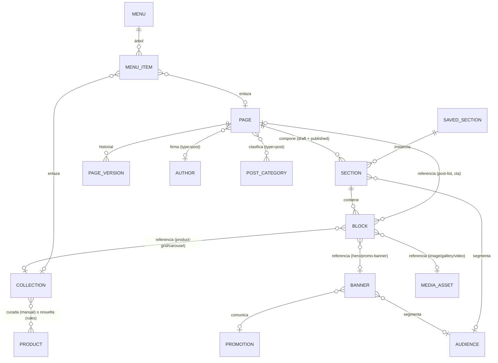

# Módulo Tienda / CMS — Arquitectura Funcional y UX

> **Consultar junto con [`ARCHITECTURE.md`](../ARCHITECTURE.md)** (§2 ubica Tienda/CMS en la *Capa
> Comercial & Marketing (Front-Office)*, al lado de Catálogo y Marketing; §4 ya define el rol
> **Marketing** = "Catálogo, Promociones y **Tienda**, sin acceso a stock o finanzas") y las specs de:
> - [`MODULO-MARKETING.md`](MODULO-MARKETING.md) — Marketing es dueño de las **ofertas** (Promoción /
>   Cupón / Descuento), las Campañas y las Audiencias. La Tienda **muestra** esas ofertas; no las
>   define. La Tienda es además el origen natural de los `AbandonedCart` que Marketing hoy simula.
> - [`MODULO-CRM.md`](MODULO-CRM.md) — las Audiencias (que el CRM alimenta) permiten **segmentar
>   contenido**: un hero sólo para VIP, un banner sólo para durmientes.
> - [`MODULO-INVENTARIO-ABASTECIMIENTO.md`](MODULO-INVENTARIO-ABASTECIMIENTO.md) — el stock decide si
>   un producto se muestra, se muestra "sin stock" o se oculta de una colección.
>
> **Estado (2026-09-07): MÓDULO COMPLETO — Fases 1, 2 y 3 implementadas.**
> - **F1 (núcleo de composición):** `productos/api/catalogApi.js` (la capa de lectura del catálogo que
>   faltaba, con 14 productos, categorías, marcas, etiquetas y reseñas; el stock se pisa con el real de
>   Inventario). Modelo `Page` / `Section` / `Block` / `Collection` / `Banner` / `MediaAsset` +
>   `PageVersion`. `lib/blockSchemas.js` con los **12 bloques de F1**; el inspector del editor se
>   **genera solo** desde el schema (`SchemaField` cubre 15 controles, incluido `repeater`).
>   **Store Builder** completo en `/tienda/paginas/:id`: outline con reordenar/ocultar/duplicar,
>   selector de bloques por familia, inspector generado, vista previa **al ancho real del dispositivo
>   y escalada**, "Ver como…" (fecha + audiencia + dispositivo), deshacer, guardar borrador, publicar
>   con validación e historial de versiones. Pantallas Resumen (KPIs + miniatura de la home +
>   "Necesita atención"), Páginas, Colecciones (con resultado en vivo) y Banners (galería + editor con
>   preview y ancla de 9 posiciones). La home es editable de verdad, con catálogo, stock y promociones
>   reales.
> - **F2 (editorial y navegación):** blog completo (`Page` con `type: "post"` + `Author` +
>   `PostCategory`), pantallas **Blog**, **Menús** y **Contenido** (Medios / Secciones guardadas /
>   Autores y categorías). **11 bloques nuevos** (23 en total): `product-spotlight`, `category-nav`,
>   `brand-strip`, `video`, `gallery`, `testimonials`, `faq`, `newsletter`, `post-list`,
>   `post-content`, `author-card`. `PageSettingsModal` con identidad, **SEO** (contadores + vista
>   previa tipo buscador) y datos de la nota. `SavedSection` (guardar una sección y reinsertarla como
>   copia) y `SectionPicker`. El bloque `newsletter` **escribe de verdad** en Marketing
>   (`subscribeFromStore` → resuelve la cuenta en el CRM por email y marca la `ChannelSubscription`).
> - **F3 (apariencia y cierre):** pantalla **Apariencia** (paleta, tipografía, esquinas, densidad,
>   header, footer y anuncio superior) con vista previa en vivo; el Tema se aplica como variables CSS
>   **dentro del preview**, y `StoreChrome` dibuja anuncio + header + footer alrededor del contenido en
>   todas las vistas previas. **3 bloques finales** (26 en total): `countdown` (lee `Promotion.endsAt`
>   de Marketing), `store-locator` (lee las sucursales de Inventario), `html-embed` (sólo Admin, y **no
>   se ejecuta** en el editor). **Timeline de banners** por mes con detección de huecos, rotación del
>   hero por `weight`, tráfico simulado. **Publicación programada** con materialización perezosa
>   (`ensureScheduledPublish`). Panel **"Necesita atención"** completo, con filtros por tipo.
> - Verificado en el navegador (lint + build limpios).

---

## 1. Objetivo y alcance

La Tienda / CMS es la capa que **arma el frente comercial**: qué ve el cliente al entrar, en qué orden,
con qué oferta adelante y con qué historia alrededor. Responde: *"¿cómo se ve y qué comunica la tienda
hoy?"*.

No es un CMS de propósito general ni un constructor libre tipo Elementor. Es un **sistema de
composición especializado en ecommerce**: un catálogo cerrado de bloques con contrato tipado, que
**referencian** entidades reales de los otros módulos en vez de duplicar su contenido.

### 1.1 La regla que define todo el módulo

> **Un bloque no guarda contenido de negocio: guarda una referencia y una configuración de
> presentación.**

Un bloque `product-grid` no guarda 8 productos: guarda `collectionId` + `columns: 4`. Si mañana entra
un producto nuevo que cumple la regla de la colección, la home se actualiza sola. Si el producto se
queda sin stock, Inventario decide qué pasa. Si tiene una promoción activa, Marketing pinta el badge.

De ahí se desprende todo lo demás:
- La Tienda **no** tiene productos, ni precios, ni promociones, ni clientes. Los **lee**.
- Lo único que la Tienda posee es la **composición**: qué bloque, dónde, con qué configuración, desde
  cuándo y para quién.
- Migrar a un backend real = reemplazar `api/tiendaApi.js`; el árbol de contenido es JSON serializable
  tal cual.

### 1.2 Qué NO es este módulo

- **No es un editor libre de HTML/CSS.** No hay drag & drop pixel-perfect, ni márgenes arbitrarios, ni
  selector de color por elemento. El layout se elige de un set cerrado de tokens (§5). Eso es
  deliberado: garantiza que la tienda no se rompa y que el equipo comercial pueda tocarla sin diseñador.
- **No es el sitio público.** El panel administra el contenido y lo **previsualiza**; el storefront real
  (`sitio-web/`) lo consumiría. En el panel, la vista previa es un renderer propio con los mismos datos
  mock.
- **No define ofertas.** Un `promo-banner` referencia una `Promotion`/`Coupon` de Marketing. Si no
  existe la promo, el bloque avisa; no la crea.
- **No es el catálogo.** Una `Colección` es una **vista curada** sobre el catálogo (manual o por reglas).
  Las categorías, marcas y atributos siguen siendo de Productos.
- **No mide.** La analítica de contenido (qué banner convirtió) es de Analytics; la Tienda expone los
  eventos y, en el MVP, un contador simulado.

### 1.3 Alcance MVP vs. futuro

| Entra ahora | Queda fuera por ahora |
|---|---|
| Página / Sección / Bloque con schema tipado y catálogo cerrado (~21 bloques) | Bloques a medida por el usuario, CSS/HTML arbitrario |
| Store Builder: outline + inspector generado por schema + vista previa responsive | Drag & drop libre en canvas, edición inline sobre el preview |
| Colecciones manuales y por reglas + página pública de colección | Merchandising avanzado (orden por margen, personalización 1:1) |
| Banners con biblioteca, programación y rotación | A/B testing estadístico (queda un "variante A/B" simple en F3) |
| Blog (posts, categorías, autores) y páginas institucionales | Comentarios, moderación, multi-idioma |
| Menús de header y footer | Mega-menús con contenido enriquecido |
| Borrador / publicado + versiones + publicación programada | Flujo de aprobación multi-usuario, comparador de versiones visual |
| Segmentación de contenido por Audiencia (Marketing/CRM) | Personalización por comportamiento en tiempo real |
| SEO por página (title, description, slug, OG, noindex) | Sitemap, redirects 301, hreflang |
| Biblioteca de medios simulada | Upload real, CDN, edición de imagen |
| Apariencia: tema (colores, tipografía, header/footer) | Theme marketplace, editor de código del tema |

---

## 2. Modelo de dominio

### 2.1 La jerarquía — tres niveles, no diez

Lo que el pedido lista como diez cosas ("Home, Banners, Secciones, Colecciones, Productos destacados,
Landing pages, Páginas, Blog, Contenido, Store Builder") colapsa en **tres niveles de composición** +
**cuatro bibliotecas de recursos**. Ese colapso es la decisión de diseño central:

```
Página            ← "Home", "Landing pages", "Páginas", "Blog" son todos Página (distinto `type`)
└── Sección[]     ← "Secciones": la banda horizontal. Define ancho, fondo, columnas, espaciado
    └── Bloque[]  ← la unidad de contenido tipada. "Productos destacados" es un bloque
```

Y alrededor, lo **reutilizable** (vive una vez, se referencia desde muchas páginas):

```
Colección   ← "Productos destacados" = una colección + un bloque que la muestra
Banner      ← creatividad con vigencia y segmentación propia
Medio       ← imágenes / videos (biblioteca)
Menú        ← navegación de header y footer
```

Y el **Store Builder** no es una entidad: es la **pantalla** donde se compone una Página.

#### Por qué Home / Landing / Página / Post son la misma entidad

Difieren en tres cosas, y las tres son datos, no código:

| | `home` | `landing` | `institucional` | `post` | `sistema` |
|---|---|---|---|---|---|
| Ruta | `/` (fija, única) | `/l/:slug` | `/:slug` | `/blog/:slug` | fija (`/404`, `/gracias`) |
| Bloques sugeridos | comercio | conversión | editorial | editorial + `post-content` | mínimos |
| Metadatos extra | — | `campaignId` | — | `excerpt`, `authorId`, `categoryIds`, `publishedAt`, `coverId` | — |
| Se puede borrar | ❌ | ✅ | ✅ | ✅ | ❌ |

Un solo editor, un solo modelo de versiones, un solo motor de publicación, un solo renderer. Tener
cuatro entidades paralelas duplicaría los cuatro.

### 2.2 Entidades

| Entidad | Descripción | Dueño |
|---|---|---|
| **Página** (`Page`) | Documento ruteable. `type` (home \| landing \| institucional \| post \| sistema), `slug`, `title`, `status` (borrador \| programada \| publicada \| archivada), `seo`, `draft` / `published` (dos árboles de secciones), `publishAt`, `updatedAt`, `updatedBy`. Los campos de blog viven en `post{}` sólo si `type === "post"`. | Tienda |
| **Sección** (`Section`) | Banda horizontal de una página. `layout` (§5: `width`, `background`, `spacing`, `columns`), `blocks[]`, `visibility` (§8.3), `anchor` (id para links internos), `name` (para el outline). Ordenada por posición en el array. | Tienda |
| **Bloque** (`Block`) | Unidad de contenido tipada. `type` (del catálogo §3), `props` (validado por el schema del tipo), `visibility`, `column` (si la sección tiene columnas). **No** tiene estilos propios. | Tienda |
| **Colección** (`Collection`) | Vista curada del catálogo. `mode` (manual \| rules), `productIds[]` + orden (manual) o `rules{}` (categorías, marcas, etiquetas, rango de precio, con/sin stock, novedades, más vendidos) + `sort` + `limit`. `slug` → página pública `/coleccion/:slug`, `heroBannerId`, `status`. `system: true` para las intocables (`destacados`, `novedades`, `ofertas`). | Tienda (lee Productos + Inventario + Pedidos) |
| **Banner** (`Banner`) | Creatividad reutilizable con ciclo de vida propio. `mediaId` + `mediaMobileId`, `headline`, `subheadline`, `cta{label,href}`, `position` (texto sobre la imagen: 9 anclas), `startsAt`/`endsAt`, `audienceId`, `promotionId`, `weight` (rotación), `status`, `stats` (impresiones/clics simulados). | Tienda |
| **Medio** (`MediaAsset`) | Imagen o video de la biblioteca. `kind`, `url`, `alt`, `width`/`height`, `sizeKb`, `folder`, `tags[]`, `usedIn[]` (derivado). **Simulado** — sin upload real. | Tienda |
| **Menú** (`Menu`) | Navegación. `location` (header \| footer \| mobile), `items[]` recursivos (`label`, `linkType` (page \| collection \| category \| url), `ref`, `children[]`, `badge`). | Tienda |
| **Autor** (`Author`) | Firma de blog. `name`, `bio`, `avatarId`, `role`. Se vincula a un `User` si existe. | Tienda |
| **Categoría de blog** (`PostCategory`) | `name`, `slug`, `description`. Separada de las categorías de producto **a propósito**. | Tienda |
| **Sección guardada** (`SavedSection`) | Sección congelada como plantilla reutilizable ("nuestra barra de beneficios", "el bloque de garantía"). Se inserta como copia; opcionalmente `linked: true` para que se propague. | Tienda |
| **Versión** (`PageVersion`) | Snapshot inmutable del árbol al publicar. `pageId`, `tree`, `publishedAt`, `publishedBy`, `label`, `note`. Permite revertir. | Tienda |
| **Tema** (`Theme`) | Config única de apariencia: paleta, tipografías, radio, densidad, config de header/footer (sticky, logo, buscador, anuncio superior). Alimenta el renderer de la vista previa. | Tienda |

### 2.3 Relación ER



### 2.4 El árbol, en JSON

Todo el contenido de una página es un solo objeto serializable. Así se ve la home:

```js
{
  id: "PG-HOME", type: "home", slug: "/", title: "Inicio", status: "publicada",
  seo: { title: "CheCAT — Indumentaria deportiva", description: "…", ogMediaId: "MD-12", noindex: false },
  draft: { sections: [ /* … */ ] },
  published: { sections: [
    { id: "SC-1", name: "Hero", layout: { width: "full", background: "surface", spacing: "none", columns: 1 },
      visibility: { mode: "always" },
      blocks: [ { id: "BL-1", type: "hero", props: { bannerIds: ["BN-1","BN-2"], height: "lg", autoplayMs: 6000, showDots: true } } ] },

    { id: "SC-2", name: "Beneficios", layout: { width: "wide", background: "sunken", spacing: "sm", columns: 1 },
      blocks: [ { id: "BL-2", type: "usp-bar", props: { items: [ { icon: "truck", title: "Envío gratis", subtitle: "Desde $80.000" }, /* … */ ] } } ] },

    { id: "SC-3", name: "Destacados", layout: { width: "wide", background: "surface", spacing: "lg", columns: 1 },
      blocks: [ { id: "BL-3", type: "product-grid",
                  props: { collectionId: "CO-DESTACADOS", columns: 4, limit: 8, showPrice: true,
                           showBadge: true, ctaLabel: "Ver todo", ctaHref: "/coleccion/destacados" } } ] },

    { id: "SC-4", name: "Oferta VIP", layout: { width: "wide", background: "accent-subtle", spacing: "md", columns: 1 },
      visibility: { mode: "audience", audienceId: "AU-VIP", startsAt: "2026-09-10T00:00:00" },
      blocks: [ { id: "BL-4", type: "promo-banner", props: { bannerId: "BN-7", promotionId: "PR-3", showCouponCode: true } } ] },
  ] },
}
```

---

## 3. Catálogo de bloques

### 3.1 Principios

1. **Catálogo cerrado.** El usuario elige de una lista; no inventa bloques. Agregar un tipo es una
   entrada en `blockSchemas.js` + un componente de render. Eso es lo que mantiene el sistema
   controlado y hace posible cambiar el diseño de todos los `product-grid` de la tienda de una vez.
2. **Schema-driven.** Cada tipo declara sus campos, su control de edición, sus defaults y sus límites.
   **El inspector del editor se genera solo desde el schema** — no se escribe un formulario por bloque.
3. **Referencia, no copia** (§1.1).
4. **Un bloque, una intención.** No hay un bloque "contenedor genérico con lo que quieras adentro":
   para eso está la Sección, que es el único nivel de layout.
5. **Sin estilos propios.** El bloque elige variantes declaradas (`cardStyle: "minimal"`), nunca
   colores ni espaciados sueltos. El aspecto lo da el Tema (§9.9).
6. **Degradación explícita.** Si la referencia falta (colección vacía, banner vencido, producto
   despublicado), el bloque tiene un estado definido: oculto, con placeholder, o con aviso en el
   editor. Nunca rompe la página.

### 3.2 Familia A — Comercio *(lo que diferencia esto de un CMS genérico)*

| `type` | Nombre | Datos que lee | Props | Fase |
|---|---|---|---|---|
| `product-grid` | Grilla de productos | Colección → Productos + Inventario + Marketing (badge de oferta) | `collectionId`, `columns` 2\|3\|4, `limit`, `cardStyle` default\|minimal, `showPrice`, `showBadge`, `showRating`, `hideOutOfStock`, `ctaLabel`, `ctaHref` | **F1** |
| `product-carousel` | Carrusel de productos | ídem | `collectionId`, `limit`, `autoplay`, `showArrows`, `cardStyle` | **F1** |
| `product-spotlight` | Producto destacado | 1 producto | `productId`, `imageSide` left\|right, `showPrice`, `showStock`, `showShipping`, `ctaLabel` | F2 |
| `collection-grid` | Grilla de colecciones | Colecciones | `items[]` (`collectionId` + `mediaId` + `label`), `columns` 2\|3\|4, `aspect` square\|wide\|tall | **F1** |
| `category-nav` | Navegación por categorías | Categorías del catálogo | `categoryIds[]`, `style` chips\|icons\|list, `showCount` | F2 |
| `brand-strip` | Tira de marcas | Marcas del catálogo | `brandIds[]`, `grayscale`, `columns` | F2 |
| `promo-banner` | Banner promocional | Banner + Promoción/Cupón | `bannerId`, `promotionId`, `showCouponCode`, `size` full\|inset | **F1** |
| `countdown` | Cuenta regresiva | `Promotion.endsAt` | `promotionId`, `heading`, `expiredBehavior` hide\|message | F3 |

**Nota sobre "Productos destacados":** no es un bloque propio. Es la colección de sistema
`CO-DESTACADOS` mostrada con `product-grid`. Así "destacados" puede aparecer en la home, en una
landing y en el footer de una categoría, siempre sincronizado, y se cura desde un solo lugar.

### 3.3 Familia B — Presentación

| `type` | Nombre | Datos | Props | Fase |
|---|---|---|---|---|
| `hero` | Hero / slider principal | Banners | `bannerIds[]` (1..5), `height` sm\|md\|lg\|full, `autoplayMs` (0 = off), `showDots`, `overlay` 0-60 | **F1** |
| `rich-text` | Texto enriquecido | — | `heading`, `body` (markdown acotado: **negrita**, *cursiva*, links, listas), `align`, `maxWidth` | **F1** |
| `image` | Imagen | Medio | `mediaId`, `mediaMobileId`, `alt`, `href`, `ratio` auto\|16:9\|4:3\|1:1 | **F1** |
| `image-text` | Imagen + texto | Medio | `mediaId`, `imageSide` left\|right, `heading`, `body`, `cta{label,href}`, `verticalAlign` | **F1** |
| `video` | Video | URL / Medio | `url`, `posterMediaId`, `autoplay`, `muted`, `loop`, `ratio` | F2 |
| `gallery` | Galería | Medios | `mediaIds[]`, `columns`, `lightbox`, `aspect` | F2 |

### 3.4 Familia C — Conversión y confianza *(el resto del ADN ecommerce)*

| `type` | Nombre | Datos | Props | Fase |
|---|---|---|---|---|
| `usp-bar` | Barra de beneficios | — | `items[]` (máx 4: `icon` de set cerrado, `title`, `subtitle`), `layout` inline\|cards | **F1** |
| `cta` | Llamado a la acción | — | `heading`, `body`, `button{label,href}`, `tone` accent\|neutral\|image, `mediaId` | **F1** |
| `testimonials` | Testimonios / reseñas | manual o Valoraciones del catálogo | `source` manual\|reviews, `items[]` \| `minRating`+`limit`, `layout` grid\|carousel | F2 |
| `faq` | Preguntas frecuentes | — | `items[]` (`q`, `a`), `heading`, `defaultOpenIndex` | F2 |
| `newsletter` | Suscripción | **escribe** a Marketing | `heading`, `body`, `buttonLabel`, `channel` email\|whatsapp, `tagOnSubscribe`, `rewardCouponId` | F2 |
| `store-locator` | Sucursales | Inventario › Sucursales | `branchIds[]`, `showMap` (mock), `showHours` | F3 |

### 3.5 Familia D — Editorial / Blog

| `type` | Nombre | Datos | Props | Fase |
|---|---|---|---|---|
| `post-list` | Últimas notas | Páginas `type: post` | `categoryIds[]`, `limit`, `columns`, `showExcerpt`, `showAuthor`, `ctaHref` | F2 |
| `post-content` | Cuerpo de la nota | la página misma | *(sin props — sólo válido en `type: post`, único por página)* | F2 |
| `author-card` | Ficha de autor | Autor | `authorId`, `showBio` | F2 |

### 3.6 Familia E — Utilidad

| `type` | Nombre | Props | Fase |
|---|---|---|---|
| `spacer` | Espaciador | `size` xs\|sm\|md\|lg\|xl | **F1** |
| `divider` | Separador | `style` line\|dots\|gradient, `width` full\|content\|short | **F1** |
| `html-embed` | Embed externo | `code` — **sólo rol Admin**, con aviso; el renderer lo aísla | F3 |

**Total: 21 tipos** (10 en F1, 8 en F2, 3 en F3). Un catálogo de este tamaño cubre el 95 % de una
tienda real y sigue siendo memorizable.

### 3.7 El schema de un bloque

Un tipo se declara una sola vez. De ahí salen: el ítem del selector, el formulario del inspector, la
validación, los defaults y la etiqueta del outline.

```js
// modules/tienda/lib/blockSchemas.js
"product-grid": {
  label: "Grilla de productos",
  family: "comercio",
  icon: GridViewOutlinedIcon,
  description: "Muestra los productos de una colección en una grilla.",
  maxPerPage: null,                    // null = sin límite; 1 en post-content
  allowedPageTypes: null,              // null = todas
  fields: [
    { key: "collectionId", label: "Colección", control: "collection", required: true },
    { key: "columns",  label: "Columnas",  control: "segmented", options: [2, 3, 4], default: 4 },
    { key: "limit",    label: "Cantidad",  control: "number", min: 2, max: 24, default: 8 },
    { key: "cardStyle",label: "Estilo de tarjeta", control: "select",
      options: [ { value: "default", label: "Con detalle" }, { value: "minimal", label: "Minimal" } ], default: "default" },
    { key: "showPrice",      label: "Mostrar precio",        control: "switch", default: true },
    { key: "showBadge",      label: "Mostrar badge de oferta",control: "switch", default: true },
    { key: "showRating",     label: "Mostrar valoración",    control: "switch", default: false },
    { key: "hideOutOfStock", label: "Ocultar sin stock",     control: "switch", default: true },
    { key: "ctaLabel",       label: "Texto del botón",       control: "text", default: "Ver todo", maxLength: 24 },
    { key: "ctaHref",        label: "Destino del botón",     control: "link" },
  ],
  // Se ejecuta al renderizar y al validar en el editor.
  resolve: (props) => resolveCollection(props.collectionId, { limit: props.limit, hideOutOfStock: props.hideOutOfStock }),
  summary: (props, ctx) => ctx.collectionName || "Sin colección",   // etiqueta en el outline
}
```

**Controles disponibles** (el inspector no necesita nada más): `text`, `textarea`, `richtext`,
`number`, `switch`, `select`, `segmented`, `color-token`, `link`, `media`, `media-list`,
`collection`, `product`, `products`, `category-list`, `brand-list`, `banner-list`, `audience`,
`promotion`, `icon`, `repeater` (lista de sub-objetos con su propio `fields`).

### 3.8 Qué explícitamente **no** es un bloque

| No es bloque | Dónde vive |
|---|---|
| Header / navegación | `Menu` + Tema (§9.9) — es del sitio, no de la página |
| Footer | ídem |
| Anuncio superior (barra fina) | Tema — global, con vigencia |
| Carrito / checkout / ficha de producto | Plantillas del storefront, fuera del CMS por ahora |
| Popup / modal de captura | F3, como recurso global tipo Banner, no como bloque de página |
| "Contenedor / columna / fila" | La **Sección** es el único nivel de layout (§5) |

---

## 4. Colecciones — la pieza que hace ecommerce al CMS

Una colección responde *"qué productos van acá"* y es el punto de acople entre contenido y catálogo.

**Modo manual** — `productIds[]` con orden explícito (arrastrar para reordenar). Para curaduría fina:
"Lo mejor de la temporada".

**Modo reglas** — se resuelve en cada lectura contra el catálogo:

| Regla | Fuente |
|---|---|
| Categorías / marcas / etiquetas | Productos |
| Rango de precio | Productos |
| Con stock / stock bajo | Inventario (`inventoryApi`) |
| Novedades (creado en los últimos N días) | Productos |
| Más vendidos (últimos N días) | Pedidos |
| En oferta (tiene promoción activa) | Marketing |

+ `sort` (manual \| precio ↑↓ \| más vendidos \| más nuevos \| mejor valorados) y `limit`.

**Colecciones de sistema** (`system: true`, no se borran, sí se editan): `destacados`, `novedades`,
`ofertas`, `mas-vendidos`. Existen para que los bloques tengan siempre una fuente válida y para que
"Productos destacados" sea una cosa concreta y única en todo el panel.

Cada colección tiene su **página pública** (`/coleccion/:slug`) que también es una `Page` compuesta:
hero de la colección + `product-grid` apuntando a sí misma. Una landing de colección es contenido, no
un caso especial.

---

## 5. Secciones y sistema de layout

La Sección es el **único** nivel donde se decide el aspecto, y elige de un set cerrado de tokens ya
definidos por el design system del panel ("premium sobrio", índigo, sin glow):

| Propiedad | Valores | Qué controla |
|---|---|---|
| `width` | `full` \| `wide` (1280) \| `narrow` (720) | Ancho del contenedor |
| `background` | `surface` \| `sunken` \| `accent-subtle` \| `inverted` \| `media` | Fondo (tokens del tema + imagen) |
| `spacing` | `none` \| `sm` \| `md` \| `lg` \| `xl` | Padding vertical |
| `columns` | 1 \| 2 \| 3 \| 4 | Reparto horizontal de los bloques |
| `columnRatio` | `equal` \| `1-2` \| `2-1` | Sólo si `columns === 2` |
| `mobileStack` | `true` \| `false` | Cómo colapsa en mobile |
| `anchor` | slug | Ancla para links internos y menús |

Ese set produce combinaciones más que suficientes y **cero páginas rotas**. No hay margen negativo, ni
posicionamiento absoluto, ni z-index. Si algo no se puede hacer con estos tokens, es señal de que falta
un tipo de bloque — no de que falte libertad de CSS.

---

## 6. Cómo Tienda **usa** los otros módulos

| Módulo | Qué lee | Dónde impacta |
|---|---|---|
| **Productos (Catálogo)** | productos, categorías, marcas, etiquetas, valoraciones, imágenes | Colecciones, `product-*`, `category-nav`, `brand-strip`, `testimonials` |
| **Inventario** | stock por SKU, sucursales | `hideOutOfStock`, badge "últimas unidades", `store-locator` |
| **Marketing** | Promociones y Cupones activos, Banners de campaña, Audiencias | badge de oferta, `promo-banner`, `countdown`, segmentación (§8.3), `newsletter` |
| **CRM** | segmentos (vía Audiencia de Marketing) | contenido segmentado |
| **Pedidos** | ranking de más vendidos | regla de colección "más vendidos" |
| **Usuarios** | autoría | `updatedBy`, `Author` |

> **Deuda que este módulo salda:** hoy Productos no tiene capa `api/` (ARCHITECTURE §2.1) y cada módulo
> que necesita catálogo usa el espejo `inventario/data/skus.mock.js`. La F1 de Tienda crea
> **`modules/productos/api/catalogApi.js`** — fachada de **sólo lectura** sobre los mocks existentes
> (`listProducts`, `getProduct`, `listCategories`, `listBrands`, `listTags`, `listReviews`). Sin
> reescribir Productos: sólo se le pone la puerta que ya debía tener. Tienda es su primer consumidor.

## 7. Qué **emite** la Tienda hacia otros módulos

Poco y bien definido — la Tienda es presentación:

| Evento | Destino | Realización en el mock |
|---|---|---|
| `newsletter_subscribe` | Marketing (`ChannelSubscription` + etiqueta) + CRM (timeline) | El bloque `newsletter` en la vista previa llama a `subscribeChannel` |
| `banner_impression` / `banner_click` | Analytics (futuro) | Contadores simulados en `Banner.stats` |
| `page_published` | Timeline interno + notificación | `PageVersion` |
| `cart_abandoned` | Marketing (`AbandonedCart`) | **Sólo conceptual** — hoy Marketing los simula; con storefront real vendrían de acá |

Dirección de imports (unidireccional, sin ciclos):

```
tiendaApi → catalogApi (Productos) · inventoryApi · marketingApi · pedidosApi
                                   ↑ nadie vuelve hacia tiendaApi
```

---

## 8. Publicación, versionado y visibilidad

### 8.1 Borrador y publicado

Cada página guarda **dos árboles**: `draft` (lo que se edita) y `published` (lo que ve el cliente).

```
editar → guarda en draft, la página queda "con cambios sin publicar"
publicar → published = clone(draft); se crea una PageVersion; status = publicada
descartar cambios → draft = clone(published)
```

Estados: `borrador` (nunca publicada) · `publicada` · `publicada con cambios pendientes` ·
`programada` (`publishAt` futuro) · `archivada` (fuera del sitio, recuperable).

### 8.2 Versiones

Cada publicación crea una `PageVersion` inmutable con el árbol completo, autor, fecha y nota
opcional. Desde el historial se puede **previsualizar** y **restaurar** (restaurar = copiar esa versión
al `draft`, no publica sola).

### 8.3 Visibilidad — la regla que le da valor de ecommerce

Secciones, bloques y banners comparten el mismo objeto `visibility`:

```js
visibility: {
  mode: "always" | "scheduled" | "audience" | "hidden",
  startsAt: "2026-09-10T00:00:00",   // opcional
  endsAt:   "2026-09-20T23:59:59",   // opcional
  audienceId: "AU-VIP",              // Audiencia de Marketing (sobre segmentos del CRM)
  devices: ["desktop", "mobile"],     // opcional
}
```

Esto permite, sin tocar la estructura: *"del 10 al 20 mostrá esta franja de Hot Sale"*, *"este hero
sólo a VIP"*, *"este banner sólo en mobile"*. El editor muestra un selector **"Ver la página como…"**
(fecha + audiencia + dispositivo) para previsualizar cada combinación.

---

## 9. UX — pantallas

### 9.1 Mapa de rutas

| Ruta | Pantalla |
|---|---|
| `/tienda` | **Resumen** — estado del sitio, accesos rápidos, últimas publicaciones |
| `/tienda/paginas` | Páginas (todas: home, landings, institucionales, sistema) |
| `/tienda/paginas/:id` | **Store Builder** (editor de composición) |
| `/tienda/paginas/:id/versiones` | Historial de versiones |
| `/tienda/colecciones` · `/tienda/colecciones/:id` | Colecciones + editor de colección |
| `/tienda/banners` | Banners (biblioteca + programación) |
| `/tienda/blog` · `/tienda/blog/:id` | Blog (lista de notas) + editor (usa el mismo Builder) |
| `/tienda/menus` | Menús de navegación |
| `/tienda/contenido` | Biblioteca: tabs **Medios / Secciones guardadas / Autores y categorías** |
| `/tienda/apariencia` | Tema: colores, tipografía, header/footer, anuncio superior |

Sidebar — sección nueva **TIENDA**, ítem `Tienda` con hijos: Resumen · Páginas · Colecciones ·
Banners · Blog · Menús · Contenido · Apariencia. (La **Home** no es un ítem: es la primera fila de
Páginas, fijada arriba, con acción directa "Editar home" también en el Resumen.)

### 9.2 Resumen (`/tienda`)

4 KPIs: **Páginas publicadas** · **Cambios sin publicar** · **Banners activos** (y cuántos vencen esta
semana) · **Colecciones vacías** (alerta: bloques apuntando a colecciones sin productos).
Debajo: tarjeta grande "Home" con miniatura de la composición y botón **Editar home**; lista "Publicado
recientemente"; lista "Necesita atención" (banners vencidos, colecciones vacías, páginas sin SEO,
bloques con referencia rota).

### 9.3 Páginas (`/tienda/paginas`)

`DataTable` con: título + slug, tipo (badge), estado (badge: borrador / publicada / con cambios /
programada), última edición (autor + relativo), acciones `⋮` (Editar · Ver historial · Duplicar ·
Archivar · Eliminar). Tabs por tipo: Todas / Home / Landings / Institucionales / Sistema.
Botón **Nueva página** → modal: tipo + título + slug + **plantilla de inicio** (En blanco · Landing de
campaña · Página institucional · Landing de colección).

### 9.4 Store Builder (`/tienda/paginas/:id`) — la pantalla principal

Tres paneles, sin drag & drop libre:

```
┌───────────────────────────────────────────────────────────────────────────────┐
│ ← Home        [Borrador · cambios sin publicar]     🖥 📱  Ver como ▾         │
│                              [Vista previa] [Guardar] [Publicar ▾]            │
├──────────────┬──────────────────────────────────────────┬─────────────────────┤
│ ESTRUCTURA   │              VISTA PREVIA                │     INSPECTOR       │
│              │                                          │                     │
│ ▾ Hero       │   ┌────────────────────────────────┐     │ Grilla de productos │
│   • hero     │   │                                │     │ ─────────────────── │
│ ▾ Beneficios │   │      (render real con los      │     │ Colección  [Dest.▾] │
│   • usp-bar  │   │       datos mock del panel)    │     │ Columnas  [2|3|●4]  │
│ ▾ Destacados │   │                                │     │ Cantidad  [ 8 ]     │
│   • prod-grid│   │   ▸ el bloque seleccionado     │     │ Estilo    [Detalle▾]│
│ ▾ Oferta VIP │   │     se resalta y hace scroll   │     │ Precio      [ ✓ ]   │
│   • promo    │   │                                │     │ Badge       [ ✓ ]   │
│              │   └────────────────────────────────┘     │ Sin stock   [ ✓ ]   │
│ + Sección    │                                          │ ─────────────────── │
└──────────────┴──────────────────────────────────────────┤ Visibilidad  ▾      │
                                                          │ Duplicar · Eliminar │
                                                          └─────────────────────┘
```

- **Estructura (izquierda):** árbol Secciones → Bloques. Por fila: ↑ ↓ para reordenar, ojo para
  ocultar, `⋮` (Duplicar · Guardar como sección · Eliminar). `+ Sección` y, dentro de cada una,
  `+ Bloque` → **selector de bloques** (modal agrupado por las 5 familias, con ícono, nombre,
  descripción y miniatura). Los bloques no válidos para el tipo de página no se ofrecen.
- **Vista previa (centro):** renderer real con los datos mock, en un contenedor con ancho conmutable
  **escritorio / tablet / mobile**. Click en el preview selecciona el bloque; seleccionar en el árbol
  hace scroll en el preview. Es una vista previa **fiel pero no editable inline** — deliberado: toda
  edición pasa por el inspector.
- **Inspector (derecha):** formulario **generado desde el schema** del bloque (o del layout, si lo
  seleccionado es una Sección) + panel de Visibilidad + acciones. Cambios en vivo sobre el preview.
- **Barra superior:** nombre y estado de la página, conmutador de viewport, **"Ver como…"** (fecha /
  audiencia / dispositivo), **Guardar** (borrador), **Publicar** (con menú: Publicar ahora / Programar
  / Ver historial / Descartar cambios).

Atajos: `⌘/Ctrl+S` guardar, `⌘/Ctrl+Z` deshacer (pila en memoria), `Del` eliminar seleccionado.

### 9.5 Colecciones (`/tienda/colecciones`)

Lista con: nombre, modo (Manual / Reglas), cantidad de productos resueltos, usada en N páginas,
estado. El **editor de colección** tiene dos paneles: reglas o selector manual a la izquierda,
**resultado en vivo** a la derecha (las tarjetas de producto tal como se verán, con precio y stock).
La barra inferior muestra "12 productos · 2 sin stock ocultos".

### 9.6 Banners (`/tienda/banners`)

Vista **galería** (miniatura desktop + mobile, headline, vigencia, audiencia, estado) con filtros
Activos / Programados / Vencidos / Borradores. El editor de banner es un modal con **vista previa en
vivo** de la creatividad + el ancla de texto (grilla de 9 posiciones) + CTA + vigencia + audiencia +
promoción vinculada. Una franja de **timeline** muestra qué banner está al aire cada día del mes —
detectar huecos y solapamientos es lo que hace útil esta pantalla.

### 9.7 Blog (`/tienda/blog`)

Lista de notas (título, categorías, autor, estado, fecha). El editor es **el mismo Store Builder** con
`type: post`: la nota trae por defecto una sección con `post-content` y arriba la portada; los campos
propios del post (extracto, autor, categorías, portada, fecha) viven en un panel "Datos de la nota".
Sub-tab para Categorías de blog y Autores (o dentro de `/tienda/contenido`).

### 9.8 Contenido (`/tienda/contenido`)

La biblioteca, en tabs:
- **Medios** — grilla con filtro por carpeta y etiqueta, buscador, y **"usado en"** por asset (evita
  borrar algo que está al aire). Alta simulada (URL + alt), como el resto del panel.
- **Secciones guardadas** — plantillas reutilizables con miniatura y "usada en N páginas".
- **Autores y categorías de blog** — CRUD simple.

### 9.9 Apariencia (`/tienda/apariencia`)

Config del tema que consume el renderer: paleta (acento + neutro, desde los tokens del panel),
tipografías (titular / cuerpo, de un set cerrado), radio y densidad, y configuración de **header**
(logo, menú, buscador, sticky), **footer** (columnas, menús, redes, medios de pago) y **anuncio
superior** (texto + vigencia). Con vista previa al costado.

---

## 10. Reglas de negocio (resumen normativo)

1. Un bloque **nunca** copia datos de otro módulo; guarda `id` + configuración de presentación.
2. El catálogo de tipos de bloque es **cerrado**; agregar uno requiere schema + renderer.
3. El **único** nivel de layout es la Sección, y elige de un set cerrado de tokens.
4. `type: home` es **única**, `slug: "/"`, no se borra ni se archiva. Ídem las de `type: sistema`.
5. `post-content` sólo existe en `type: post`, y como máximo uno por página.
6. El `slug` es único entre páginas publicadas; cambiarlo en una publicada pide confirmación
   (se rompen los links existentes; los redirects quedan fuera del MVP).
7. **Publicar** copia `draft` → `published` y crea una `PageVersion`. Nunca se edita `published`.
8. Una página `programada` se publica sola cuando `publishAt` ≤ ahora (materialización perezosa:
   `ensureScheduledPublish()` en la primera lectura posterior, igual que `ensureShipment`).
9. Una referencia rota (colección borrada, banner vencido, producto despublicado) **no rompe** la
   página: el bloque se oculta en el render y se marca **"Necesita atención"** en el editor y el Resumen.
10. No se puede borrar una Colección, un Banner o un Medio **usado por una página publicada**: se avisa
    dónde se usa y se ofrece archivar.
11. La visibilidad se evalúa en cascada: si la Sección está oculta, sus bloques no se evalúan.
12. Una colección con `hideOutOfStock` que queda vacía se comporta como referencia rota (regla 9).
13. El `newsletter` respeta la `ChannelSubscription` de Marketing: si la cuenta está de baja, no
    re-suscribe en silencio.
14. Sólo los roles **Admin** y **Marketing** publican; **Editor** guarda borradores (§11).

---

## 11. Permisos (RBAC)

| Acción | Admin | Marketing | Editor | Otros |
|---|---|---|---|---|
| Ver Tienda | ✅ | ✅ | ✅ | ❌ |
| Editar borradores | ✅ | ✅ | ✅ | ❌ |
| **Publicar / programar** | ✅ | ✅ | ❌ | ❌ |
| Colecciones y Banners | ✅ | ✅ | ❌ | ❌ |
| Menús y Apariencia | ✅ | ❌ | ❌ | ❌ |
| `html-embed` | ✅ | ❌ | ❌ | ❌ |
| Eliminar página / restaurar versión | ✅ | ✅ | ❌ | ❌ |

---

## 12. Arquitectura de archivos

```
src/modules/tienda/
├── data/
│   ├── pages.mock.js          # home + 2 landings + 3 institucionales + 2 sistema
│   ├── collections.mock.js    # 4 de sistema + 3 propias
│   ├── banners.mock.js        # activos, programados, vencidos
│   ├── media.mock.js          # biblioteca simulada
│   ├── menus.mock.js          # header + footer
│   ├── posts.mock.js          # notas + categorías + autores (F2)
│   └── theme.mock.js          # config de apariencia (F3)
├── lib/
│   ├── blockSchemas.js        # ⭐ el catálogo: 21 tipos con fields/defaults/validación
│   ├── blocks.js              # helpers: crear bloque con defaults, validar, resumir
│   ├── layout.js              # tokens de sección (width/background/spacing/columns)
│   ├── visibility.js          # evaluación de `visibility` (fecha + audiencia + dispositivo)
│   └── time.js                # TODAY compartido, formateo (patrón del resto de módulos)
├── api/
│   └── tiendaApi.js           # única puerta para la UI
├── components/
│   ├── builder/
│   │   ├── SectionOutline.jsx     # árbol izquierdo
│   │   ├── BlockPicker.jsx        # selector por familia
│   │   ├── BlockInspector.jsx     # ⭐ formulario generado desde el schema
│   │   ├── SchemaField.jsx        # despacha control → componente
│   │   ├── SectionLayoutForm.jsx  # tokens de la sección
│   │   ├── VisibilityForm.jsx     # `visibility` compartido
│   │   └── ViewAsBar.jsx          # fecha / audiencia / dispositivo
│   ├── preview/
│   │   ├── PagePreview.jsx        # ⭐ renderer: árbol → React
│   │   ├── SectionRenderer.jsx
│   │   ├── blocks/                # un componente por tipo (21)
│   │   └── ProductCard.jsx        # tarjeta de producto de la tienda
│   ├── CollectionEditor.jsx
│   ├── BannerModal.jsx
│   ├── BannerTimeline.jsx
│   ├── MediaPicker.jsx
│   └── MenuTree.jsx
├── Resumen.jsx · Paginas.jsx · PaginaEditor.jsx · Colecciones.jsx
├── Banners.jsx · Blog.jsx · Menus.jsx · Contenido.jsx · Apariencia.jsx
└── Tienda.css

src/modules/productos/api/catalogApi.js   # NUEVO — fachada de lectura del catálogo (§6)
```

---

## 13. Plan por fases

### F1 — Núcleo de composición ✅ *(implementada)*
- `catalogApi.js` en Productos (§6).
- Modelo completo: `Page` / `Section` / `Block` / `Collection` / `Banner` / `MediaAsset` +
  `PageVersion` + mocks.
- `blockSchemas.js` con los **12 bloques F1**: `hero`, `product-grid`, `product-carousel`,
  `collection-grid`, `promo-banner`, `rich-text`, `image`, `image-text`, `usp-bar`, `cta`,
  `spacer`, `divider`.
- **Store Builder** completo: outline, selector de bloques, inspector generado por schema, vista previa
  responsive, guardar borrador / publicar / descartar / historial.
- Pantallas: Resumen, Páginas, Colecciones (con resultado en vivo), Banners (galería + editor).
- Home editable de verdad, con datos reales de catálogo, stock y promociones.

**Decisiones tomadas al implementar:**
1. **La vista previa se dibuja al ancho real del dispositivo y se escala** (`ResizeObserver` +
   `transform: scale`). Sin eso el preview de escritorio se veía como un mobile: los bloques usan
   container queries y respondían al ancho de la columna del editor, no al del visitante.
2. **La visibilidad programada/segmentada ya entra en F1**, no en F3: sin el selector "Ver como…" el
   editor guardaría a ciegas. Lo que queda para F3 es la programación de *banners* con timeline y la
   publicación programada de páginas.
3. **El catálogo de mocks se amplió a 14 productos.** Los 5 originales conservan `id`, `name`, `sku` y
   `price` (los usan Inventario, Logística, Facturación, Finanzas y Marketing); los 9 nuevos existen
   para que una grilla de 4 columnas y las reglas de colección sean creíbles.
4. **Sin URLs de imagen.** Cada `MediaAsset` y cada producto traen `color` + `label` y el renderer
   dibuja un placeholder. Cuando haya storage real llega `url` y el renderer no cambia.
5. **Las filas del outline son `div[role=button]`**, no `<button>`: adentro llevan los IconButton de
   reordenar y ocultar, y un botón no puede anidar botones.

### F2 — Editorial y navegación ✅ *(implementada)*
- Blog: `Page type: post` + categorías + autores + bloques `post-list` / `post-content` / `author-card`.
- Bloques F2: `product-spotlight`, `category-nav`, `brand-strip`, `video`, `gallery`, `testimonials`,
  `faq`, `newsletter` (con escritura real a Marketing).
- Menús (header/footer) con árbol de dos niveles y vista previa.
- Biblioteca de Contenido: Medios (+ "usado en"), Secciones guardadas, Autores y categorías.
- SEO por página (`PageSettingsModal`) + versiones (ya de F1).

**Decisiones tomadas al implementar:**
1. **Los renderers se partieron por familia** (`blocks/commerce.jsx`, `presentation`, `conversion`,
   `editorial`, `utility` + `primitives`), con `blocks/index.jsx` como único despachador. Con 23
   bloques, un archivo solo dejaba de ser editable.
2. **`showIf` en los campos del schema.** `testimonials` cambia de campos según si las reseñas salen
   del catálogo o se cargan a mano: mostrar los ocho campos siempre era un inspector con la mitad sin
   sentido. `visibleFields()` lo aplica en el inspector **y** en la validación — un campo oculto nunca
   es obligatorio.
3. **`resolveBlockData(block, page)`.** `post-content` saca su contenido de la página, no de sus props;
   sin el segundo parámetro el renderer habría tenido que consultar la API por su cuenta y romper la
   regla de §3.1.
4. **`newsletter` recibe la acción en `data.subscribe`**, no la importa. Así el renderer sigue sin
   conocer a Marketing ni al CRM, y el mismo componente sirve para el storefront real.
5. **Las secciones guardadas se insertan como copia** (ids nuevos): cada página queda dueña de la suya.
   La propagación (`linked: true`) queda para más adelante, porque cambia el modelo mental.
6. **La descripción SEO de una nota cae a su extracto** si no se escribe otra: pedir el mismo texto dos
   veces es la forma más segura de que uno de los dos quede viejo.

### F3 — Segmentación, apariencia y cierre ✅ *(implementada)*
- **Apariencia**: paleta, tipografía, esquinas, densidad, header, footer y anuncio superior, con vista
  previa en vivo sobre la home.
- `StoreChrome`: anuncio + header + footer alrededor del contenido, en **todas** las vistas previas.
- Bloques F3: `countdown`, `store-locator`, `html-embed` (Admin).
- Timeline de banners por mes con detección de huecos; rotación del hero por `weight`; tráfico simulado.
- Publicación programada (`ensureScheduledPublish`).
- Panel "Necesita atención" completo, con filtros por tipo.

**Decisiones tomadas al implementar:**
1. **El Tema se aplica como variables CSS sobre `.st-store`, no sobre `:root`.** Así el panel conserva
   su identidad "premium sobrio" y lo único que cambia de aspecto es la tienda. Es lo que permite ver
   la paleta carmín en el preview mientras el panel sigue índigo.
2. **`html-embed` no ejecuta nada en el editor**: muestra el código como texto con un marcador.
   Renderizar HTML de terceros dentro del panel sería regalarle la sesión a quien pegó el snippet; el
   storefront real lo aislaría en un iframe con sandbox. Verificado: cero `<script>` inyectados.
3. **`weight` es literal**: un banner con peso 3 ocupa tres lugares en la rotación del hero. Más simple
   de explicar que un sorteo ponderado, y determinista.
4. **El timeline es por banner, no por día.** Una lista ordenada por fecha no deja ver huecos ni
   solapamientos; una franja por banner sobre una regla de días, sí. (Encontró un rango invertido en
   los propios mocks apenas se dibujó.)
5. **La programación de publicación reusa `ensureScheduledPublish`**, igual que `ensureShipment` de
   Logística: la página se publica sola en la primera lectura posterior a la fecha, sin timers.
6. El **anuncio superior tiene vigencia propia** y se oculta fuera de ella aunque esté activado; que
   quede activo con la vigencia vencida es un error en "Necesita atención".
